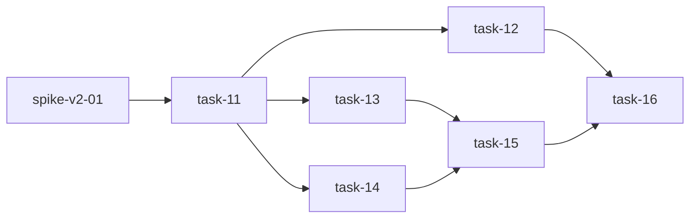

# 实现计划

## Spike 前置验证

| Spike | 验证内容 | 不通过后果 |
|---|---|---|
| spike-v2-01 | 验证 SillySpec CLI 的 `--dir` 参数支持：`sillyspec run scan --dir <path>` 能否在任意目录执行，无需目标目录为 SillySpec 项目。 | task-12 和 task-13 需改为先由平台直接复制 `.sillyspec` 模板目录，跳过 CLI 调用。 |

## Wave 1~4（已完成）

> 以下任务已在 execute 阶段完成，此处保留计划结构以维持完整性。

- [x] task-01: 建立 spec workspace 持久化与基础服务
- [x] task-02: 建立 spec profile manifest 与冲突策略基础
- [x] task-03: 改造 workspace 扫描与创建流程，允许普通项目纳管
- [x] task-04: 提供 spec workspace API 与导入、同步、冲突处理入口
- [x] task-05: 建立 AgentSpecBundle 上下文构建链路
- [x] task-06: 改造 Claude Code adapter 消费完整规范 bundle
- [x] task-07: 将 Agent run 后台化并扩展运行审计
- [x] task-08: 改造前端 workspace 创建、runtime 与 spec workspace 管理界面
- [x] task-09: 改造前端 Agent 执行入口、Agent 类型和设置页
- [x] task-10: 补齐测试覆盖并执行验收

## Wave 5（V2 设计修正 — ADR-04 独立目录）

- [x] task-11: config.py 新增 spec_data_root 配置项并修改 spec_workspace 路径计算
- [x] task-12: 改造所有解析模块从 spec_root 读取

## Wave 6（V2 设计修正 — ADR-05 CLI 作为工具 + ADR-06 验证器）

- [x] task-13: AgentSpecBundle 新增 available_tools 并改造 adapter 上下文
- [x] task-14: 新增 SpecValidator 程序化验证
- [x] task-15: 新增 SpecBootstrapService 和 /spec-bootstrap 端点

## Wave 7（测试与验收）

- [x] task-16: V2 测试覆盖与全局验收

## 任务总表

| 编号 | 任务 | Wave | 优先级 | 估时 | 依赖 | 说明 |
|---|---|---|---|---|---|---|
| task-11 | config.py 新增 spec_data_root 并修改路径计算 | W5 | P0 | 3h | spike-v2-01 | Settings 新增 `spec_data_root` 字段；SpecWorkspaceService.create 和 WorkspaceService._ensure_spec_workspace 改用绝对路径 `{spec_data_root}/{workspace_id}/`；spec_root 目录不存在时自动创建。 |
| task-12 | 改造所有解析模块从 spec_root 读取 | W5 | P0 | 5h | task-11 | ComponentParser、ScanDocsParser、ChangeParser、TaskParser 的调用方（service 层）改为从 SpecWorkspace.spec_root 读取，不再拼 workspace.root_path + "/.sillyspec"。需先查 spec_workspace 表获取 spec_root。 |
| task-13 | AgentSpecBundle 新增 available_tools 并改造 adapter | W6 | P0 | 4h | task-11 | AgentSpecBundle 新增 `available_tools: list[str]` 字段，默认 `["sillyspec"]`。context_builder 传入该字段。ClaudeCodeAdapter 在 prompt 中指示 Agent 使用 CLI 命令。需确认 sillyspec CLI 在执行环境可用。 |
| task-14 | 新增 SpecValidator 程序化验证 | W6 | P0 | 4h | task-11 | 新建 `spec_workspace/validator.py`。验证：YAML schema（projects/*.yaml 必须有 id/name/type）、引用完整性（relations.target 存在）、目录结构（至少有 projects/）。返回 ValidationReport，失败时写入 SpecConflict 记录。 |
| task-15 | 新增 SpecBootstrapService 和 /spec-bootstrap 端点 | W6 | P0 | 5h | task-13, task-14 | 新建 `spec_workspace/bootstrap.py`。协调 Agent 调用 CLI 初始化 + SpecValidator 验证。router 新增 `POST /spec-bootstrap` 端点。bootstrap 完成后自动触发验证，更新 sync_status。 |
| task-16 | V2 测试覆盖与全局验收 | W7 | P0 | 4h | task-12, task-15 | 新增 test_validator.py、test_bootstrap.py。更新已有测试适配 spec_data_root。运行全量测试。前端类型检查。 |

## 依赖关系图

## 关键路径

spike-v2-01 → task-11 → task-14 → task-15 → task-16

## 全局验收标准

- [ ] 普通代码目录在没有 `.sillyspec` 时可以被扫描、创建和纳管。
- [ ] 规范文件存储在 `spec_data_root` 独立目录中（绝对路径），不与代码仓库混放。
- [ ] 所有解析模块（component、scan_docs、change、task）从 `spec_root` 读取，不再从 `workspace.root_path/.sillyspec`。
- [ ] Agent 通过 `AgentSpecBundle.available_tools` 获知可用工具，prompt 中包含 SillySpec CLI 使用指令。
- [ ] SpecValidator 能程序化验证 YAML schema、引用完整性和目录结构，验证失败产生 SpecConflict 记录。
- [ ] `/spec-bootstrap` 端点触发 Agent 使用 CLI 初始化规范空间，完成后自动触发验证。
- [ ] 平台默认使用 platform-managed 规范空间，repo `.sillyspec` 只作为可选导入、同步或原生策略。
- [ ] 后端相关 pytest 通过，前端类型检查通过。
