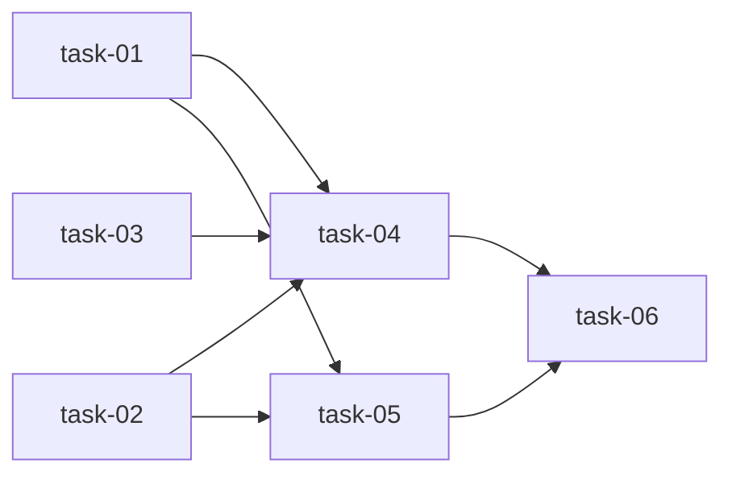

# 实现计划

## Wave 1（并行，无依赖）

- [x] task-01: ClaudeCodeAdapter 逐行流式读取 + Redis Pub/Sub 发布
- [x] task-02: SSE 端点 + Redis subscribe 服务方法
- [x] task-03: 前端 EventSource 消费函数

## Wave 2（依赖 Wave 1）

- [x] task-04: Agent Console 页面 SSE 集成

## Wave 3（依赖 Wave 2）

- [x] task-05: 后端流式日志单元测试
- [x] task-06: 部署 + 集成验证

## 任务总表

| 编号 | 任务 | Wave | 优先级 | 估时 | 依赖 | 说明 |
|---|---|---|---|---|---|---|
| task-01 | Adapter 逐行读取 + Redis 发布 | W1 | P0 | 2h | — | 改 `_exec_stream`，逐行读 stdout，解析 stream-json event，格式化后 PUBLISH 到 `agent_run:{run_id}`，累积到 output buffer |
| task-02 | SSE 端点 + Redis subscribe | W1 | P0 | 2h | — | `service.py` 新增 `stream_run_logs` 异步生成器（Redis pubsub.subscribe → yield SSE data）；`router.py` 新增 `GET /{run_id}/stream` StreamingResponse 端点；30 秒 keepalive；done event |
| task-03 | 前端 EventSource 消费函数 | W1 | P0 | 1h | — | `agent.ts` 新增 `streamAgentRunLogs(workspaceId, runId, onMessage, onDone)`，内部用 `EventSource` 连接 SSE 端点 |
| task-04 | Agent Console 页面集成 | W2 | P0 | 2h | task-01,02,03 | `agent/page.tsx` running 时用 `streamAgentRunLogs` 替代 `setInterval` 轮询；completed/failed 时保持 DB 查询 |
| task-05 | 后端单元测试 | W3 | P0 | 1h | task-01,02 | 测试 Redis publish 行为、SSE 端点响应格式、非 running 状态立即 done |
| task-06 | 部署集成验证 | W3 | P0 | 1h | task-04,05 | docker compose up，触发 bootstrap，验证 SSE 实时流 |

## 依赖关系图

## 关键路径

task-01 → task-04 → task-06（最长路径，约 5h）

## 全局验收标准

- [ ] Agent running 时前端通过 SSE 实时看到日志行（延迟 <1s）
- [ ] Agent completed/failed 时 SSE 发送 done event 并关闭
- [ ] Agent 非 running 状态连接 SSE 端点立即返回 done
- [ ] 现有 `/logs` DB 查询端点行为不变
- [ ] 现有 DB 日志写入逻辑不变
- [ ] 所有已有测试通过
- [ ] 新增测试覆盖 SSE 端点和 Redis 发布
