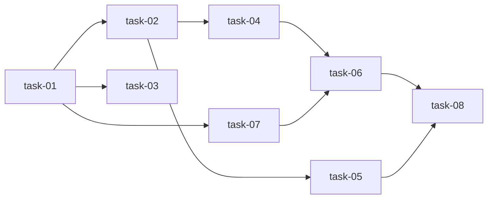

# 实现计划

## Spike 前置验证

无 Spike 需要。技术方案确定（SQLModel + Alembic 迁移 + 标准 CRUD），无新技术栈或未验证集成。

## Wave 1：数据基础（task-01）

模型重构是关键路径起点，必须先完成。

- [ ] task-01: 数据模型重构 — Workspace 吸收 Component 元数据

## Wave 2：核心功能（task-02, task-03, task-07）

三个任务并行，均依赖 W1 的模型变更，彼此独立。

- [ ] task-02: WorkspaceRelation 模块 — CRUD + 拓扑查询
- [ ] task-03: Change/Task/AgentRun M:N 关联 — 关联表 + 查询逻辑
- [ ] task-07: SpecWorkspace/ScanDocs 适配 — 适配新 Workspace 模型

## Wave 3：集成 + 清理（task-04, task-05, task-06）

依赖 W1+W2 的模型和模块。

- [ ] task-04: 解析器迁移 — Scanner 创建独立 Workspace + WorkspaceRelation
- [ ] task-05: Agent 跨空间上下文构建 — 基于 WorkspaceRelation 拉取 spec 摘要
- [ ] task-06: 删除 Component 模块 — 移除 component/ 目录，清理所有引用

## Wave 4：验证（task-08）

- [ ] task-08: 测试覆盖 — 全量 pytest

## 任务总表

| 编号 | 任务 | Wave | 优先级 | 估时 | 依赖 | 说明 |
|---|---|---|---|---|---|---|
| task-01 | 数据模型重构 | W1 | P0 | 4h | — | Workspace 吸收 component 元数据字段，新增 workspace_relations/change_workspaces/task_workspaces/agent_run_workspaces 表，删除 project_components/component_relations 表，Alembic 迁移 |
| task-02 | WorkspaceRelation 模块 | W2 | P0 | 4h | task-01 | relation_model.py + relation_schema.py + relation_service.py + router 端点 + 拓扑 API |
| task-03 | Change/Task/AgentRun M:N | W2 | P0 | 4h | task-01 | 关联表 + schema workspace_ids + service M:N 查询 + API 适配 |
| task-07 | SpecWorkspace/ScanDocs 适配 | W2 | P1 | 3h | task-01 | spec_workspace/service.py 和 scan_docs/service.py 改为从 Workspace（而非 Component）查询 |
| task-04 | 解析器迁移 | W3 | P0 | 4h | task-01, task-02 | workspace/scanner.py + service.py：YAML 解析后创建独立 Workspace + WorkspaceRelation |
| task-05 | Agent 跨空间上下文 | W3 | P1 | 3h | task-02 | context_builder.py：通过 WorkspaceRelation 查询关联 Workspace，构建 referenced_workspaces 摘要 |
| task-06 | 删除 Component 模块 | W3 | P0 | 2h | task-04, task-07 | 删除 backend/app/modules/component/，清理 main.py + migrations/env.py + conftest.py + 4 个 test 文件中的 import |
| task-08 | 测试覆盖 | W4 | P0 | 3h | task-01~07 | workspace tests（relation/topology）+ change/task/agent M:N tests + parser migration tests + 全量 pytest |

## 依赖关系图

## 关键路径

task-01 → task-02 → task-04 → task-06 → task-08（最长路径，约 17h）

## 全局验收标准

- [ ] Workspace 表包含 component 元数据字段（component_key, tech_stack, build_command, test_command, role, repo_url, default_branch, source_yaml_path）
- [ ] project_components 和 component_relations 表已删除
- [ ] workspace_relations 表支持 CRUD，允许循环依赖，禁止自环
- [ ] change_workspaces / task_workspaces / agent_run_workspaces M:N 关联表可用
- [ ] 全局拓扑 API 返回正确的图结构
- [ ] Scanner 解析 YAML 后创建独立 Workspace + WorkspaceRelation
- [ ] Agent context_builder 能通过 WorkspaceRelation 拉取关联 Workspace 的 spec 摘要
- [ ] component 模块已完全删除，无残留 import
- [ ] 所有测试通过（pytest）
