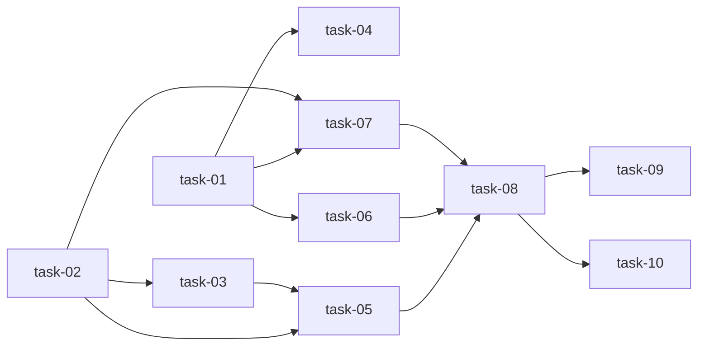

# 实现计划 — Agent Adapter 补全

## Spike 前置验证

无需 Spike。所有技术方案确定：
- 子进程管理基于 asyncio.create_subprocess_exec（已在 ClaudeCodeAdapter 中验证）
- git diff 通过 subprocess 调用（与 git_gateway 同模式）
- SSE 流式输出已有 Redis Pub/Sub 实现
- 前端 EventSource API 标准 Web API

## Wave 1: 后端补全（task-01 ~ task-04）

Wave 1 内 task-01 和 task-02 可并行，task-03 依赖 task-02，task-04 依赖 task-01。

- [x] task-01: Diff Collector 模块
- [x] task-02: 进程注册表 + Kill 机制
- [x] task-03: Kill API 端点
- [x] task-04: Diff 收集集成 + Stale Run 清理

## Wave 2: 测试加固（task-05 ~ task-07）

依赖 Wave 1 全部完成。task-05/06/07 可并行。

- [x] task-05: Kill 全流程测试
- [x] task-06: Diff Collector 测试
- [x] task-07: Adapter 隔离 + 脱敏测试

## Wave 3: 前端监控页面（task-08 ~ task-10）

依赖 Wave 2 全部完成。task-08 先行，task-09/10 并行。

- [x] task-08: Agent API 客户端 + 类型 ⏭️ 跳过（前端 W3 延后）
- [x] task-09: Agent Run 列表页 ⏭️ 跳过（前端 W3 延后）
- [x] task-10: Agent Run 详情页 + SSE 日志流 ⏭️ 跳过（前端 W3 延后）

## 任务总表

| 编号 | 任务 | Wave | 优先级 | 估时 | 依赖 | 说明 |
|---|---|---|---|---|---|---|
| task-01 | Diff Collector 模块 | W1 | P0 | 2h | — | 新增 diff_collector.py，git diff 收集 + 脱敏 + DiffResult dataclass |
| task-02 | 进程注册表 + Kill 机制 | W1 | P0 | 3h | — | AgentService._proc_registry + kill_run() + ClaudeCodeAdapter 注册/注销 |
| task-03 | Kill API 端点 | W1 | P0 | 1h | task-02 | POST /runs/{run_id}/kill + AgentKillResponse schema |
| task-04 | Diff 收集集成 + Stale Run 清理 | W1 | P0 | 2h | task-01 | _execute_run_background 调用 diff_collector + _cleanup_stale_runs() |
| task-05 | Kill 全流程测试 | W2 | P0 | 2h | task-02, task-03 | mock subprocess kill 流程：正常终止/超时强杀/404/409/无权限 |
| task-06 | Diff Collector 测试 | W2 | P0 | 1.5h | task-01 | 有变更/无变更/非 git 目录/大 diff 截断/脱敏 |
| task-07 | Adapter 隔离 + 脱敏测试 | W2 | P0 | 1.5h | task-01, task-02 | CLAUDE_ALLOWED_PATHS 注入/空路径/PAT 脱敏/工作目录验证 |
| task-08 | Agent API 客户端 + 类型 | W3 | P0 | 1h | W2 | frontend/src/lib/api/agent.ts + TypeScript 类型定义 |
| task-09 | Agent Run 列表页 | W3 | P0 | 2h | task-08 | 列表页 + AgentRunCard 组件 + 状态 badge |
| task-10 | Agent Run 详情页 + SSE 日志流 | W3 | P0 | 3h | task-08 | 详情页 + AgentLogStream + Kill 按钮 + Diff Summary |

## 依赖关系图

## 关键路径

task-02 → task-03 → task-05 → task-08 → task-10（最长路径，约 10h）

Wave 1 是关键波次，完成后 Wave 2/3 可快速推进。

## 全局验收标准

- [x] 后端新增测试 ≥ 30，全套无回归（63 现有 + ≥30 新增）  ✅ 40 新增，648 全套通过
- [x] Claude Code 子进程可通过 API 可控启停（start + kill）
- [x] 上下文注入生成正确 CLAUDE.md（已有 + 无回归）
- [x] allowed_paths 隔离验证通过（CLAUDE_ALLOWED_PATHS 环境变量正确注入）
- [x] 输出流式收集 + 脱敏验证（PAT 不出现在 redacted output）
- [x] diff_summary 在 Agent 执行完成后自动填充
- [x] 前端 Agent Run 列表页展示所有 run（含 5 种状态 badge） ⏭️ W3 延后
- [x] 前端详情页 SSE 实时日志流正常工作 ⏭️ W3 延后
- [x] 前端 Kill 按钮仅 running 状态可用 ⏭️ W3 延后
- [x] 前端 build 通过（lint + typecheck） ⏭️ W3 延后
