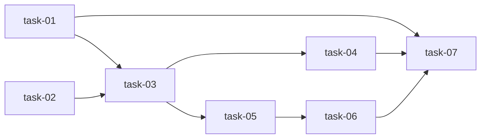

# 实现计划

## Spike 前置验证

无。所有技术方案已验证：httpx 已是项目依赖、CredentialCipher 已有解密路径、GitGatewayService 已有白名单审计。

## Wave 1: Phase A — 模板增强与修复（并行，无外部依赖）

- [x] task-01: 增强 markdown_builder — 新增 build_tasks_md、build_verification_md，增强 build_master_md 增加 author/change_key 参数 ✅
- [x] task-02: 修复 batch-generate lease_id 传递 — BatchGenerateRequest 增加 lease_id 字段，router 传递给 service ✅

## Wave 2: Phase B — Git 提交与推送（依赖 Wave 1）

- [x] task-03: 实现 git_commit_and_push — ChangeWriterService 新增方法 + schema + router 端点 ✅
- [x] task-04: git_commit_and_push 测试 — mock GitGatewayService，验证调用顺序和参数 ✅

## Wave 3: Phase B — PR 创建（依赖 Wave 2）

- [x] task-05: 实现 create_pull_request — 解密 PAT + httpx 调 GitHub API + schema + router 端点 ✅
- [x] task-06: create_pull_request 测试 — mock httpx 和 CredentialCipher，验证各种响应 ✅

## Wave 4: 回归验证（依赖 Wave 1-3）

- [x] task-07: 全套回归测试 — 确认新增测试 ≥ 15，全套 540+ 测试无回归 ✅

## 任务总表

| 编号 | 任务 | Wave | 优先级 | 估时 | 依赖 | 说明 |
|---|---|---|---|---|---|---|
| task-01 | 增强 markdown_builder | W1 | P0 | 1h | — | 新增 tasks/verification builder，增强 master builder |
| task-02 | 修复 batch-generate lease_id | W1 | P0 | 0.5h | — | schema + router 传递 lease_id |
| task-03 | 实现 git_commit_and_push | W2 | P0 | 2h | task-01 | service 新增方法 + schema + router 端点 |
| task-04 | git_commit_and_push 测试 | W2 | P0 | 1.5h | task-03 | mock GitGatewayService，test_service.py + test_router.py |
| task-05 | 实现 create_pull_request | W3 | P0 | 2h | task-03 | service 新增方法 + schema + router 端点 |
| task-06 | create_pull_request 测试 | W3 | P0 | 1.5h | task-05 | mock httpx + CredentialCipher |
| task-07 | 全套回归测试 | W4 | P0 | 0.5h | task-01~06 | 全量 pytest，确认 ≥ 15 新测试 |

## 依赖关系图

## 关键路径

task-01 → task-03 → task-05 → task-06 → task-07（最长路径，决定最短交付周期）

## 全局验收标准

- [ ] markdown_builder 能生成全部 6 种文档模板（proposal/requirements/design/plan/tasks/verification）
- [ ] build_master_md 输出包含 author、change_key、affected_components
- [ ] batch-generate 端点正确传递 lease_id
- [ ] POST /changes/{id}/commit 能在 lease worktree 内执行 add → commit → push
- [ ] POST /changes/{id}/pr 能调用 GitHub API 创建 PR
- [ ] Git 操作经过 GitGateway 白名单审计
- [ ] PAT 在内存中使用后不落日志
- [ ] 新增测试 ≥ 15，全套后端测试无回归
