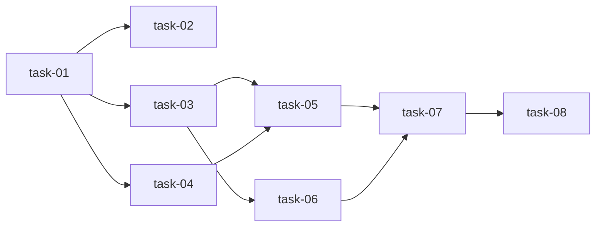

# 实现计划 — Execution Coordinator 执行可靠性保证

## Wave 1 — 数据模型 + 迁移（无外部依赖）

- [ ] task-01: AgentRun 模型扩展（6 个新字段 + checkpoint_data）
- [ ] task-02: Alembic 迁移（新增列 + 索引）

## Wave 2 — CoordinatorService 核心（依赖 task-01）

- [ ] task-03: ExecutionCoordinatorService — 幂等检查 + 乐观锁 + 指纹计算
- [ ] task-04: ExecutionCoordinatorService — resume + checkpoint + approval

## Wave 3 — API + 集成（依赖 Wave 2）

- [ ] task-05: Coordinator schemas + router + 注册
- [ ] task-06: AgentService.start_run 集成 coordinator

## Wave 4 — 测试 + 验收（依赖 Wave 3）

- [ ] task-07: Coordinator 测试套件（≥15 新测试）
- [ ] task-08: 全量回归验证

## 任务总表

| 编号 | 任务 | Wave | 优先级 | 估时 | 依赖 | 说明 |
|------|------|------|--------|------|------|------|
| task-01 | AgentRun 模型扩展 | W1 | P0 | 1h | — | model.py 新增 6 字段 + checkpoint_data JSONB |
| task-02 | Alembic 迁移 | W1 | P0 | 0.5h | task-01 | 新增列 + 唯一索引 + 条件索引 |
| task-03 | Coordinator 幂等+锁+指纹 | W2 | P0 | 2h | task-01 | check_idempotency, update_with_lock, compute_fingerprint |
| task-04 | Coordinator resume+checkpoint+approval | W2 | P0 | 2h | task-01 | resume_run, save/load_checkpoint, request_approval, approve |
| task-05 | Coordinator schemas + router | W3 | P0 | 1.5h | task-03,04 | coordinator_schema.py + router 新端点 + main.py 注册 |
| task-06 | AgentService 集成 | W3 | P0 | 1.5h | task-03 | start_run 集成幂等检查 + 指纹 + resume_token |
| task-07 | 测试套件 | W4 | P0 | 3h | task-05,06 | 6 能力点 × (正向+异常) + 集成测试 |
| task-08 | 全量回归 | W4 | P0 | 0.5h | task-07 | pytest 全套无回归 |

## 依赖关系图

## 关键路径

task-01 → task-03 → task-05 → task-07 → task-08（最长路径，~8h）

## 全局验收标准

- [ ] idempotency_key 去重生效（相同 key 不重复创建）
- [ ] resume_token 恢复执行正常
- [ ] checkpoint save/load 正确（version 递增）
- [ ] optimistic lock 检测并发冲突（返回 409）
- [ ] approval_token 审批流程正常（一次性 token）
- [ ] context_fingerprint 校验正常（不匹配返回 409）
- [ ] 所有新字段向后兼容（可 NULL / 有默认值）
- [ ] 新增测试 ≥ 15
- [ ] pytest 全套无回归
