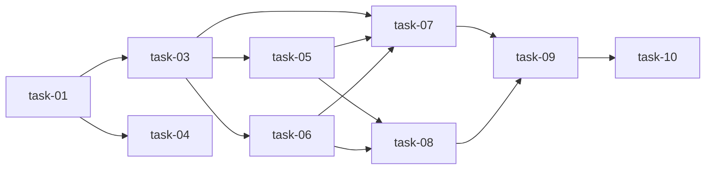

# 实现计划 — Tool Gateway 通用化

## Wave 1 — 数据模型 + 策略引擎（无外部依赖，可并行）

- [ ] task-01: ToolPolicy 数据模型 + Alembic 迁移
- [ ] task-02: AgentRun 关联 ToolPolicy FK（迁移）
- [ ] task-03: ToolPolicyService 策略校验引擎
- [ ] task-04: Policy CRUD schemas + router + 注册

## Wave 2 — 新工具 Handler（依赖 task-03 策略引擎）

- [ ] task-05: run_tests handler 实现
- [ ] task-06: http_get handler 实现

## Wave 3 — 集成 + 测试（依赖 Wave 1 + Wave 2）

- [ ] task-07: execute 流程集成 policy check + 审计双写
- [ ] task-08: schema 扩展 + API 更新
- [ ] task-09: 完整测试套件（≥20 新测试）
- [ ] task-10: 全量回归验证

## 任务总表

| 编号 | 任务 | Wave | 优先级 | 估时 | 依赖 | 说明 |
|------|------|------|--------|------|------|------|
| task-01 | ToolPolicy 数据模型 + 迁移 | W1 | P0 | 2h | — | `tool_policy.py` 模型定义 + Alembic 迁移 |
| task-02 | AgentRun FK 关联 | W1 | P0 | 1h | — | `agent/model.py` 新增 `tool_policy_id` + 迁移 |
| task-03 | ToolPolicyService 策略引擎 | W1 | P0 | 4h | task-01 | 校验逻辑：工具白名单、路径、命令黑名单、域名、资源限制 |
| task-04 | Policy CRUD API | W1 | P0 | 3h | task-01 | `policy_schema.py` + `policy_router.py` + main.py 注册 |
| task-05 | run_tests handler | W2 | P0 | 3h | task-03 | 封装 pytest/go test 执行，结构化结果解析 |
| task-06 | http_get handler | W2 | P0 | 3h | task-03 | 白名单域名 + SSRF 防护 + 只读 GET |
| task-07 | execute 流程集成 | W3 | P0 | 3h | task-03,05,06 | policy check + 审计双写 + _dispatch 扩展 |
| task-08 | schema + API 更新 | W3 | P0 | 1h | task-05,06 | `schema.py` 新增 tool_type，router 适配 |
| task-09 | 完整测试套件 | W3 | P0 | 4h | task-07,08 | 策略校验 + 路径逃逸 + SSRF + 审计 + handler 测试 |
| task-10 | 全量回归验证 | W3 | P0 | 1h | task-09 | `pytest` 全套无回归 |

## 依赖关系图

## 关键路径

task-01 → task-03 → task-05/06 → task-07 → task-09 → task-10（最长路径，~14h）

## 全局验收标准

- [ ] 7 种 tool_type 全部可调用（file_read/write/list/search + shell_exec + run_tests + http_get）
- [ ] ToolPolicy CRUD 5 个端点正常
- [ ] AgentRun 可关联 ToolPolicy，未关联时使用默认策略
- [ ] 路径逃逸测试通过
- [ ] shell 命令黑名单测试通过
- [ ] http_get 域名白名单 + SSRF 防护测试通过
- [ ] 审计双写验证（ToolOperationLog + AuditLog）
- [ ] 超时/输出截断限制生效
- [ ] pytest 全套无回归（648+ tests passed）
- [ ] 新增测试 ≥ 20
