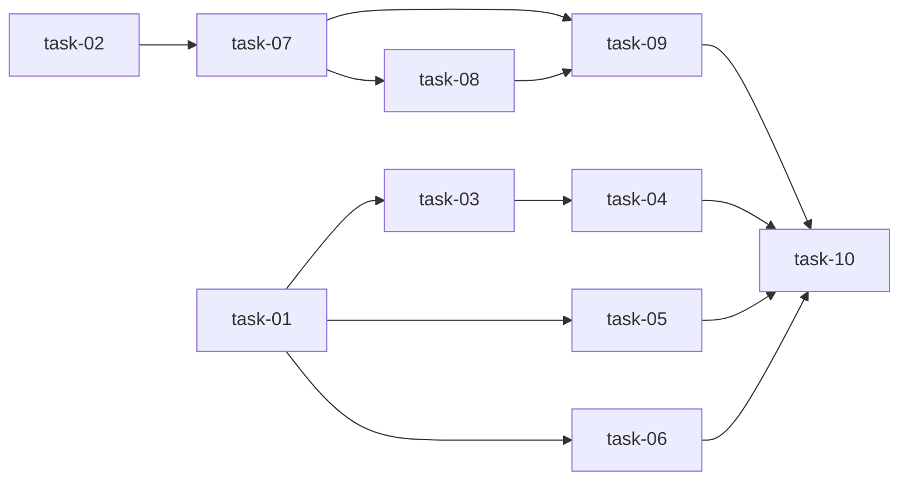

# 实现计划: Workflow State Machine Enhancement

## Wave 1: 修复 + 清理（基础保障，无依赖）

- [x] task-01: 修复 test_change_transition_draft_to_proposed 失败
- [x] task-02: datetime.utcnow → datetime.now(timezone.utc) 清理

## Wave 2: Spec Guardian 增强（依赖 Wave 1）

- [x] task-03: ChangeDocument 新增 word_count 字段 + Alembic migration
- [x] task-04: Spec Guardian G4 — 文档字数 ≥ 100 检查
- [x] task-05: Spec Guardian G5 — 关联组件存在性检查
- [x] task-06: Spec Guardian G7 — 未解决 reject review 检查

## Wave 3: 审计日志自动覆盖（依赖 Wave 2）

- [x] task-07: 新建 core/audit_hooks.py — SQLAlchemy event hook
- [x] task-08: get_session 注入 audit_context
- [x] task-09: Audit hook 单元测试

## Wave 4: 全量验证（依赖 Wave 3）

- [x] task-10: 全量测试验证

## 任务总表

| 编号 | 任务 | Wave | 优先级 | 估时 | 依赖 | 说明 |
|------|------|------|--------|------|------|------|
| task-01 | 修复 test_change_transition_draft_to_proposed | W1 | P0 | 1h | — | 根因：SQLite 外键约束。修复测试 setup |
| task-02 | datetime.utcnow deprecation 清理 | W1 | P0 | 0.5h | — | 4 个文件全局替换 |
| task-03 | ChangeDocument.word_count 字段 | W2 | P0 | 1h | task-01 | model.py + Alembic migration |
| task-04 | Guard G4: 文档字数 ≥ 100 | W2 | P0 | 1h | task-03 | spec_guardian.py + test |
| task-05 | Guard G5: 组件存在性 | W2 | P1 | 1h | task-01 | spec_guardian.py + test |
| task-06 | Guard G7: 未解决 review | W2 | P1 | 1.5h | task-01 | 需查询审计日志判断 rework |
| task-07 | core/audit_hooks.py | W3 | P0 | 2h | task-02 | SQLAlchemy event hook 注册 |
| task-08 | get_session 注入 audit_context | W3 | P0 | 1h | task-07 | db.py 修改 |
| task-09 | Audit hook 测试 | W3 | P0 | 1.5h | task-07, task-08 | test_audit_hooks.py |
| task-10 | 全量测试验证 | W4 | P0 | 0.5h | task-01~09 | pytest 全量 540+ |

## 依赖关系图

## 关键路径

task-02 → task-07 → task-08 → task-09 → task-10（5.5h）

## 全局验收标准

- [ ] `test_change_transition_draft_to_proposed` 通过
- [ ] 所有现有 44 个 workflow 测试通过
- [ ] 新增 spec_guardian 规则（G4/G5/G7）有对应测试且全部通过
- [ ] SQLAlchemy event hook 对所有 BaseModel 子类自动记录审计
- [ ] AuditLog 不记录自身（递归保护）
- [ ] `datetime.utcnow()` 全部替换为 `datetime.now(timezone.utc)`
- [ ] 全量测试通过（540+）
- [ ] 不改变现有 API 接口行为
