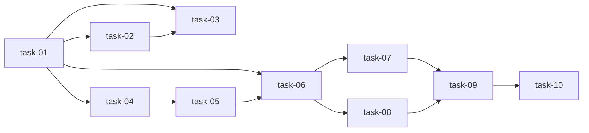

# 实现计划

## Spike 前置验证

无需 Spike。方案复用现有 `AgentSpecBundle`、`ClaudeCodeAdapter.run_with_bundle()`、`AgentRunLog`、Redis Pub/Sub、SSE stream 和 Workspace 页面模式，没有引入新技术栈；主要风险在实现顺序和回归测试覆盖。

## Wave 1（后端执行链路，串行基础）

- [x] task-01: 重构 spec bootstrap 为异步 AgentRun 启动
- [x] task-02: 实现 bootstrap 后台 ClaudeCodeAdapter 执行与验证收尾
- [x] task-03: 更新 spec bootstrap 后端测试

## Wave 2（后端用户指导接口，依赖 Wave 1）

- [x] task-04: 增加 AgentRun 用户输入记录与 SSE 推送服务
- [x] task-05: 增加 AgentRun 用户输入 HTTP 端点和测试

## Wave 3（前端消息流和交互，依赖 Wave 1-2）

- [x] task-06: 更新前端 API 类型和用户输入 API
- [x] task-07: Workspace 详情页接入 bootstrap SSE 和内联输入
- [x] task-08: Agent 控制台接入 pending input 和用户指导输入

## Wave 4（文档与验证，依赖 Wave 1-3）

- [x] task-09: 同步 SillySpec 模块文档
- [x] task-10: 运行目标测试、lint、typecheck 并修复回归

## 任务总表

| 编号 | 任务 | Wave | 优先级 | 估时 | 依赖 | 说明 |
|---|---|---|---|---|---|---|
| task-01 | 重构 spec bootstrap 为异步 AgentRun 启动 | W1 | P0 | 3h | — | `bootstrap()` 创建 run/关联/审计后立即返回 `agent_run_id`、`stream_url`、`status` |
| task-02 | 实现 bootstrap 后台 ClaudeCodeAdapter 执行与验证收尾 | W1 | P0 | 5h | task-01 | 构造 bootstrap `AgentSpecBundle`，调用 `ClaudeCodeAdapter.run_with_bundle()`，完成后运行 `SpecValidator` 并更新状态/冲突 |
| task-03 | 更新 spec bootstrap 后端测试 | W1 | P0 | 3h | task-01, task-02 | 覆盖立即返回、adapter 调用、验证成功/失败、后台异常 |
| task-04 | 增加 AgentRun 用户输入记录与 SSE 推送服务 | W2 | P0 | 3h | task-01 | 在 `AgentService` 增加 `submit_run_input()`，写 `AgentRunLog(channel=user_input)` 并 Redis publish |
| task-05 | 增加 AgentRun 用户输入 HTTP 端点和测试 | W2 | P0 | 3h | task-04 | 新增 `POST /agent/runs/{id}/input`，校验 workspace 归属和 `WORKSPACE_WRITE` |
| task-06 | 更新前端 API 类型和用户输入 API | W3 | P0 | 2h | task-01, task-05 | `BootstrapResult` 改为 run/stream 语义，`agent.ts` 增加 submit input API |
| task-07 | Workspace 详情页接入 bootstrap SSE 和内联输入 | W3 | P0 | 5h | task-06 | 点击 Bootstrap 后立即连 stream，展示日志、终态和用户指导输入 |
| task-08 | Agent 控制台接入 pending input 和用户指导输入 | W3 | P1 | 4h | task-06 | 对 `pending_input`/`user_input` 日志展示交互面板，提交同一输入接口 |
| task-09 | 同步 SillySpec 模块文档 | W4 | P0 | 2h | task-01..task-08 | 更新 backend agent/spec_workspace 和 frontend scan 文档 |
| task-10 | 运行目标测试、lint、typecheck 并修复回归 | W4 | P0 | 3h | task-01..task-09 | 运行 spec_workspace/agent 目标测试、ruff、frontend typecheck |

## 依赖关系图

## 关键路径

task-01 -> task-02 -> task-03 -> task-04 -> task-05 -> task-06 -> task-07 -> task-09 -> task-10

关键路径决定最短交付周期，因为后端 run 语义和输入接口必须先稳定，前端才能安全接入 SSE 与用户指导输入。

## 全局验收标准

- [ ] `/spec-bootstrap` 不再直接执行 `_run_sillyspec_init()` 或裸 `sillyspec` 子进程
- [ ] `/spec-bootstrap` 返回 `agent_run_id` 后前端可立即连接 Agent SSE
- [ ] 后台执行调用 `ClaudeCodeAdapter.run_with_bundle()`
- [ ] Agent prompt 包含 `sillyspec init --dir <spec_root>` 和 `sillyspec run scan --dir <spec_root>`
- [ ] 后端验证收尾能更新 `sync_status` 和 `SpecConflict`
- [ ] Workspace 详情页与 Agent 控制台都能提交用户指导输入
- [ ] 现有 `/agent/runs/{id}/stream` 历史回放和普通 Agent 控制台日志展示保持兼容
- [ ] 目标后端测试通过
- [ ] Ruff 通过
- [ ] Frontend typecheck 通过
