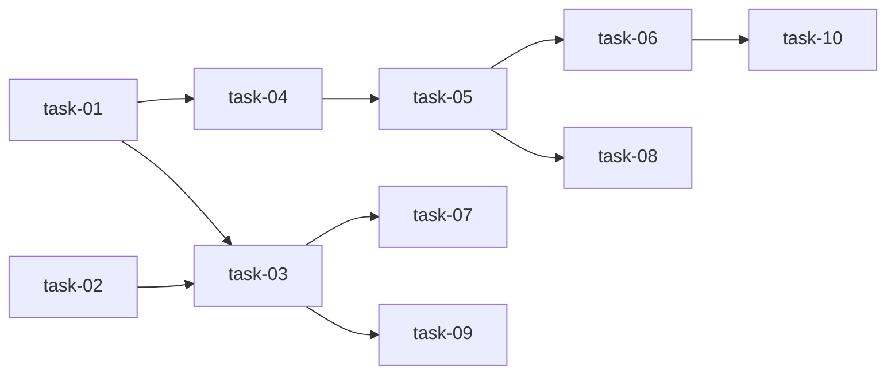

# 实现计划

## Wave 1（并行，无依赖 — 后端基础）

- [x] task-01: 后端 `_serialize_log_event` 增加 `log_id` 字段
- [x] task-02: 后端 `get_run_logs` 增加 `after` 参数过滤

## Wave 2（依赖 Wave 1 — 后端组合 + 前端类型）

- [x] task-03: 后端 `stream_run_logs` 增加 `after` 参数 + router 透传
- [x] task-04: 前端 `StreamLogEvent` 增加 `log_id` 字段 + `getAgentRunLogs` 支持 `after` 参数

## Wave 3（依赖 Wave 2 — 前端核心 + 后端测试/文档）

- [x] task-05: 新增 `frontend/src/lib/agent-stream.ts` — `AgentRunStreamClient` 类
- [ ] task-07: 后端单测 — `after` 过滤 + `log_id` 字段
- [x] task-09: 同步 agent 模块文档

## Wave 4（依赖 Wave 3 — 前端集成 + 前端测试）

- [x] task-06: 前端 Workspace 详情页替换为 `AgentRunStreamClient`
- [ ] task-08: 前端单测 — `AgentRunStreamClient` 重连/去重/状态

## Wave 5（依赖 Wave 4 — 前端文档）

- [x] task-10: 同步前端 INTEGRATIONS 文档

## 任务总表

| 编号 | 任务 | Wave | 优先级 | 估时 | 依赖 | 说明 |
|---|---|---|---|---|---|---|
| task-01 | `_serialize_log_event` 增加 `log_id` | W1 | P0 | 0.5h | — | 修改 `service.py:65`，序列化时加入 `entry.id`（UUID） |
| task-02 | `get_run_logs` 增加 `after` 过滤 | W1 | P0 | 0.5h | — | 修改 `service.py:390`，增加 `after: str \| None` 参数（UUID），timestamp 过滤 |
| task-03 | `stream_run_logs` + router 透传 `after` | W2 | P0 | 1h | task-01, task-02 | router 解析 query param → service.stream_run_logs(after=) → DB replay 过滤 |
| task-04 | 前端 `StreamLogEvent` + `getAgentRunLogs` 扩展 | W2 | P0 | 0.5h | task-01 | 类型加 `log_id: string \| null`，API 函数支持 `after` 参数 |
| task-05 | `AgentRunStreamClient` 类 | W3 | P0 | 3h | task-04 | 连接管理、token 刷新、重连、回填、去重、状态通知 |
| task-06 | Workspace 详情页集成 | W4 | P0 | 1.5h | task-05 | 替换 handleBootstrap 中 EventSource 逻辑，增加状态指示器 |
| task-07 | 后端单测 | W3 | P0 | 1h | task-03 | `after` 过滤空/有值/边界、`log_id` 存在于 SSE 输出 |
| task-08 | 前端单测 | W4 | P1 | 2h | task-05 | 重连流程、去重 Set、状态机、指数退避 |
| task-09 | 同步 agent 模块文档 | W3 | P1 | 0.5h | task-03 | 记录 `after` 参数和 `log_id` 事件字段 |
| task-10 | 同步前端 INTEGRATIONS 文档 | W5 | P2 | 0.5h | task-06 | 记录 `AgentRunStreamClient` 集成 |

## 依赖关系图

## 关键路径

task-01 → task-04 → task-05 → task-06 → task-10（前端核心链路，决定交付周期）

## 全局验收标准

- [ ] `GET /stream?after=<uuid>` 只返回该 log 之后的日志，不传时行为不变
- [ ] SSE 事件包含 `log_id` 字段（UUID 字符串）
- [ ] `AgentRunStreamClient` 断线后自动重连（最多 5 次，指数退避）
- [ ] 重连时通过 `GET /logs?after=<uuid>` 回填断线期间日志
- [ ] 回填和 SSE 推送重叠事件通过 `log_id` Set 去重
- [ ] Workspace 详情页显示连接状态（connecting/connected/error）
- [ ] 所有后端单测通过
- [ ] 未传 `after` 参数时现有行为完全不变
