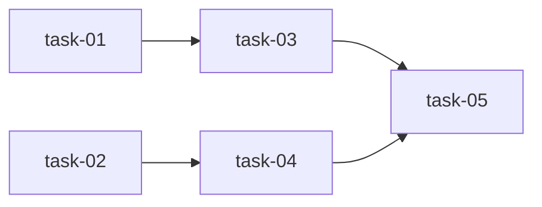

# 实现计划

> 无技术不确定性（单模块逻辑修正 + 前端契约对齐），不需要 Spike。
> 任务编号与 tasks/task-NN.md 蓝图 frontmatter 对齐。

## Wave 1（并行，无依赖）
- [x] task-01: 后端 documents_complete 改判四件套 exists
- [x] task-02: 前端归档门禁契约对齐后端（changes.ts 类型）

## Wave 2（依赖 Wave 1）
- [x] task-03: 后端归档门禁测试（依赖 task-01 的判定逻辑）
- [x] task-04: 前端完整度分区 + 归档门禁渲染（依赖 task-02 的类型定义）

## Wave 3（依赖 Wave 2）
- [x] task-05: 验证 — change 模块测试全通过 + 前端 tsc 0 错误

## 任务总表
| 编号 | 任务 | Wave | 优先级 | 估时 | 依赖 | 说明 |
|---|---|---|---|---|---|---|
| task-01 | 后端 documents_complete 改判四件套 exists | W1 | P0 | 1h | — | service.py check_archive_gate，REQUIRED_DOC_TYPES 集合判 exists，弃用 status |
| task-02 | 前端归档门禁契约对齐 | W1 | P0 | 0.5h | — | changes.ts: ArchiveCheckItem→{name,passed,detail}，failed_checks→checks |
| task-03 | 后端归档门禁测试 | W2 | P0 | 1h | task-01 | 新建 backend/tests/modules/change/test_archive_gate.py，覆盖齐全通过/缺件失败 |
| task-04 | 前端完整度分区 + 门禁渲染 | W2 | P0 | 1.5h | task-02 | page.tsx: REQUIRED/OPTIONAL 常量、分母改四件套、门禁渲染改用 checks/name/passed/detail |
| task-05 | 验证 | W3 | P0 | 0.5h | task-03,04 | pytest change 模块 + npx tsc --noEmit |

## 依赖关系图

## 关键路径
task-01 → task-03 → task-05（后端链，决定最短交付周期）

## 全局验收标准
- [x] 完整度卡片对仅有四件套的变更显示 X/4 就绪，可选文档缺失不影响计数
- [x] documents_complete 四件套齐全时 passed=true、缺件时 passed=false 且 detail 指明缺哪些
- [x] 归档门禁 UI 正确渲染后端 6 项 checks（passed + detail），未通过 badge 计数正确
- [x] change 模块 pytest 全通过
- [x] 前端 npx tsc --noEmit 0 错误
