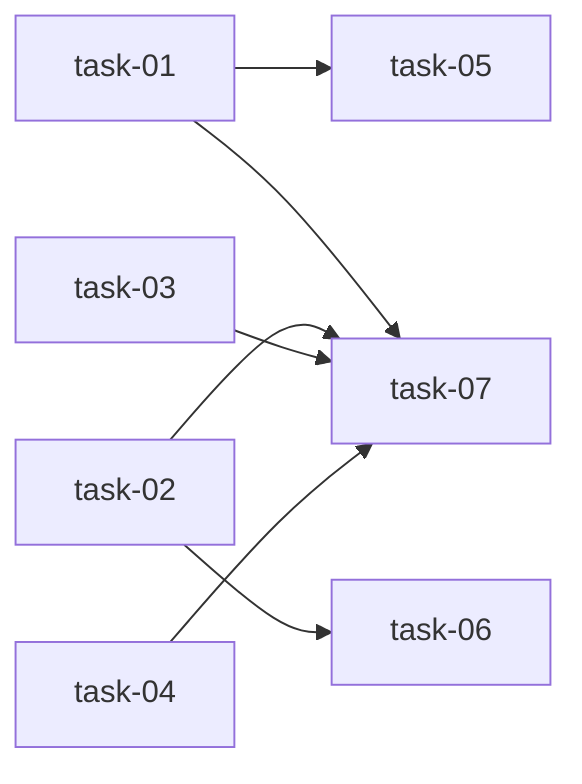

# 实现计划

## Wave 1（并行，无依赖）
- [x] task-01: scan_generate 幂等返回进行中 scan run
- [x] task-02: _execute_scan_run 成功收尾自动 reparse 子组件
- [x] task-03: 弹窗去 SSE，「生成项目规范」改为跳转详情页
- [x] task-04: 详情页 load 查询进行中 scan run 并自动恢复 SSE 回显 + done 后刷新计数

## Wave 2（依赖 Wave 1）
- [x] task-05: 后端 scan_generate 幂等返回单测（依赖 task-01）
- [x] task-06: _execute_scan_run 收尾 reparse 单测（依赖 task-02）
- [x] task-07: 同步受影响模块文档（依赖 task-01,02,03,04）

## 任务总表
| 编号 | 任务 | Wave | 优先级 | 估时 | 依赖 | 说明 |
|---|---|---|---|---|---|---|
| task-01 | scan_generate 幂等返回进行中 scan run | W1 | P0 | 2h | — | 触发前查 AgentRunWorkspace 关联 + change_id is None 的 pending/running run，有则幂等返回 |
| task-02 | _execute_scan_run 成功收尾自动 reparse | W1 | P0 | 3h | — | exit_code==0 分支调 reparse，独立 try/except，失败仅 warning |
| task-03 | 弹窗去 SSE 改跳转 | W1 | P0 | 2h | — | 移除 generating 阶段与 SSE，scanGenerate 后 router.push 跳详情页 |
| task-04 | 详情页恢复回显 + 刷新计数 | W1 | P0 | 4h | — | load 查进行中 run 自动连 SSE；done 后 load 刷新 componentCount |
| task-05 | scan_generate 幂等单测 | W2 | P1 | 2h | task-01 | 验证已有进行中 run 时不新建 |
| task-06 | _execute_scan_run 收尾 reparse 单测 | W2 | P1 | 2h | task-02 | 验证成功后触发 reparse、失败仅 warning |
| task-07 | 同步模块文档 | W2 | P1 | 1h | task-01,02,03,04 | 更新 workspace/agent 相关 scan 文档 |

## 依赖关系图

## 关键路径
task-02 → task-06 → task-07（后端收尾 reparse 实现 + 测试 + 文档，技术风险最高的链路）

## 全局验收标准
- [ ] 后端单测通过（scan_generate 幂等、收尾 reparse）
- [ ] 点击「生成项目规范」跳转详情页，弹窗关闭，无弹窗内日志
- [ ] 进入详情页时进行中的 scan run 自动恢复 SSE 回显且按钮禁用
- [ ] 同一 workspace 进行中无法重复触发（前端禁用 + 后端幂等）
- [ ] scan 成功后子组件自动创建，「项目组组件」计数刷新增加
- [ ] 无进行中 run 时 scan_generate 行为不变（兼容）
