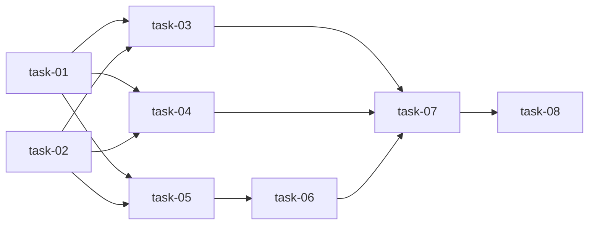

# 实现计划：修正 Agent 驱动变更中心流程闭环

## Wave 1（后端状态机基础，无前端依赖）

- [ ] task-01: resolve_human_gate 全返回 none + 新增 complete_stage 统一入口
- [ ] task-02: 新增 rerun_stage 同阶段重跑 + TRANSITIONS 加 verify→propose 回退边

## Wave 2（后端 Review API 修正，依赖 Wave 1 的 complete_stage/rerun_stage）

- [ ] task-03: 修正 proposal-review（approve→plan, revise→rerun, unclear→brainstorm）+ 记录 review_history
- [ ] task-04: 修正 plan-review（approve→execute, replan→rerun, back_to_propose, back_to_brainstorm）+ 记录 review_history
- [ ] task-05: 修正 human-test（pass→archive+need_archive_confirm, bug→quick, doc_mismatch→propose）

## Wave 3（后端 archive-confirm API，依赖 Wave 2 的 human_test 修正）

- [ ] task-06: 新增 archive-confirm API（schema + router + service）

## Wave 4（前端 Gate 面板，依赖 Wave 2/3 的 API 就绪）

- [ ] task-07: Gate 面板加 comment textarea + 修 archive-confirm 按钮 + 清理旧 UI 残留

## Wave 5（测试验证，依赖所有实现完成）

- [ ] task-08: 后端状态流转测试（complete_stage + rerun_stage + review API + archive-confirm）

## 任务总表

| 编号 | 任务 | Wave | 优先级 | 估时 | 依赖 | 说明 |
|------|------|------|--------|------|------|------|
| task-01 | complete_stage + gate 时机修正 | W1 | P0 | 3h | — | 修改 resolve_human_gate 返回 none；新增 complete_stage 方法 |
| task-02 | rerun_stage + verify→propose 回退 | W1 | P0 | 2h | — | 新增 rerun_stage 方法；TRANSITIONS 加 verify→propose |
| task-03 | proposal-review 修正 | W2 | P0 | 2h | task-01,02 | revise 走 rerun_stage；approve 走 transition+dispatch；记录 review_history |
| task-04 | plan-review 修正 | W2 | P0 | 2h | task-01,02 | replan 走 rerun_stage；approve 走 transition+dispatch；记录 review_history |
| task-05 | human-test 修正 | W2 | P0 | 1h | task-01,02 | pass→archive+need_archive_confirm；bug→quick；doc_mismatch→propose |
| task-06 | archive-confirm API | W3 | P0 | 1h | task-05 | 新增 POST /archive-confirm；只在 archive+need_archive_confirm 时允许 |
| task-07 | 前端 Gate 面板修正 | W4 | P0 | 3h | task-03-06 | comment textarea + archive-confirm 按钮 + 清理旧 UI |
| task-08 | 后端测试 | W5 | P0 | 3h | task-01-06 | 覆盖 complete_stage、rerun_stage、review API、archive-confirm |

## 依赖关系图

## 关键路径

task-01/02 → task-03/04/05 → task-06 → task-07 → task-08

## 全局验收标准

- [ ] 进入 propose 时 human_gate=none，propose Agent 完成后 human_gate=need_proposal_review
- [ ] proposal revise 能重跑 propose，不报 InvalidTransition
- [ ] plan replan 能重跑 plan，不报 InvalidTransition
- [ ] human-test pass 进入 archive+need_archive_confirm，不直接 dispatch archive
- [ ] human-test bug 触发 quick
- [ ] human-test doc_mismatch 回到 propose
- [ ] archive-confirm 能触发 archive Agent
- [ ] 前端 Gate 面板能填写并提交 comment
- [ ] 前端不再引用 ready_for_dev / accepted
- [ ] 所有 pytest 通过
- [ ] 所有 ruff/mypy 检查通过
