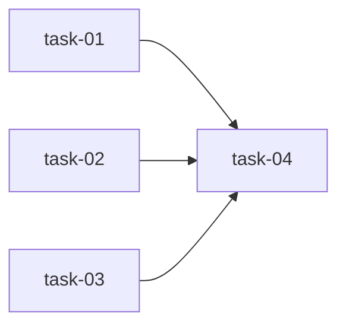

# 实现计划

## Spike 前置验证

无。本次变更为纯 CSS 类名修复，技术方案明确，无不确定性。

## Wave 1（并行，无依赖）

- [x] task-01: 修复 Agent 控制台活跃运行日志溢出
- [x] task-02: 修复 Agent 控制台已完成运行日志溢出
- [x] task-03: 修复变更详情页日志查看器溢出

## Wave 2（依赖 Wave 1）

- [x] task-04: 浏览器视觉验证三处日志区域

## 任务总表

| 编号 | 任务 | Wave | 优先级 | 估时 | 依赖 | 说明 |
|---|---|---|---|---|---|---|
| task-01 | 修复 Agent 控制台活跃运行日志溢出 | W1 | P0 | 10min | — | agent/page.tsx:566 内容 span 添加 `overflow-x-auto` |
| task-02 | 修复 Agent 控制台已完成运行日志溢出 | W1 | P0 | 10min | — | agent/page.tsx:719 td/容器添加宽度约束 `overflow-hidden` |
| task-03 | 修复变更详情页日志查看器溢出 | W1 | P0 | 10min | — | changes/[cid]/page.tsx:878 内容 span 添加 `overflow-x-auto` |
| task-04 | 浏览器视觉验证三处日志区域 | W2 | P0 | 15min | task-01, task-02, task-03 | 验证日志块内水平滚动、页面无 X 轴滚动条 |

## 依赖关系图

## 关键路径

task-01/02/03（并行）→ task-04（验证）

所有实现任务并行执行，验证任务在全部实现完成后执行。关键路径长度 = 1 Wave 实现 + 1 Wave 验证。

## 全局验收标准

- [ ] 日志内容超宽时，日志块内出现水平滚动条（FR-01）
- [ ] 页面本身不出现 X 轴滚动条（FR-02）
- [ ] 日志内容完整显示，无字符截断或丢失（FR-03）
- [ ] 现有 channel 着色、标签、自动滚动等功能不受影响（FR-04）
- [ ] 前端 TypeScript 编译无错误
- [ ] 三处日志显示区域行为一致
