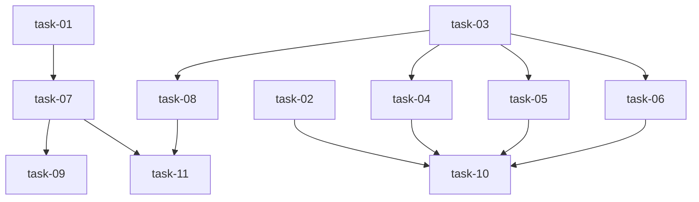

# 实现计划：Daemon Agent 检测体系扩展

## Wave 1：Agent 检测基础（无内部依赖）

- [ ] task-01: 扩展 AgentDetector — 12 种 agent 定义 + 环境变量覆盖 + 版本检测
- [ ] task-02: 版本校验模块（semver 解析 + 最低版本检查）

## Wave 2：执行协议层（无内部依赖，可与 Wave 1 并行）

- [ ] task-03: AgentBackend 抽象接口 + Backend 工厂
- [ ] task-04: StreamJsonBackend（claude/gemini/cursor）
- [ ] task-05: JsonRpcBackend（codex/hermes/kimi/kiro）
- [ ] task-06: JsonlBackend + NdjsonBackend + TextBackend（copilot/opencode/openclaw/pi/antigravity）

## Wave 3：Daemon 集成（依赖 Wave 1 + Wave 2）

- [ ] task-07: Daemon 多 runtime 注册循环 + client 改造
- [ ] task-08: TaskRunner 按 provider 分发执行

## Wave 4：前端展示（依赖 Wave 3 验证）

- [ ] task-09: Runtimes 页面 provider 展示增强

## Wave 5：测试（依赖 Wave 3）

- [ ] task-10: 单元测试（AgentDetector + Backend 解析 + 版本校验）
- [ ] task-11: 集成测试（daemon 多 runtime 注册 → 任务执行）

## 任务总表

| 编号 | 任务 | Wave | 优先级 | 估时 | 依赖 | 说明 |
|------|------|------|--------|------|------|------|
| task-01 | AgentDetector 扩展 | W1 | P0 | 2h | — | 12 种 agent 定义 + 环境变量 + 版本检测 |
| task-02 | 版本校验模块 | W1 | P0 | 1h | — | semver 解析 + MIN_VERSIONS 映射 |
| task-03 | AgentBackend 接口 | W2 | P0 | 1h | — | 抽象基类 + 工厂函数 |
| task-04 | StreamJsonBackend | W2 | P0 | 2h | task-03 | claude/gemini/cursor NDJSON 协议 |
| task-05 | JsonRpcBackend | W2 | P0 | 2h | task-03 | codex/hermes/kimi/kiro JSON-RPC 协议 |
| task-06 | 其他 Backend | W2 | P1 | 2h | task-03 | copilot JSONL + opencode/openclaw/pi NDJSON + antigravity text |
| task-07 | Daemon 多 runtime 注册 | W3 | P0 | 3h | task-01, task-03 | daemon.py + client.py 改造 |
| task-08 | TaskRunner provider 分发 | W3 | P0 | 3h | task-03 | 按 provider 类型选择 backend |
| task-09 | 前端展示增强 | W4 | P1 | 2h | task-07 | runtimes 页面 provider 标签 |
| task-10 | 单元测试 | W5 | P1 | 3h | task-01, task-02, task-06 | mock 检测 + 协议解析 + 版本校验 |
| task-11 | 集成测试 | W5 | P1 | 2h | task-07, task-08 | 多 runtime 注册 → 执行 |

## 依赖关系图

## 关键路径

**主关键路径**：task-01 → task-07 → task-11
（2h + 3h + 2h = 7h ≈ 1 工作日）

**协议关键路径**：task-03 → task-05 → task-10
（1h + 2h + 3h = 6h，可与主路径并行）

## 全局验收标准

- [ ] AgentDetector 能检测 12 种 agent（通过 mock 测试）
- [ ] 环境变量覆盖生效（`SILLYHUB_CLAUDE_PATH` 等优先于 PATH）
- [ ] 版本低于最低要求的 agent 被标记警告但仍可注册
- [ ] 无 agent 安装时 daemon 正常启动不崩溃
- [ ] TaskRunner 按 provider 类型选择正确的 Backend 执行
- [ ] 前端 runtimes 页面展示 provider 类型
- [ ] 所有单元测试通过
- [ ] 向后兼容：旧 daemon 客户端仍可正常注册
