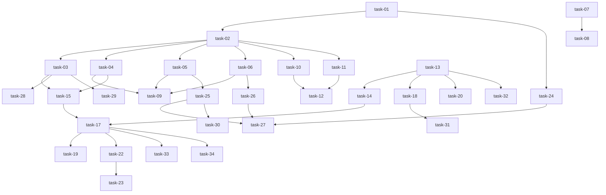

# 实现计划：本地守护进程

## Spike 前置验证

| Spike | 验证内容 | 不通过后果 |
|---|---|---|
| spike-01 | WebSocket 唤醒延迟测试（验证 < 1 秒） | 改用纯 HTTP 轮询模式 |
| spike-02 | Patch 应用安全性（验证 git apply --3way 不丢失代码） | 增加预检查和回滚机制 |

## Wave 1：服务器基础设施（并行，无内部依赖）

- [x] task-01: 数据库迁移（daemon_runtimes + daemon_task_leases 表）
- [x] task-02: 创建 daemon 模块骨架（__init__.py, router.py, schema.py, service.py, model.py, protocol.py）
- [x] task-03: 实现 HTTP API（register + heartbeat）
- [x] task-04: 实现 HTTP API（claim + start）
- [x] task-05: 实现 HTTP API（heartbeat 续期 + messages + complete）
- [x] task-06: 实现 DaemonLeaseService（lease 管理、过期检测、幂等性）
- [x] task-07: 实现 RunPlacementService（统一决策层）
- [x] task-08: 修改 AgentService 三个入口（start_run, start_stage_dispatch, start_scan_dispatch）
- [x] task-09: 单元测试（幂等性、重复 claim、重复 complete）

## Wave 2：WebSocket Hub（依赖 Wave 1）

- [x] task-10: 实现 WebSocket 路由（/api/daemon/ws）
- [x] task-11: 实现 DaemonWsHub（连接管理、唤醒信号分发、心跳确认、去重）
- [x] task-12: 集成测试（离线重连、唤醒延迟）

## Wave 3：本地守护进程（依赖 Wave 1，部分可选）

- [x] task-13: 创建 sillyhub-daemon 包（pyproject.toml）
- [x] task-14: 实现 Config（配置文件读写）
- [x] task-15: 实现 DaemonClient（HTTP + WebSocket 客户端）
- [x] task-16: 实现 AgentDetector（检测本地 claude/sillyspec）
- [x] task-17: 实现 Daemon 核心循环（启动、轮询、心跳、唤醒处理）
- [x] task-18: CLI 命令（daemon start/stop/status/logs）
- [x] task-19: 单元测试 + 本地集成测试

## Wave 4：任务执行器（依赖 Wave 3）

- [x] task-20: 实现 WorkspaceManager（镜像工作区策略：clone/pull）
- [x] task-21: 实现 CredentialManager（密钥本地存储、占位符渲染）
- [x] task-22: 实现 TaskRunner（Agent 执行、进度报告、patch 收集）
- [x] task-23: 错误处理测试（子进程崩溃、超时、重试）

## Wave 5：服务器端结果处理（依赖 Wave 1）

- [x] task-24: 实现 _apply_patch_to_worktree（git apply --check/--3way、冲突检测）
- [x] task-25: AgentRun 状态同步（从 daemon 消息更新）
- [x] task-26: 任务回退流程（lease 过期 → server 子进程，attempt_number 计数）
- [x] task-27: 集成测试（完整流程：注册 → claim → 执行 → complete → 回退）

## Wave 6：前端集成（依赖 Wave 1，可选）

- [x] task-28: 运行时管理页面（列表在线运行时、显示状态、删除/维护操作）
- [x] task-29: Agent Run 创建 UI（运行位置选择：服务器/本地，无运行时时禁用本地）
- [x] task-30: SSE 路径验证（确认前端订阅路径不变）

## Wave 7：高级特性（依赖 Wave 3，可选）

- [ ] task-31: 多配置文件支持（--profile <name>）  <!-- P2, deferred -->
- [ ] task-32: 自动更新机制（守护进程自更新）  <!-- P2, deferred -->
- [ ] task-33: 离线队列（网络断开时本地排队）  <!-- P2, deferred -->
- [ ] task-34: 资源监控（CPU/内存上报）  <!-- P2, deferred -->

## 任务总表

| 编号 | 任务 | Wave | 优先级 | 估时 | 依赖 | 说明 |
|---|---|---|---|---|---|---|
| task-01 | 数据库迁移 | W1 | P0 | 2h | — | daemon_runtimes + daemon_task_leases 表 |
| task-02 | 创建 daemon 模块骨架 | W1 | P0 | 3h | task-01 | router/schema/service/model/protocol |
| task-03 | HTTP API（register + heartbeat） | W1 | P0 | 4h | task-02 | POST /api/daemon/register, /heartbeat |
| task-04 | HTTP API（claim + start） | W1 | P0 | 4h | task-02 | POST /api/daemon/leases/{id}/claim, /start |
| task-05 | HTTP API（续期 + messages + complete） | W1 | P0 | 5h | task-02, task-06 | POST /api/daemon/leases/{id}/heartbeat, /messages, /complete |
| task-06 | DaemonLeaseService | W1 | P0 | 6h | task-02 | lease 管理、过期检测、幂等性 |
| task-07 | RunPlacementService | W1 | P0 | 4h | — | 统一决策层 |
| task-08 | 修改 AgentService 三个入口 | W1 | P0 | 3h | task-07 | start_run, start_stage_dispatch, start_scan_dispatch |
| task-09 | 单元测试（幂等性） | W1 | P1 | 4h | task-04, task-05, task-06 | 重复 claim、重复 complete |
| task-10 | WebSocket 路由 | W2 | P1 | 3h | task-02 | /api/daemon/ws |
| task-11 | DaemonWsHub | W2 | P1 | 5h | task-02 | 连接管理、唤醒信号、心跳确认、去重 |
| task-12 | 集成测试 | W2 | P1 | 3h | task-10, task-11 | 离线重连、唤醒延迟 |
| task-13 | 创建 sillyhub-daemon 包 | W3 | P0 | 2h | — | pyproject.toml |
| task-14 | Config | W3 | P0 | 2h | — | 配置文件读写 |
| task-15 | DaemonClient | W3 | P0 | 4h | task-03, task-04 | HTTP + WebSocket 客户端 |
| task-16 | AgentDetector | W3 | P2 | 2h | — | 检测本地 claude/sillyspec |
| task-17 | Daemon 核心循环 | W3 | P0 | 6h | task-15 | 启动、轮询、心跳、唤醒处理 |
| task-18 | CLI 命令 | W3 | P1 | 3h | task-13 | daemon start/stop/status/logs |
| task-19 | 单元测试 + 本地集成测试 | W3 | P1 | 4h | task-15, task-17 | 守护进程自测试 |
| task-20 | WorkspaceManager | W4 | P0 | 4h | task-13 | 镜像工作区策略（clone/pull） |
| task-21 | CredentialManager | W4 | P0 | 2h | — | 密钥本地存储、占位符渲染 |
| task-22 | TaskRunner | W4 | P0 | 6h | task-20, task-21 | Agent 执行、进度报告、patch 收集 |
| task-23 | 错误处理测试 | W4 | P2 | 3h | task-22 | 子进程崩溃、超时、重试 |
| task-24 | _apply_patch_to_worktree | W5 | P0 | 5h | task-01 | git apply --check/--3way、冲突检测 |
| task-25 | AgentRun 状态同步 | W5 | P1 | 3h | task-05 | 从 daemon 消息更新 |
| task-26 | 任务回退流程 | W5 | P0 | 4h | task-06, task-07 | lease 过期 → server 子进程 |
| task-27 | 集成测试 | W5 | P1 | 5h | task-24, task-25, task-26 | 完整流程测试 |
| task-28 | 运行时管理页面 | W6 | P2 | 6h | task-03 | 列表在线运行时、状态、操作 |
| task-29 | Agent Run 创建 UI | W6 | P2 | 4h | task-03 | 运行位置选择 |
| task-30 | SSE 路径验证 | W6 | P2 | 1h | task-25 | 确认前端订阅路径不变 |
| task-31 | 多配置文件支持 | W7 | P2 | 3h | task-18 | --profile <name> |
| task-32 | 自动更新机制 | W7 | P2 | 4h | task-13 | 守护进程自更新 |
| task-33 | 离线队列 | W7 | P2 | 5h | task-17 | 网络断开时本地排队 |
| task-34 | 资源监控 | W7 | P2 | 3h | task-17 | CPU/内存上报 |

## 依赖关系图

## 关键路径

**主关键路径**（最长路径，决定最短交付周期）：
task-01 → task-02 → task-03 → task-15 → task-17 → task-22 → task-23
（2h + 3h + 4h + 4h + 6h + 6h + 3h = 28h ≈ 3.5 工作日）

**服务器关键路径**（前端依赖）：
task-01 → task-02 → task-03 → task-28
（2h + 3h + 4h + 6h = 15h ≈ 2 工作日）

## 全局验收标准

- [ ] 所有单元测试通过（pytest）
- [ ] 幂等性测试通过（重复 claim、重复 complete）
- [ ] 集成测试通过（守护进程注册 → claim → 执行 → complete → 回退）
- [ ] WebSocket 唤醒延迟 < 1 秒（spike-01）
- [ ] Patch 应用不丢失代码（spike-02）
- [ ] 向后兼容：无守护进程时，Agent 仍在服务器子进程运行
- [ ] 优雅降级：守护进程离线时，任务自动切换到服务器
- [ ] SSE 路径不变：前端订阅 `/api/workspaces/{ws}/agent/runs/{runId}/stream`
- [ ] 密钥隔离：用户密钥存储在本地 `~/.sillyhub/daemon/credentials.json`，永不上传
