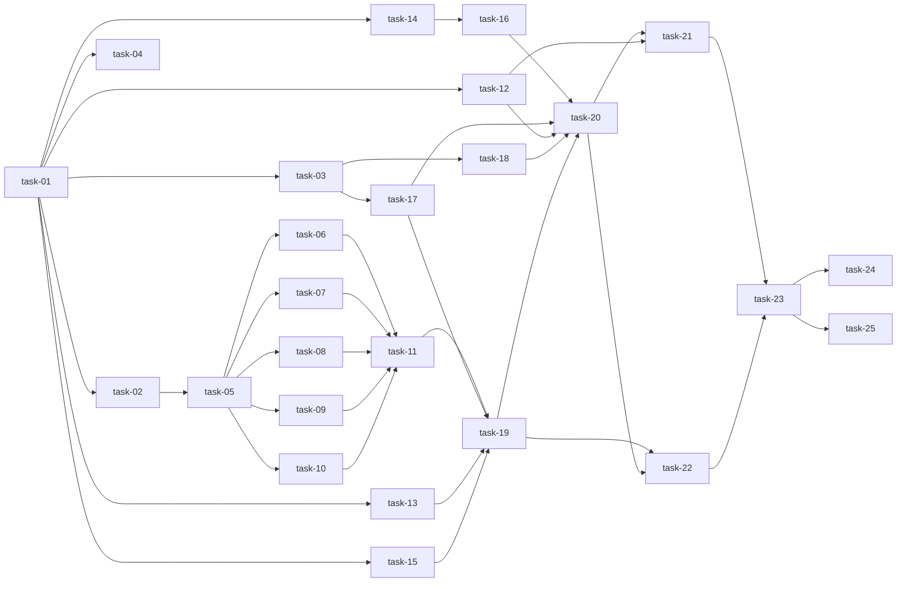

# 实现计划

> 变更：`2026-06-13-daemon-nodejs-rewrite`
> 方案：方案B（协议抽象 + Wave 增量交付）
> 任务来源：`tasks.md`（T-W0-01..T-W5-05）→ 本文展开为 `task-01..task-25`
> 设计依据：`design.md`（§5.2 Wave 路线图、§6 文件变更清单、§7 接口定义）
> 模块依赖依据：`.sillyspec/docs/sillyhub-daemon/modules/_module-map.yaml`

---

## Spike 前置验证

**结论：不需要独立 Spike Wave。** 理由：

- 协议抽象方案 B 确定性高——已有 Python 版 `AgentBackend(ABC)` + `get_backend()` 骨架可逐结构参考，重写是「结构升级」而非「技术探险」。
- Node 运行时栈（原生 `fetch` / `ws` / `commander` / `node:test`→`vitest`）均为成熟技术，无未经验证的集成。
- 两个 P0 风险（R-01 协议解析翻译偏差、R-02 契约漂移）已在 design 内置应对：**1:1 复用 Python 测试 fixture**（W1 每个 adapter 吃下同款样本产出等价 AgentEvent）+ **protocol.ts 从 backend protocol.py 逐字拷贝 + 契约单测断言**（W3）。这些是任务内验证，不构成独立 Spike。

技术不确定性的小颗粒（stdin 自动批准 R-03、stdout 背压 R-04）下沉到 `task-06`（stream_json adapter，最复杂）与 `task-19`（TaskRunner 子进程流）的验收用例中就地验证。

---

## Wave 执行语义

> Wave 划分对齐 design.md §5.2 路线图，是**交付阶段**而非纯并行批次。

- **Wave 间为 barrier**：每 Wave 全部任务完成 + `tsc` 零错误 + 该 Wave 单测全绿（G-04）才推进下一 Wave。
- **Wave 内按 depends_on 拓扑顺序执行**：同 Wave 内存在 depends_on 时，先完成被依赖任务再执行下游（不强求 Wave 内并行）。各 Wave 内关键顺序：
  - **W0**：task-01（工程骨架）先行 → task-02/03/04 可并行
  - **W1**：task-05（adapter 接口）先行 → task-06/07/08/09/10（5 adapter）并行 → task-11（工厂收敛）
  - **W2**：task-14（version）先行 → task-16（agent-detector）；task-12/13/15 与 task-14 并行
  - **W3**：task-17（REST）/ task-18（WS）并行
  - **W4**：task-19（TaskRunner）→ task-20（Daemon）
  - **W5**：task-21（CLI）/ task-22（测试迁移）并行 → task-23（真实冒烟，删 Python 前置门槛）→ task-24（删 Python）/ task-25（Docker 切换）并行
- **无循环依赖**：25 个任务基于 depends_on 拓扑可全部线性排序（已验证，关键路径见下文）。

---

## Wave 0 — 项目骨架（无依赖）

- [x] task-01: Node 工程初始化（package.json + tsconfig strict + vitest.config.ts）
- [x] task-02: 共享类型定义（src/types.ts：AgentEvent / TaskResult / DaemonMessage / Lease payload）
- [x] task-03: 协议常量定义（src/protocol.ts，对齐 backend protocol.py）
- [x] task-04: 测试脚手架（tests/ + fixture 目录复用 Python 样本）

## Wave 1 — 协议抽象层 ★（方案B 核心，依赖 W0）

- [x] task-05: ProtocolAdapter 接口 + AgentEvent IR（src/adapters/protocol-adapter.ts）
- [x] task-06: stream_json adapter（src/adapters/stream-json.ts，claude/gemini/cursor）
- [x] task-07: json_rpc adapter（src/adapters/json-rpc.ts，codex/hermes/kimi/kiro）
- [x] task-08: jsonl adapter（src/adapters/jsonl.ts，copilot）
- [x] task-09: ndjson adapter（src/adapters/ndjson.ts，opencode/openclaw/pi）
- [x] task-10: text adapter（src/adapters/text.ts，antigravity）
- [x] task-11: 工厂 + provider→protocol 映射（src/adapters/index.ts，getBackend + PROTOCOL_PROVIDERS）

## Wave 2 — 基础设施（与 W1 并行，依赖 W0）

- [x] task-12: config（src/config.ts，DaemonConfig + config.json）
- [x] task-13: credential（src/credential.ts，0600 + `{{USER_*}}` 渲染）
- [x] task-14: version（src/version.ts，semver 解析与最低版本校验）
- [x] task-15: workspace（src/workspace.ts，git mirror/pull/diff + Windows rmtree）
- [x] task-16: agent-detector（src/agent-detector.ts，12 provider 探测，依赖 version）

## Wave 3 — 通信层（依赖 W2）

- [x] task-17: HubClient REST（src/hub-client.ts，lease 生命周期端点，原生 fetch）
- [x] task-18: WsClient（src/ws-client.ts，5s 重连 + HTTP 轮询兜底，ws 库）

## Wave 4 — 编排层（依赖 W1 + W3）

- [x] task-19: TaskRunner（src/task-runner.ts，编排链 + 子进程执行 spawn）
- [x] task-20: Daemon 主类（src/daemon.ts，register/心跳/事件分发/lease 状态机）

## Wave 5 — CLI + 冒烟 + 收尾（依赖 W4）

- [x] task-21: CLI（src/cli.ts，commander：start/stop/status/logs）
- [x] task-22: 测试迁移（tests/**/*.test.ts，1:1 迁移 16 个 Python 测试文件）
- [x] task-23: 真实 backend 冒烟（task_available→claim→start→messages→complete+patch）✅ PASSED 2026-06-14
- [x] task-24: 删除 Python 源码（sillyhub_daemon/** + pyproject.toml）✅ DONE 2026-06-14
- [x] task-25: Docker / 构建切换 — N/A（daemon 未容器化）✅ 2026-06-14

---

## 任务总表

| 编号 | 任务 | Wave | 优先级 | 依赖 | 说明 |
|---|---|---|---|---|---|
| task-01 | Node 工程初始化 | W0 | P0 | — | package.json（dep: ws/commander，devDep: typescript/vitest/@types/ws/node）、tsconfig strict(target ES2022/module NodeNext)、vitest.config.ts |
| task-02 | 共享类型定义 | W0 | P0 | task-01 | AgentEvent/TaskResult/DaemonMessage/Lease payload；TS interface + 联合类型，对应 Python dataclass |
| task-03 | 协议常量定义 | W0 | P0 | task-01 | MSG_* 消息类型 + STATE_* 任务状态常量，从 backend protocol.py 逐字拷贝 |
| task-04 | 测试脚手架 | W0 | P0 | task-01 | tests/ 目录 + fixture/（复用 Python tests 样本文件） |
| task-05 | ProtocolAdapter 接口 + IR | W1 | P0 | task-02 | 方案B 核心：parse(line)→AgentEvent[] + onControl?(stdin) 可选；拆开「执行」与「解析」两职 |
| task-06 | stream_json adapter | W1 | P0 | task-05 | claude/gemini/cursor；assistant/user/system/result/control_request；含 stdin 自动批准（R-03） |
| task-07 | json_rpc adapter | W1 | P0 | task-05 | codex/hermes/kimi/kiro；JSON-RPC 2.0 stdio（method/params/id） |
| task-08 | jsonl adapter | W1 | P0 | task-05 | copilot；点分事件名（session.start / tool_use 等） |
| task-09 | ndjson adapter | W1 | P0 | task-05 | opencode/openclaw/pi；简单事件（type/part） |
| task-10 | text adapter | W1 | P0 | task-05 | antigravity；非空行即 text event |
| task-11 | 工厂 + provider 映射 | W1 | P0 | task-06,07,08,09,10 | getBackend 懒加载 + PROTOCOL_PROVIDERS；未知 provider 抛错 |
| task-12 | config | W2 | P0 | task-01 | DaemonConfig：server_url/token/runtime_id/workspace_dir/poll_interval；JSON 持久化 + 自动创建目录 |
| task-13 | credential | W2 | P0 | task-01 | `{{USER_*}}` 渲染（credentials.json > env）+ fs.chmod(0o600)，Windows 降级警告 |
| task-14 | version | W2 | P0 | task-01 | parse_semver / format_semver / check_min_version |
| task-15 | workspace | W2 | P0 | task-01 | git mirror/pull --ff-only/collect diff；Windows rmtree 错误处理 |
| task-16 | agent-detector | W2 | P0 | task-14 | 12 provider 探测：env 覆盖→PATH 查找→标记不可用；--version + 最低版本校验 |
| task-17 | HubClient REST | W3 | P0 | task-03 | register/claim/start/heartbeat/submit_messages/complete；原生 fetch，trust_env=false 语义 |
| task-18 | WsClient | W3 | P0 | task-03 | ws 连接 /api/daemon/ws?runtime_id=xxx；5s 退避重连 + HTTP 轮询兜底 |
| task-19 | TaskRunner | W4 | P0 | task-11,17,13,15 | 编排链：workspace→CLAUDE.md→credential→adapter→spawn+逐行parse→submit→diff；子进程 stdout 背压（R-04） |
| task-20 | Daemon 主类 | W4 | P0 | task-16,17,12,03,18,19 | start/stop/三循环（heartbeat/poll/ws）；task_available→TaskRunner；CancelledError 优雅退出映射 |
| task-21 | CLI | W5 | P0 | task-20,12 | commander：start(--server/--token)/stop(SIGTERM)/status/logs；PID 文件 + 日志文件路径不变 |
| task-22 | 测试迁移 | W5 | P0 | task-01..task-20 | 1:1 迁移 16 个 Python 测试文件到 vitest；行为覆盖等价（不追求行数 1:1） |
| task-23 | 真实 backend 冒烟 | W5 | P0 | task-21,22 | 手动一次完整 lease（claim→start→messages→complete+patch）对真实 backend |
| task-24 | 删除 Python 源码 | W5 | P0 | task-23 | sillyhub_daemon/** + pyproject.toml；仅在 task-23 冒烟通过后 |
| task-25 | Docker / 构建切换 | W5 | P1 | task-23 | daemon 镜像基础镜像 Python→Node（如 deploy/docker-compose 涉及） |

> Wave 依赖：`W0 → (W1 ‖ W2) → W3 → W4 → W5`，与 module-map 实测依赖一致。
> 任务数为 25（超出 full 模板「15 个以内」通用建议）：daemon 完整重写需 5 个协议 adapter（W1）+ 5 个基础设施（W2）独立成任务以保持粒度均匀（单任务 ≤ 8h、依赖清晰），属本项目合理例外。

---

## 依赖关系图

---

## 关键路径

`task-01 → task-02 → task-05 → task-06 → task-11 → task-19 → task-20 → task-21 → task-23`

（最长串行链：工程骨架 → 类型 IR → adapter 接口 → 最复杂 adapter（stream_json）→ 工厂收敛 → TaskRunner 编排 → Daemon 生命周期 → CLI → 真实冒烟。决定整个重写的最短交付周期，约 30h 串行工时。）

---

## 全局验收标准

- [ ] **G-01 功能等价**：Node 版与 Python 版对外行为 1:1（agent 执行 / 消息流 / diff 收集 / lease 生命周期）
- [ ] **G-02 契约不变**：`protocol.ts` 常量与 `backend/app/modules/daemon/protocol.py` 逐字一致；契约单测断言全部消息类型；真实冒烟走通完整 lease
- [ ] **G-03 协议可扩展**：W1 之后用 mock adapter 验证「新增协议零侵入编排层」
- [ ] **G-04 增量可交付**：每 Wave `tsc` 编译零错误 + `vitest` 该 Wave 单测全绿即可推进
- [ ] **G-05 零/少依赖**：`dependencies` 仅 `ws` / `commander`，HTTP 用原生 `fetch`
- [ ] **类型安全**：TypeScript strict 模式，`tsc` 零错误
- [ ] **测试迁移**：16 个 Python 测试文件用例 1:1 迁移到 vitest，行为覆盖等价
- [ ] **可回退**：Python 版 `sillyhub_daemon/` 保留至 task-23 冒烟通过；task-24 删除为其后置门槛
- [ ] **跨平台**：POSIX credential 0600；Windows 权限操作降级警告不中断
- [ ] **未上线免责**：数据可清空，无版本迁移 / 双写 / 灰度

---

## 风险应对映射（来自 design §10，落实到任务）

| 风险 | 等级 | 落实任务 |
|---|---|---|
| R-01 协议解析翻译偏差 | P0 | task-06..10（1:1 复用 Python fixture）+ task-11（工厂单测）+ task-22（测试迁移） |
| R-02 WS 契约漂移 | P0 | task-03（逐字拷贝）+ task-17/18（契约单测）+ task-23（真实冒烟） |
| R-03 stdin control_request hang | P1 | task-06（onControl 建模）+ task-19（stdin 不关闭 + 看门狗） |
| R-04 stdout 背压/编码 | P1 | task-19（readline 切行）+ task-22（跨行 JSON/空行/非 UTF-8 用例） |
| R-05 0600 跨平台 | P2 | task-13（fs.chmod + Windows 降级） |
| R-06 git 子进程错误 | P2 | task-15 + task-22 |
| R-07 Python/Node 并存构建混乱 | P2 | task-24/25（W5 单点切换，删除 Python） |
| R-08 vitest/pytest 语义对齐 | P2 | task-22（行为覆盖 1:1，非行数 1:1） |
