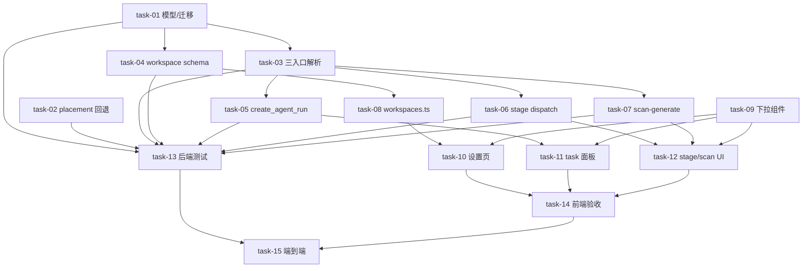

# Plan — Agent Runtime Selection

> 变更：`2026-06-14-agent-runtime-selection`
> 来源：design.md（§5 总体方案 / §6 文件清单 / §7 接口 / §10 风险）+ requirements.md（FR-01~FR-08）+ tasks.md（T1~T15）
> 前置：`2026-06-14-unified-agent-execution`（daemon 唯一执行路径，已归档）

## 复杂度判定

**plan_level = full**。15 个 task > 8；跨 workspace / agent / change / frontend 4 个模块；涉及 DB 迁移 + agent 调度逻辑（placement 回退、三入口 provider 解析）。

## R-05 存疑点结论（plan 阶段确认，消除 design.md 风险）

scan-generate provider 注入点已通过代码调研精确化（design.md §6.1 标注 ⚠️ 现已闭合）：

- **request schema**：`backend/app/modules/workspace/schema.py` 的 `ScanGenerateRequest`（L53，现仅 `root_path`）→ 增 `provider: str | None = None`
- **HTTP 入口**：`backend/app/modules/workspace/router.py` 的 `scan_generate`（L71）→ 把 `payload.provider` 透传 `service.scan_generate(..., provider=...)`
- **service**：`backend/app/modules/workspace/service.py` 的 `WorkspaceService.scan_generate`（L765）→ 增 `provider` 形参，透传 `start_scan_dispatch(..., provider=...)`
- **dispatch 注入**：`AgentService.start_scan_dispatch`（L786，T3 覆盖）→ 解析 provider 后透传 `dispatch_to_daemon(provider=...)`

> stage 手动 dispatch 同理：`change/router.py` 的 `manual_dispatch`（L544）当前**无 request body schema**（裸端点）。T6 需新增一个轻量 request schema（`ManualDispatchRequest{provider?: str}`）以接收显式 provider；自动调度链路（`auto_dispatch_next_step`）不传 provider，由 `start_stage_dispatch` 内部读 workspace.default_agent 兜底（FR-04 / R-03）。

## 模块依赖分析（来自 _module-map.yaml）

- `workspace`（加 `default_agent` 列）→ 被依赖：worktree(FK)、change(M2N)、task(M2N)、agent(M2N)。加 nullable 列无破坏性。
- `agent`（三入口读 default_agent + placement 回退）→ 被依赖：change(dispatch.py)、change_writer(router.py)。
- `change`（dispatch 透传 provider + manual_dispatch request schema）→ 被依赖：agent、archive、change_writer、task。
- 前端 lib/app：依赖后端 API 契约（Wave 2/3 产出）。

关键事实（plan 锚定）：
- placement `_get_online_runtime`（placement.py:285）**已有 provider 参数**（条件 `AND provider = :provider`），但 provider 给定且无在线 runtime 时**直接返回 None**——T2 要在此处加"回退任意在线 + warn"逻辑。
- agent/service.py 三入口（`start_run`:154 / `start_stage_dispatch`:530 / `start_scan_dispatch`:786）**都已 `self._session.get(Workspace, workspace_id)`**（读 repo_url/default_branch），加 `provider or workspace.default_agent` 解析无障碍。
- `decide_backend`（placement.py:76）只判 `_has_online_runtime`，与 provider 解耦——**不改**（design 非目标）。
- daemon 零改动（`_registeredRuntimes` 多 runtime + lease.metadata provider 传播已就绪，design §6.3）。

---

## Wave 分组（拓扑排序，同 Wave 内无依赖可并行）

> 每个任务的完整蓝图见 `tasks/task-NN.md`（execute 子代理只读那一个文件即可干活）。此处仅列 Wave 编排、模块与依赖。

### 🌊 Wave 1 — 无依赖基础层（模型 / placement / 前端共享组件）

> 前置：无。三个任务互相独立，可全并行。task-01 产出模型列，task-02 产出 placement 回退，task-09 产出前端下拉组件。

- [x] task-01: 数据模型 + Alembic 迁移：`Workspace.default_agent` 列 — 模块 workspace — depends_on: 无
- [x] task-02: placement provider 严格优先 + 无在线回退 + 告警 — 模块 agent — depends_on: 无
- [x] task-09: provider 下拉共享组件 AgentProviderSelect — 模块 frontend_components — depends_on: 无

### 🌊 Wave 2 — 依赖 task-01 的核心层（三入口解析 / workspace schema）

> 前置：task-01（需要 default_agent 列存在）。task-03 是本变更核心，task-04 并行做 schema。

- [x] task-03: 三入口 provider 解析（显式 > workspace.default_agent > None）并透传 dispatch_to_daemon — 模块 agent — depends_on: task-01
- [x] task-04: workspace schema 增 default_agent（Create/Update/Read）+ exclude_unset — 模块 workspace — depends_on: task-01

### 🌊 Wave 3 — 依赖 task-03/task-04 的透传层（三入口 HTTP 契约 + 前端 lib）

> 前置：task-03（解析逻辑就位）、task-04（workspace API 契约）。task-05/06/07 并行做后端透传，task-08 并行做前端 lib。

- [x] task-05: AgentRunCreate + create_agent_run 透传 provider — 模块 agent — depends_on: task-03
- [x] task-06: stage 手动 dispatch 入口支持 provider（新增 ManualDispatchRequest）— 模块 change — depends_on: task-03
- [x] task-07: scan-generate 入口支持 provider（R-05 闭合）— 模块 workspace — depends_on: task-03
- [x] task-08: workspaces.ts Workspace 接口增 default_agent + updateWorkspace(PATCH) — 模块 frontend_lib — depends_on: task-04

### 🌊 Wave 4 — 依赖 Wave 3 的 UI + 后端测试

> 前置：task-05/06/07（后端契约）、task-08/09（前端 lib/组件）。task-10/11/12 并行做触发面板 UI，task-13 并行写后端测试。

- [x] task-10: workspace 设置页 — 默认 Agent 下拉 + 保存 — 模块 frontend_app — depends_on: task-08, task-09
- [x] task-11: task 触发面板 — agent 下拉（默认联动 workspace.default_agent）— 模块 frontend_app — depends_on: task-05, task-09
- [x] task-12: stage 手动 dispatch + scan 触发 — agent 下拉 — 模块 frontend_app — depends_on: task-06, task-07, task-09
- [x] task-13: 后端测试 — placement 回退 / provider 解析 / 三入口透传 / API schema — 模块 测试(agent/workspace/change) — depends_on: task-01~task-07

### 🌊 Wave 5 — 前端验收

> 前置：task-08~12（前端全部完成）。

- [x] task-14: 前端测试 / typecheck + 手动验收 — 模块 frontend — depends_on: task-08~task-12

### 🌊 Wave 6 — 端到端验收

> 前置：task-13（后端测试绿）、task-14（前端验收绿）。

- [x] task-15: 端到端多 provider 全链路验收 — 模块 全链路 — depends_on: task-13, task-14（单测覆盖 FR-01~04 + 前端编译覆盖 FR-05/07/08 + daemon 零 diff 覆盖成功标准 6 已完成；真实多 daemon 端到端跑批留待运行时环境，详见 verify-result.md 发现 3）

> daemon：无任务（零改动，design §6.3 已确认链路就绪）。

---

## 依赖关系图（Mermaid）

## 关键路径

**task-01 → task-03 → task-05 → task-11 → task-14 → task-15**（6 Wave，最长链）。

- 任何一环延期都会推迟 task-15（端到端验收）。
- 次长链：task-01 → task-04 → task-08 → task-10 → task-14 → task-15（同样 6 Wave）。
- task-02 / task-09 在 Wave 1 但不阻塞关键路径末端（task-02 只到 task-13→task-15；task-09 到 task-10/11/12→task-14→task-15，与关键路径同长但汇入点靠后）。

---

## 任务总表（含模块依赖与 Wave）

| task | 模块 | 核心文件 | depends_on | Wave |
|---|---|---|---|---|
| task-01 | workspace | model.py + 迁移 | — | 1 |
| task-02 | agent | placement.py | — | 1 |
| task-09 | frontend_components | AgentProviderSelect.tsx | — | 1 |
| task-03 | agent | service.py（三入口） | task-01 | 2 |
| task-04 | workspace | schema.py | task-01 | 2 |
| task-05 | agent | schema.py + router.py | task-03 | 3 |
| task-06 | change | dispatch.py + router.py + schema.py | task-03 | 3 |
| task-07 | workspace | schema/router/service | task-03 | 3 |
| task-08 | frontend_lib | workspaces.ts | task-04 | 3 |
| task-10 | frontend_app | workspaces/[id]/page.tsx | task-08, task-09 | 4 |
| task-11 | frontend_app | tasks/[tid]/page.tsx + agent.ts | task-05, task-09 | 4 |
| task-12 | frontend_app | changes/[cid]/page.tsx + scan-dialog | task-06, task-07, task-09 | 4 |
| task-13 | 测试 | placement/agent/workspace/change tests | task-01~07 | 4 |
| task-14 | frontend | typecheck/build + 手动 | task-08~12 | 5 |
| task-15 | 全链路 | 端到端 | task-13, task-14 | 6 |

> 6 个 Wave 由拓扑排序严格推导（同 Wave 内任务无 depends_on 关系，可并行；循环依赖检查通过，无环）。

### 跨 Wave 文件复用提示（一致性审查留痕，execute 注意）

以下文件被多个任务（不同 Wave）修改，**改的是同文件的不同类/函数**，按 Wave 顺序串行执行无冲突，execute 阶段须后置任务基于前置任务的产物：

| 文件 | 复用任务 | 各自改动 |
|---|---|---|
| `backend/app/modules/workspace/schema.py` | task-04 (W2), task-07 (W3) | task-04: WorkspaceCreate/Update/Read 增 default_agent；task-07: ScanGenerateRequest 增 provider |
| `backend/app/modules/workspace/service.py` | task-04 (W2), task-07 (W3) | task-04: update 确认 exclude_unset；task-07: scan_generate 增 provider 形参 |
| `frontend/src/lib/workspaces.ts` | task-08 (W3), task-12 (W4) | task-08: Workspace 接口 + updateWorkspace；task-12: ScanGenerateInput 增 provider |

> 同 Wave 内无任何文件重叠（已核对全部 6 个 Wave）。execute 按 Wave 1→6 顺序、同 Wave 内并行即可。

## 验收标准（对照 requirements.md FR-01~FR-08 + design 成功标准 1~6）

- FR-01（workspace 持久化默认 agent）→ task-04 + task-13
- FR-02（provider 解析优先级）→ task-03 + task-13
- FR-03（placement 严格匹配 + 回退）→ task-02 + task-13
- FR-04（自动调度用默认 agent）→ task-03（内部读 default_agent）
- FR-05（task 触发显式 provider）→ task-05 + task-11
- FR-06（stage/scan 显式 provider）→ task-06 + task-07 + task-12
- FR-07（workspace 设置页下拉）→ task-10
- FR-08（触发面板下拉联动）→ task-11 + task-12
- 成功标准 1（NULL 行为不变）→ task-02/03 维持现状分支 + task-13
- 成功标准 6（daemon 无感知）→ task-15 验证 daemon 无 diff

## 风险与对策（继承 design §10）

| 编号 | 风险 | 对策（落到 task） |
|---|---|---|
| R-01 | 回退掩盖配置错误 | task-02 warning；task-09/10 下拉标注 offline provider |
| R-02 | 同 provider 多 runtime | task-02 维持 ORDER BY last_heartbeat（provider 维度） |
| R-03 | 自动调度漏传 provider | task-03 provider 解析下沉到 start_stage_dispatch 内部 |
| R-04 | 前端下拉数据滞后 | task-09 打开时即时拉取 listDaemonRuntimes |
| R-05 | scan-generate 注入点 | ✅ plan 已闭合（见顶部 R-05 结论），task-07 |
| R-06 | default_agent 拼写错误 | task-09 下拉只列在线 provider；后端容忍未知 provider 回退兜底 |
