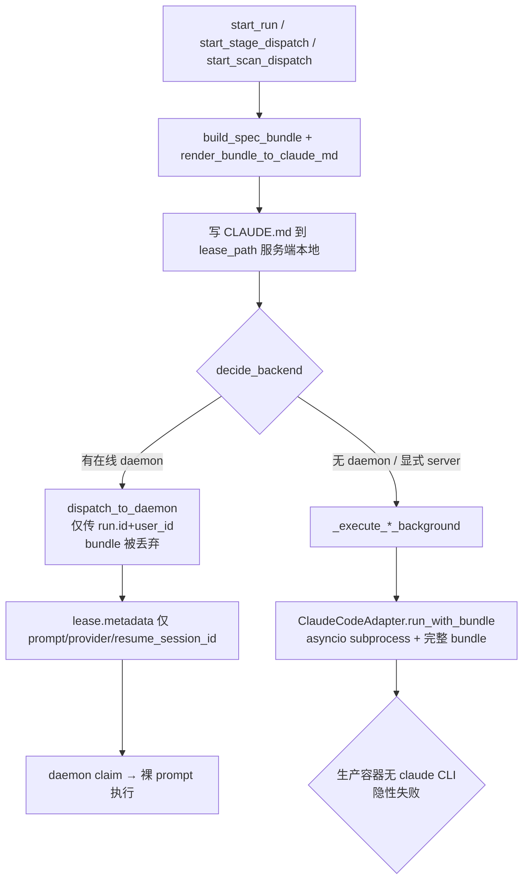
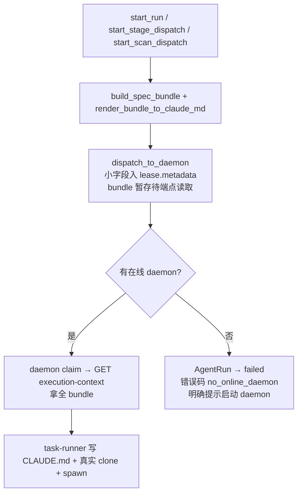

# Design — 统一 Agent 执行路径（Daemon-Only）

## 1. 背景 / 问题

SillyHub 当前存在**两条** Agent 执行路径，由 `RunPlacementService.decide_backend()` 分叉：

- **DAEMON 路径**：`decide_backend` → `dispatch_to_daemon` → INSERT `daemon_task_leases`（status=pending）→ WS 唤醒 → Node.js daemon 轮询/WS claim → `task-runner.ts` spawn claude 子进程 → `submit_messages`/`complete_lease` 回报。
- **SERVER 路径**（fallback）：`decide_backend` → `_execute_*_background` → `ClaudeCodeAdapter.run_with_bundle` → `asyncio.create_subprocess_exec` spawn claude → Redis pub/sub。

经源码核实，存在两层问题：

| 层 | 性质 | 证据 |
|---|---|---|
| 协议机械层 | **真重复** | `claude_code.py:_build_claude_command` 与 `stream-json.ts:buildArgs` 产出的 claude 启动参数字节级相同（`-p --output-format stream-json --input-format stream-json --verbose --permission-mode bypassPermissions`）；`_build_stream_input` 与 `buildInput` 的 stdin payload 格式相同；Python `_parse_*` 与 Node `parse` 是两份解析器。 |
| 上下文层 | **缺口（非重复）** | `service.py:315` `dispatch_to_daemon(run.id, user_id)` **不传 bundle**；`daemon/service.py:_build_claim_payload` **不填** `claudeMd/repoUrl/branch/allowed_paths`；daemon 两条流（poll `daemon.ts:441`、WS `daemon.ts:629`）都只从 claim payload 取上下文，**无**额外 fetch。结果：DAEMON 实际只有裸 prompt，而 SERVER 有完整 bundle（`render_bundle_to_claude_md` 渲染的 CLAUDE.md + repo_url/branch/allowed_paths）。 |

附带痛点：
- SERVER 模式在生产环境**无效**（后端容器无 claude CLI），却作为静默 fallback 存在，产生"看似成功实则失败"的隐性故障。
- 凭据分散：daemon 用 `credentials.json`，SERVER 用环境变量。
- 状态机割裂：lease 生命周期（pending/claimed/expired/cancelled）与 `AgentRun.status`（pending/running/completed/failed/killed）各自演进，靠 `sync_agent_run_status` 事后对账。

## 2. 目标 / 非目标

**目标**
1. 消除协议机械层重复——claude 命令构建 / stdin / 解析逻辑只存在一处（Node daemon）。
2. 补齐上下文层缺口——daemon 获得与原 SERVER 路径等价的完整 bundle 上下文。
3. 状态机单一化——lease 成为 `AgentRun` 的唯一执行载体。
4. "好用、好迭代"——未来改 claude 调用契约只改 daemon 一处；改上下文只改后端一处。

**非目标**
- 不改 claude CLI 本身的调用语义（仍是 stream-json NDJSON 协议）。
- 不重做 daemon-nodejs-rewrite 已交付的 lease/claim/heartbeat 机制（保留复用）。
- 不做 SERVER→DAEMON 的灰度/双跑过渡（用户授权：未上线、数据可清空、无需兼容）。

## 3. 现状分析（数据流）

### 3.1 现状（两条路径并存）



**问题点**：① E 处 bundle 丢弃；② G 处 daemon 裸 prompt；③ H→J 生产失败；④ I 与 G 协议逻辑重复。

### 3.2 目标（Daemon-Only 单路径）



## 4. 方案概览：Daemon-Only

删除 SERVER 子进程执行路径，daemon 成为唯一执行者；新增 execution-context 端点把原 SERVER 的 bundle 上下文透传给 daemon；kill 与状态机收口到 lease。

### 备选方案对比（决策记录）

| 方案 | 命中痛点数 | 结论 |
|---|---|---|
| **A. Daemon-Only**（本设计） | 4/4 | ✅ 采纳 |
| B. Server-Only（杀 daemon，后端装 claude） | 1（仅重复） | ❌ 与生产现实冲突（容器无 claude）、推翻 25/25 daemon 重写、丢失本机执行能力 |
| C. 共享契约源（双路径 + SSOT 同步） | 1（仅命令重复） | ❌ 凭据/状态机/无效 fallback 三痛点未解，且新增契约同步负担违 YAGNI |

## 5. 详细设计（按 Phase）

### Phase 1 — 后端：移除 SERVER 执行路径
- 删除 `backend/app/modules/agent/adapters/claude_code.py` 中 `_build_claude_command`、`_build_stream_input`、`_exec_stream`、`_parse_stream_events`、`_format_conversation_log`、`_extract_result_metadata`，以及 `run_with_bundle`/`run` 的 subprocess 实现（保留 `AgentAdapter` 抽象基类于 `base.py`，作为未来扩展点）。
- 删除 `AgentService._execute_run_background` / `_execute_stage_run` / `_execute_scan_run`（`service.py:348 / 970 / 1341`）三条 SERVER 执行体。
- 删除 `AgentService._proc_registry`（`service.py:143`）与 `kill_run` 中的 SIGTERM→5s→SIGKILL 链（`service.py:487-543`）。
- 删除 `RunPlacementService.dispatch_to_server`（`placement.py:193`）。
- `RunPlacementService.decide_backend` 简化：移除 `ExecutionBackend.SERVER` 分支与 `preferred_backend="server"` 支持；无在线 daemon 时抛新异常 `NoOnlineDaemonError`（携带 workspace_id / user_id），上层捕获后将 `AgentRun` 置 `failed` + `error_code="no_online_daemon"` + 用户可读消息「未检测到在线 daemon，请启动 sillyhub-daemon 后重试」。

### Phase 2 — 后端：上下文补齐（execution-context 端点）
- 新增 `GET /agent-runs/{run_id}/execution-context`（`agent/router.py`），返回：
  ```json
  {
    "agent_run_id": "...",
    "claude_md": "<render_bundle_to_claude_md(bundle)>",
    "prompt": "...",
    "provider": "claude",
    "resume_session_id": "...",
    "repo_url": "...",
    "branch": "...",
    "allowed_paths": ["..."],
    "tool_config": {...},
    "session_id": "..."
  }
  ```
  - 内部复用 `context_builder.build_spec_bundle` / `build_scan_bundle` + `render_bundle_to_claude_md`（单一上下文真相源，签名不变）。
- `dispatch_to_daemon` 签名扩展（新增关键字参数 `repo_url`、`branch`、`allowed_paths`、`tool_config`），写入 `lease.metadata`。**CLAUDE.md 不入 lease.metadata**（可达数十 KB，避免 JSON 列膨胀），由端点按需 fetch。
- `DaemonService._build_claim_payload`（`daemon/service.py:304`）补充透传 `repo_url/branch/allowed_paths/tool_config`（从 lease.metadata 读）。

### Phase 3 — 后端：kill / 状态机收口
- `kill_run` 改道：查 `agent_run_id` 对应的活跃 lease → 调 `DaemonLeaseService.cancel_lease(agent_run_id)`（`lease_service.py:280`，已存在且签名匹配）→ daemon 经 WS/poll 感知 → task-runner SIGTERM 子进程。移除 `_proc_registry`。
- 状态映射单一化（由 daemon 侧 `sync_agent_run_status` `daemon/service.py:667` 驱动，已是既有机制）：

  | lease.status | AgentRun.status |
  |---|---|
  | claimed（start 后） | running |
  | completed | completed |
  | expired | failed |
  | cancelled | killed |

- diff 收集收口：task-runner `collectDiff` → `complete_lease` 上报（既有），作为唯一 diff 来源；移除 SERVER 侧 diff collector。

### Phase 4 — sillyhub-daemon：补齐上下文 fetch
- `daemon.ts:_runLeaseStateMachine`（`daemon.ts:592`）在 claim（step 1）后、execute（step 3）前新增一步：`GET /agent-runs/{agentRunId}/execution-context`，填充 `LeaseCtx.claudeMd/repoUrl/branch/allowedPaths/toolConfig`（当前 `daemon.ts:629-649` 这些字段恒 undefined）。
- task-runner 步骤 2「claudeMd 非空则写 `${workDir}/.claude/CLAUDE.md`」（`task-runner.ts:262`）补齐后真正生效。
- `prepareWorkspace(wsName, repoUrl, branch)`（`task-runner.ts:259`）拿到真实 repoUrl/branch 后真正 clone，退役 `repoUrl ?? undefined` / `branch ?? 'main'` 兜底。
- `HubClient` 新增 `getExecutionContext(agentRunId)` 方法（沿用既有 REST prefix 与鉴权）。

### Phase 4.5 — daemon 功能补齐与增强

**设计原则**：daemon 成为唯一执行者后，必须 ≥ 原 SERVER 路径能力——「删旧 + 最小补齐」不够。本 Phase 先**逐项核实**现有 daemon 链路与 SERVER 路径的能力对等性（很多链路已存在，需确认而非臆断缺口），再补真实缺口，最后叠加合理增强。

#### A. 能力对齐核实（每项：SERVER 侧实现 → daemon 侧现状 → 差距 → 处置）

**A1. 实时流推送** — ✅ 链路已等价（无需补，仅可优化）
- SERVER：`_exec_stream` 逐行 parse stream-json event → `redis.publish(f"agent_run:{run_id}", msg)`（`claude_code.py:540/551/725/752/786`）。
- daemon：task-runner `readline` 逐行 → `submitMessages` → 后端 `DaemonService.submit_messages`（`daemon/service.py:550`）**已 publish `f"agent_run:{agent_run_id}"`**（`daemon/service.py:612-615`），payload 含 `event/messages/count/agent_run_status`。
- 差距：前端订阅**同一 channel** 即可拿实时流，**语义等价**。唯一差异：daemon 多一跳 HTTP（每批 message 一次 POST），高频输出时延迟/开销略高于 SERVER 的进程内直发。
- 处置：**保留**。作为增强项 B8（流式合并/批次）择机优化，不阻塞对齐。

**A2. session metadata 提取（cost / timing / tokens）** — ⚠️ 链路在，需核实上报完整性
- SERVER：`_extract_result_metadata`（`claude_code.py:161`）聚合 `total_cost_usd/duration_ms/duration_api_ms/num_turns/input_tokens/output_tokens/session_id`，且从多 message 的 `usage` 字段**累加聚合** input/output_tokens（`claude_code.py:196-233`）。
- daemon：adapter `extractResultStats`（`stream-json.ts:495-513`）已收集 `total_cost_usd/total_duration_ms/total_api_duration_ms/usage/num_turns/duration_ms`，挂在 `complete` event 的 `metadata.stats`（`stream-json.ts:338`）；后端 `complete_lease`（`daemon/service.py` ~480）已写回 `AgentRun.total_cost_usd/duration_ms/input_tokens/output_tokens/session_id/exit_code`。
- 差距：① **需核实** task-runner `_finish` 是否把 `stats` 透传进 `complete_lease` 的 `result.stats`——当前 `daemon.ts:662` 只传 `durationMs`，stats 上报链路**可能断点**；② `extractResultStats` 只**原样存 `usage` 对象**，不像 SERVER 那样拆 `input_tokens/output_tokens` 并跨 message 累加。
- 处置：**核实 + 补**。A2-1：task-runner 把 `lastResultInfo.stats` 透传到 `complete_lease` result.stats；A2-2：adapter 层拆 usage 为 `input_tokens/output_tokens` 并累加（对齐 SERVER `_extract_result_metadata` 聚合策略）。

**A3. conversation log 格式化** — ⚠️ 形态不同，按前端依赖定
- SERVER：`_format_conversation_log`（`claude_code.py:306`）把 stream events 转**人可读汇总文本**（含 role/content/cost_info 行），存 `AgentRun.output_redacted`（`claude_code.py:846`）。
- daemon：逐行 message 写 `AgentRunLog`（`content_redacted[:5000]`，`daemon/service.py:572-578`），task-runner 另在 `outputParts` 累积原始拼接（`task-runner.ts:355`）存入 `output_redacted`。**无**等价的「按 turn 分段 + cost_info」汇总。
- 差距：daemon 是**结构化 log 行**，SERVER 是**汇总文本**。若前端依赖汇总文本形态则缺口；若前端基于 AgentRunLog 重建则等价。
- 处置：**核实前端消费形态**。若需汇总：daemon 在 `complete_lease` 时由 `outputParts` 生成汇总文本（cost_info 由 stats 拼），写入 `output_redacted`，对齐 SERVER 字段语义。

**A4. diff collector 完整能力** — ❌ **确认真实缺口（R-06 解除）**
- SERVER：`collect_diff`（`diff_collector.py`）= `git diff --shortstat` + `git diff` + **`redact_output`**（敏感内容脱敏）+ **50KB 截断** + `stat_summary` + `files_changed/insertions/deletions` 解析（`_STAT_PATTERN`）。
- daemon：`collectDiff`（`workspace.ts:156-181`）= `git diff --shortstat` + `git diff`，`patch` 字段为**原始 diff，无 redact、无 50KB 截断、无 stat_summary**（stats 仅存 shortstat 原文）。
- 差距：❌ 三项缺失——① **无 redact**（密钥/token 泄漏到 diff）；② **无 50KB 截断**（大 diff 撑爆 `complete_lease` payload 与存储）；③ **无 stat_summary 人可读串**。
- 处置：**必须补**（P0）。A4-1：daemon 侧 `collectDiff` 增加 50KB 截断 + stat_summary 生成；A4-2：redact 策略——daemon 无 Python `redact_output`，**两种方案**：(a) daemon 移植 redact 正则（新增 `redact.ts`），(b) 后端 `complete_lease` 收到 diff 后二次 redact（后端已有 `redact_output`，复用零成本）。**推荐 (b)**——redact 规则单一真相源在后端，daemon 不重复敏感规则。

**A5. 完整 bundle 上下文** — ✅ Phase 2/4 已覆盖
- execution-context 端点（Phase 2）+ daemon fetch（Phase 4）已设计透传 `claude_md/prompt/provider/repo_url/branch/allowed_paths/tool_config`。

#### B. 合理增强功能（按优先级分档）

> **P1**（与痛点强相关、收益高、本 change 必做）；**P2**（锦上增强、plan 阶段定是否纳入本 change 或拆独立 change）。

**B1. 环境变量透传**（P1，解「凭据分散」痛点）— `credentials.json` token + tool_config.env 注入 claude 子进程 env
- 现状：daemon 凭据在 `credentials.json`，claude 子进程环境**未注入** token；凭据分散（SERVER 用 env、daemon 用文件）。
- 增强：`spawn` 时构造子进程 env，注入 `ANTHROPIC_API_KEY`/OAuth token + `tool_config.env` 段；dispatch 时 token 占位走 lease.metadata 或端点，daemon 本地拼装。
- 边界：token **不写日志、不回传 server**；`redact` 覆盖 env dump。

**B2. 超时可配置**（P1）
- 现状：看门狗超时硬编码（task-runner `setTimeout`，`task-runner.ts:390`）。
- 增强：优先级 `lease.metadata.timeout_seconds` > daemon config > 默认值；`dispatch_to_daemon` 新增可选 `timeout_seconds` 入 lease.metadata。
- 影响：lease.metadata 新增字段（无 schema 变更，JSON 列）。

**B3. 重试机制**（P1）
- 现状：claude 子进程崩溃（OOM/网络/段错误）→ 直接 `failed`。
- 增强：**仅对 spawn 级失败**（非零退出、超时、非用户 cancel）自动重试 N 次（默认 1）；重试前清理 workspace 残留；**不传 resume_session_id**（避免重复 side-effect）或显式新 session。
- 边界：业务 `is_error`（claude 主动报错）**不重试**；重试次数计入 metadata 供排查。

**B4. workspace 复用/缓存**（P2）
- 现状：每任务全新 clone（`prepareWorkspace`），大 repo 秒级启动。
- 增强：缓存 base repo（bare/partial clone）+ 每任务 `git worktree add`，任务后清 worktree、留 base。
- 风险：worktree 并发隔离、branch 切换缓存失效、磁盘占用需清理策略。**默认开启 + config 可关**。

**B5. 日志收集**（P2）
- 现状：claude stderr 混在 daemon 主日志，难按任务排查。
- 增强：每任务独立 `${logDir}/{leaseId}.stderr`（含退出码/时长 header）；TTL 清理。

**B6. 心跳细化**（P2）
- 现状：lease heartbeat 固定间隔。
- 增强：执行中频繁（~5s）、claimed/空闲稀疏（~30s），减无效请求 + 更快检测挂死。

**B7. 资源限制**（P2）
- 现状：spawn 无 CPU/内存限制，claude 子进程可吃满资源拖垮 daemon。
- 增强：优先内存上限（`--max-old-space-size` 或 ulimit/cgroups），跨平台差异在 plan 阶段定。

**B8. 流式合并/批次优化**（P2，对应 A1 的多一跳 HTTP）
- 现状：task-runner 每行 stdout 一次 `submitMessages` HTTP。
- 增强：本地微批（如 50ms 窗口或 N 行）合并提交，减少 HTTP 往返；保持后端 publish 语义不变。

#### Phase 4.5 验收要点
- A1：前端订阅 `agent_run:{id}` 能拿到 daemon 实时流（与 SERVER 等价验证）。
- A2：daemon 执行后 `AgentRun.total_cost_usd/duration_ms/input_tokens/output_tokens` 非空且与 claude result 消息一致；累加策略对齐 SERVER。
- A3：若前端需汇总——`AgentRun.output_redacted` 含 cost_info 汇总文本；否则记录形态决策。
- A4：daemon 上报 diff 经 50KB 截断 + 后端 redact；大 diff 与含密钥 diff 不撑爆存储、不泄漏。
- B1-B3（P1）：token 注入生效（claude 能鉴权）；超时可配（短超时任务准时终止）；spawn 崩溃自动重试一次后仍失败才标 failed。

### Phase 5 — 测试与清理
- 后端：删除 `_build_claude_command` / `run_with_bundle` 直接单测；新增 execution-context 端点测试、`NoOnlineDaemonError` 路径测试、lease↔AgentRun 状态映射测试。
- daemon：新增 execution-context fetch 测试、CLAUDE.md 写入测试、真实 clone 测试。
- 清理孤儿变更 `unified-agent-execution`（DB id=264，scan 阶段空存根）。

## 6. 文件变更清单

| 操作 | 文件 | 说明 |
|---|---|---|
| 删除 | `backend/app/modules/agent/adapters/claude_code.py` | SERVER 命令构建/stdin/解析/subprocess（约 903 行） |
| 修改 | `backend/app/modules/agent/service.py` | 删 `_execute_run_background`/`_execute_stage_run`/`_execute_scan_run`/`_proc_registry`/kill SIGTERM 链；三处 dispatch 改为统一走 daemon + 无 daemon 抛错 |
| 修改 | `backend/app/modules/agent/placement.py` | `decide_backend` 去 SERVER 分支；删 `dispatch_to_server`；新增 `NoOnlineDaemonError`；`dispatch_to_daemon` 签名扩字段 |
| 修改 | `backend/app/modules/agent/router.py` | 新增 `GET /agent-runs/{id}/execution-context` |
| 修改 | `backend/app/modules/daemon/service.py` | `_build_claim_payload` 透传 repo_url/branch/allowed_paths/tool_config |
| 修改 | `backend/app/modules/agent/context_builder.py` | 无逻辑改动，仅消费方变更（真实性确认：函数已存在，签名不变） |
| 修改 | `sillyhub-daemon/src/daemon.ts` | `_runLeaseStateMachine` 新增 execution-context fetch 步骤填充 LeaseCtx |
| 修改 | `sillyhub-daemon/src/hub-client.ts` | 新增 `getExecutionContext(agentRunId)` |
| 修改 | `sillyhub-daemon/src/task-runner.ts` | 退役 repoUrl/branch 兜底（仅注释/防御性保留） |
| 新增 | `backend/app/modules/agent/tests/test_execution_context.py` | 端点 + NoOnlineDaemon + 状态映射测试 |
| 新增 | `sillyhub-daemon/src/__tests__/execution-context.test.ts` | fetch + CLAUDE.md 写入测试 |
| 修改 | `sillyhub-daemon/src/adapters/stream-json.ts` | A2：`extractResultStats` 拆 `usage` 为 input/output_tokens 并跨 message 累加（对齐 SERVER `_extract_result_metadata`） |
| 修改 | `sillyhub-daemon/src/task-runner.ts` | A2：`_finish` 透传 `stats` 到 complete_lease result；A4：collectDiff 后 50KB 截断 + stat_summary；B2：超时从 lease.metadata/config 读；B3：spawn 级失败重试 N 次；B5：stderr 写独立文件；B8：submitMessages 微批 |
| 修改 | `sillyhub-daemon/src/workspace.ts` | A4：`collectDiff` 增加 50KB 截断 + stat_summary 生成（redact 由后端 complete_lease 二次处理） |
| 修改 | `sillyhub-daemon/src/daemon.ts` | A2：`complete_lease` payload 补全 stats（含 tokens）；B6：heartbeat 间隔执行中/空闲分档 |
| 修改 | `backend/app/modules/daemon/service.py` | A3：`complete_lease` 汇总 output_redacted（若前端依赖）；A4：diff 入库前 `redact_output` 二次脱敏；B2：timeout_seconds 透传 lease.metadata |
| 修改 | `backend/app/modules/agent/placement.py` | B1/B2：`dispatch_to_daemon` 新增 `timeout_seconds` 等可选参数入 lease.metadata |
| 新增 | `sillyhub-daemon/src/__tests__/daemon-parity.test.ts` | A1-A4 对齐测试（实时流 channel、metadata 写回、diff 截断+redact） |
| 新增 | `sillyhub-daemon/src/spawn-env.ts` | B1：claude 子进程 env 构造（token 注入 + redact 守卫） |
| 可选 | `sillyhub-daemon/src/workspace-cache.ts` | B4：base repo + worktree 缓存（P2，plan 阶段定是否本 change 做） |

## 7. 接口定义

### 7.1 新增 HTTP 端点
```python
# backend/app/modules/agent/router.py
@router.get("/agent-runs/{run_id}/execution-context")
async def get_execution_context(
    run_id: uuid.UUID,
    session: SessionDep,
    user: Annotated[User, Depends(get_current_user)],
) -> ExecutionContextResponse:
    """返回 daemon 执行所需的完整上下文（claude_md + prompt + repo/branch + 守卫）。"""
```

### 7.2 dispatch_to_daemon 签名扩展
```python
async def dispatch_to_daemon(
    self,
    agent_run_id: uuid.UUID,
    user_id: uuid.UUID,
    *,
    provider: str | None = None,
    prompt: str | None = None,
    resume_session_id: str | None = None,
    repo_url: str | None = None,        # 新增
    branch: str | None = None,          # 新增
    allowed_paths: list[str] | None = None,  # 新增
    tool_config: dict | None = None,    # 新增
) -> uuid.UUID | None: ...
```

### 7.3 TypeScript 新增
```typescript
// sillyhub-daemon/src/hub-client.ts
async getExecutionContext(agentRunId: string): Promise<ExecutionContextPayload>;

// sillyhub-daemon/src/types.ts
interface ExecutionContextPayload {
  agent_run_id: string;
  claude_md: string;
  prompt?: string;
  provider?: string;
  resume_session_id?: string;
  repo_url?: string;
  branch?: string;
  allowed_paths?: string[];
  tool_config?: Record<string, string>;
  session_id?: string;
}
```

## 8. 数据模型

**无表结构变更**。`AgentRun`（status: pending/running/completed/failed/killed）、`DaemonTaskLease`、`DaemonRuntime` 表结构保持不变。新增字段仅写入既有 `DaemonTaskLease.metadata`（JSON 列）的既有机制，无迁移。

## 9. 兼容策略

用户明确「本项目未正式上线，数据可清空，无需版本迭代兼容」，故采用**破坏性切换**：
- 不保留 SERVER 路径代码，不做特性开关。
- 不保留 `preferred_backend="server"` 参数（API 调用方传该值将收到 422/忽略——具体在 plan 阶段定）。
- `AgentRun` 历史数据可清空，不处理存量状态漂移。
- 唯一保留的"回退"是错误路径：无在线 daemon → `AgentRun.failed` + 明确错误码，由用户/前端引导启动 daemon 后重试。

## 10. 风险登记

| 编号 | 风险 | 等级 | 应对策略 |
|---|---|---|---|
| R-01 | 删除面广（claude_code.py 整文件 + service.py 三条执行体），回归风险 | P1 | Phase 5 测试覆盖 execution-context 端点 + NoOnlineDaemon + 状态映射；execute 阶段先跑全量 pytest |
| R-02 | execution-context 端点泄漏 bundle 内容（含 proposal/design 等敏感上下文） | P1 | 复用既有 `get_current_user` 鉴权 + 校验 run 归属当前 user |
| R-03 | CLAUDE.md 体积大导致 claim→fetch 延迟或传输失败 | P2 | 端点按需 fetch（非塞 lease.metadata）；daemon 侧加超时与重试 |
| R-04 | kill 改道后 daemon 离线时无法取消子进程 | P2 | cancel_lease 标记 lease→expired/cancelled；daemon 重连后下一次心跳/claim 检测到状态并终止 |
| R-05 | dev 环境无 daemon 时所有 agent run 失败，开发摩擦 | P2 | 错误消息明确指引启动 daemon；文档更新本地开发流程 |
| R-06 | ~~task-runner `collectDiff` 能力存疑~~ **已确认真实缺口**：daemon `collectDiff`（workspace.ts:156）无 redact / 无 50KB 截断 / 无 stat_summary | P0 | A4 已设计：daemon 侧截断 + stat_summary，redact 由后端 `complete_lease` 复用 `redact_output` 二次处理（单一真相源） |
| R-07 | A2 metadata 上报链路可能断点：`daemon.ts:662` 当前仅传 `durationMs`，stats 是否透传 complete_lease 未核实 | P1 | plan 阶段读 task-runner `_finish` + daemon.ts complete 调用，确认 stats 透传；缺失则 A2-1 补 |
| R-08 | A3 conversation log 形态差异：前端是否依赖 SERVER 的汇总文本未核实 | P1 | plan 阶段核实前端 `agent_run:{id}` 消费 + output_redacted 渲染路径；按结果定 A3 处置 |
| R-09 | B1 token 注入：凭证经 lease.metadata/端点流转增加泄漏面 | P1 | token 不入日志、不入 Redis publish payload、不回传前端；spawn env 仅本地构造；diff/log 经 redact 覆盖 |
| R-10 | B3 重试导致 side-effect 重复（claude 已改文件后崩溃再跑一遍） | P1 | 重试前清 workspace 残留；不传 resume_session_id（新 session）；重试次数记 metadata；仅 spawn 级失败重试，业务 is_error 不重试 |
| R-11 | B4 worktree 缓存并发隔离/缓存失效/磁盘膨胀 | P2 | P2 增强，默认 config 可关；plan 阶段定 base 复用 key 策略 + TTL 清理；可拆独立 change |
| R-12 | Phase 4.5 改动面扩大（task-runner/workspace/daemon/spawn 多点），回归风险上升 | P1 | daemon-parity.test.ts 覆盖 A1-A4；B1-B3 各增独立测试；execute 阶段先全量跑 daemon + backend 测试 |

## 11. 自审

| 检查项 | 结果 |
|---|---|
| 需求覆盖 | ✅ 4 痛点（命令重复/SERVER 无效/凭据分散/状态机割裂）均有对应 Phase；Phase 4.5 进一步落实用户「daemon 必须比 SERVER 更强」要求（A 类对齐 + B 类增强） |
| 约束一致性 | ✅ 破坏性切换符合用户「未上线/可清空/无需兼容」授权；遵循文档驱动（本 design 先于代码） |
| 真实性 | ✅ 表名/字段/方法/行号均来自源码核实（AgentRun.status 5 值、cancel_lease(agent_run_id) 签名、context_builder 函数、kill_run:487、_build_claim_payload:304、daemon.ts:629/441）；Phase 4.5 核实证据：daemon `submit_messages` publish `agent_run:{id}`（daemon/service.py:612-615）、`complete_lease` 写回 total_cost_usd/tokens（daemon/service.py:480+）、`collectDiff` 无 redact/截断（workspace.ts:156-181）、adapter 已收集 stats（stream-json.ts:495/338） |
| YAGNI | ✅ 不引入契约同步/代码生成（否决方案 C）；不保留无效 SERVER fallback；Phase 4.5-B 增强按 P1/P2 分档，P2 锦上项可拆独立 change 避免膨胀 |
| 验收标准 | ✅ 具体：① grep 确认 claude 命令构建只在 stream-json.ts；② execution-context 端点返回完整 bundle；③ 无 daemon 时 AgentRun.failed+错误码；④ kill 经 lease cancel；⑤ 状态映射测试通过；⑥ daemon 实时流经同一 `agent_run:{id}` channel 可订阅；⑦ AgentRun cost/duration/tokens 字段非空且对齐 claude result；⑧ diff 经 50KB 截断 + redact；⑨ token 注入 claude 子进程生效；⑩ spawn 崩溃自动重试一次 |
| 非目标清晰 | ✅ 第 2 节明确 3 项非目标 |
| 兼容策略 | ✅ 第 9 节破坏性切换 + 错误路径回退 |
| 风险识别 | ✅ 12 项（R-06 已从存疑转为确认缺口 + A4 处置；新增 R-07~R-12 覆盖 Phase 4.5；R-07/R-08 为 plan 阶段需核实项） |

**自审存疑（需 plan 阶段澄清）**：
- ✅ ~~R-06~~：已核实——SERVER `collect_diff`（diff_collector.py）有 redact + 50KB 截断 + stat_summary，daemon `collectDiff`（workspace.ts:156）三皆缺，确认为真实缺口，A4 已设计处置。
- ⚠️ R-07：A2 metadata 上报链路——`daemon.ts:662` 当前仅传 `durationMs`，task-runner `_finish` 是否把 adapter `stats` 透传进 `complete_lease` result.stats 未最终确认；plan 阶段读 task-runner `_finish` + daemon.ts complete 调用核实，缺失则 A2-1 补。
- ⚠️ R-08：A3 conversation log 形态——前端是否依赖 SERVER 的汇总文本（output_redacted）还是基于 AgentRunLog 重建，未确认；plan 阶段读前端 run 详情渲染路径定 A3 处置范围。
- ⚠️ `_execute_stage_run`/`_execute_scan_run` 内 bundle 构建细节（stage_dispatch 多 stage 内联 CLAUDE.md 逻辑，`service.py:1017-1024`）需在 plan 阶段确认 execution-context 端点能等价覆盖 stage/scan 场景的 bundle 形态。

Phase 4.5 daemon 功能补齐与增强章节已落地（A 类 5 项对齐核实 + B 类 8 项增强分档），R-06 解除，3 项存疑（R-07/R-08/stage-scan bundle）已显式标注 plan 阶段核实路径。自审通过，进入下一步。
