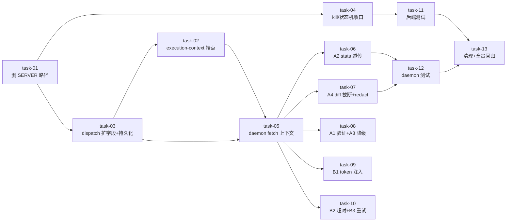

# Plan — 统一 Agent 执行路径（Daemon-Only）

> plan_level: **full**｜任务数: 13（≤15 约束内）｜7 个 Wave（基于 task `depends_on` 拓扑排序，同 Wave 内任务无相互依赖可并行）｜本 plan 不含实现细节（细节落 `tasks/task-NN.md`）

## 概述

删除后端 SERVER 执行路径，daemon 成为唯一执行者；新增 execution-context 端点补齐上下文缺口；kill / 状态机 / diff 收口到 lease；daemon 功能对齐 SERVER（stats 透传 / diff 截断 redact）并叠加 P1 增强（token 注入 / 超时可配 / spawn 重试）。

**plan 前核实结论（3 项风险已闭环）**：

| 风险 | 核实结论 | 对 plan 的影响 |
|---|---|---|
| R-07 stats 透传 | **确认断点**：`task-runner.ts:_finish`(794-809) 返回结果无 stats 字段，`daemon.ts:654 completeLease` 不传 stats；adapter `extractResultStats`(495) 原样存 usage 不拆分。链路断在 `_finish` | task-06 必须补三处：adapter 拆 usage 累加 + _finish 透传 + completeLease payload 补全 |
| R-08 前端 conversation log | **A3 缺口不成立**：前端基于 `AgentRunLog` 结构化行重建展示（`extractRunSummary`），不依赖 SERVER 汇总文本；唯一 `output_redacted` 消费点 Quick Chat 由 daemon `outputParts` 累积已覆盖 | task-08 A3 降级为「保持 AgentRunLog 形态 + 记录决策」，不做汇总文本生成 |
| stage-scan bundle 覆盖 | **确认 design T2.1 设计缺口**：stage run 的 `prompt/step_prompt/stage/read_only`、scan run 的 `root_path/spec_root/runtime_root` 均为临时参数未持久化；三种 run 类型需分发 | task-02 端点须做 run 类型分发 + 从 lease.metadata 恢复参数；task-03 三处 dispatch 须持久化这些参数 |

## Wave 分组（基于 task `depends_on` 拓扑排序）

> 拓扑校验：13 任务无循环依赖。Wave 编号 = 最长依赖链深度。**同 Wave 内任务互不依赖、可并行执行**。关键路径长 7（task-01→task-03→task-02→task-05→task-06/07→task-12→task-13），总执行轮次 = Wave 数 = 7。

### Wave 1 — 删除 SERVER 执行路径（P0，后端）

- [ ] task-01: 删除 SERVER 执行路径（claude_code.py 整文件 + service.py 三条 `_execute_*_background` + `_proc_registry` + kill SIGTERM→SIGKILL 链 + placement.py `dispatch_to_server` + `decide_backend` SERVER 分支 + 新增 `NoOnlineDaemonError`）

### Wave 2 — dispatch 扩字段 + kill/状态机收口（P0，后端，task-01 落地后两任务并行）

- [ ] task-03: `dispatch_to_daemon` 签名扩字段（repo_url/branch/allowed_paths/tool_config/timeout_seconds）+ 三处 dispatch（start_run / start_stage_dispatch / start_scan_dispatch）把 stage/scan 的上下文参数（prompt/step_prompt/stage/read_only/root_path/spec_root/runtime_root）持久化到 `lease.metadata` + `_build_claim_payload` 透传
- [ ] task-04: `kill_run` 改道 `DaemonLeaseService.cancel_lease(agent_run_id)` + 移除 SERVER 侧 `collect_diff` 调用（diff 收口 daemon）+ 验证 lease.status → AgentRun.status 状态映射单一驱动

### Wave 3 — execution-context 端点（P0，后端，task-03 落地后）

- [ ] task-02: 新增 `GET /agent-runs/{run_id}/execution-context` —— run 类型分发（task/stage/scan，依据 task_id/change_id/spec_strategy）+ 从 lease.metadata 恢复上下文参数 + 复用 `build_spec_bundle`/`build_stage_bundle`/`build_scan_bundle` + `render_bundle_to_claude_md` + 鉴权 + run 归属校验

### Wave 4 — daemon fetch 上下文 + 后端测试（P0，跨模块并行，task-02/03/04 落地后）

- [ ] task-05: daemon `_runLeaseStateMachine` claim 后新增 execution-context fetch 步骤填充 `LeaseCtx` + `HubClient.getExecutionContext` + `ExecutionContextPayload` 类型 + task-runner CLAUDE.md 写入生效 + 真实 clone 生效（退役 `repoUrl ?? undefined` / `branch ?? 'main'` 兜底）
- [ ] task-11: 后端测试（execution-context 端点三种 run 类型 + NoOnlineDaemon + 状态映射 + diff redact 二次脱敏）—— 与 task-05 无相互依赖，分属 agent / sillyhub-daemon 模块，可并行

### Wave 5 — daemon 能力对齐 SERVER + P1 增强（P0/P1，task-05 落地后五任务并行）

- [ ] task-06: A2 stats 透传链路补全 —— adapter `extractResultStats` 拆 `usage` 为 input/output_tokens 并跨 message 累加 + task-runner `_finish` 透传 stats 到 result + daemon `completeLease` payload 补 stats + 后端 `complete_lease` 写回 AgentRun cost/timing/tokens
- [ ] task-07: A4 diff 截断 + redact —— daemon `collectDiff` 增加 50KB 截断 + stat_summary 生成 + 后端 `complete_lease` diff 入库前 `redact_output` 二次脱敏（redact 单一真相源留后端）
- [ ] task-08: A1 实时流等价验证（`agent_run:{id}` channel 一致性测试）+ A3 conversation log 降级决策记录（前端基于 AgentRunLog 重建，保持逐行形态，不做汇总文本）
- [ ] task-09: B1 token + `tool_config.env` 注入 claude 子进程 env（新增 spawn-env.ts）+ token 不入日志 / 不入 Redis publish payload / 不回传前端 + env dump 经 redact
- [ ] task-10: B2 超时可配（`lease.metadata.timeout_seconds` > daemon config > 默认，优先级链）+ B3 spawn 级失败自动重试（仅非零退出/超时/非用户 cancel/非业务 is_error；重试前清 workspace 残留、不传 resume_session_id、重试次数入 metadata）

### Wave 6 — daemon 测试（P0，task-06/07/09/10 落地后）

- [ ] task-12: daemon 测试（execution-context fetch + CLAUDE.md 写入 + 真实 clone + A2 stats 写回 + A4 截断 + B1 token 注入 + B2 超时 + B3 重试）

### Wave 7 — 清理与全量回归（P0，task-11/12 落地后）

- [ ] task-13: 清理孤儿变更 `unified-agent-execution`（DB id=264，scan 阶段空存根）+ 全量回归（backend pytest + daemon vitest）

## 任务总表

| 编号 | Wave | 任务 | 主要文件 | 优先级 | 模块 | 依赖 |
|---|---|---|---|---|---|---|
| task-01 | 1 | 删除 SERVER 执行路径 + NoOnlineDaemonError | `agent/adapters/claude_code.py`(删)、`agent/service.py`、`agent/placement.py` | P0 | agent | — |
| task-02 | 3 | execution-context 端点（run 类型分发） | `agent/router.py`、`agent/context_builder.py`(复用) | P0 | agent | task-03 |
| task-03 | 2 | dispatch 扩字段 + lease.metadata 持久化上下文参数 | `agent/placement.py`、`agent/service.py`(3 处 dispatch)、`daemon/service.py`(`_build_claim_payload`) | P0 | agent, daemon | task-01 |
| task-04 | 2 | kill 改 cancel_lease + 状态映射 + diff 收口 | `agent/service.py`、`daemon/service.py` | P0 | agent, daemon | task-01 |
| task-05 | 4 | daemon fetch execution-context + CLAUDE.md/clone 生效 | `sillyhub-daemon/src/daemon.ts`、`hub-client.ts`、`task-runner.ts`、`types.ts` | P0 | sillyhub-daemon | task-02, task-03 |
| task-06 | 5 | A2 stats 透传链路（adapter 拆 usage + _finish 透传 + completeLease 补全 + 后端写回） | `sillyhub-daemon/src/adapters/stream-json.ts`、`task-runner.ts`、`daemon.ts`、`daemon/service.py` | P0 | sillyhub-daemon, daemon | task-05 |
| task-07 | 5 | A4 diff 50KB 截断 + stat_summary + 后端 redact | `sillyhub-daemon/src/workspace.ts`、`daemon/service.py` | P0 | sillyhub-daemon, daemon | task-05 |
| task-08 | 5 | A1 实时流验证 + A3 降级决策记录 | `sillyhub-daemon/tests/daemon-parity.test.ts` | P1 | sillyhub-daemon | task-05 |
| task-09 | 5 | B1 token 注入 spawn env | `sillyhub-daemon/src/spawn-env.ts`(新)、`task-runner.ts` | P1 | sillyhub-daemon | task-05 |
| task-10 | 5 | B2 超时可配 + B3 spawn 重试 | `sillyhub-daemon/src/task-runner.ts`、`agent/placement.py` | P1 | sillyhub-daemon, agent | task-05 |
| task-11 | 4 | 后端测试 | `agent/tests/test_execution_context.py`(新) | P0 | agent | task-01, task-02, task-03, task-04 |
| task-12 | 6 | daemon 测试 | `sillyhub-daemon/tests/*`(新) | P0 | sillyhub-daemon | task-05, task-06, task-07, task-09, task-10 |
| task-13 | 7 | 清理孤儿变更 + 全量回归 | DB(`unified-agent-execution` id=264，位于 `.sillyspec/.runtime/sillyspec.db`)、项目根 | P0 | 项目 | task-11, task-12 |

## 关键路径

Wave 间是硬依赖（上层 Wave 未就绪，下层无法验证）；同 Wave 内任务无相互依赖、可并行。关键路径长 7（task-01→task-03→task-02→task-05→task-06/07→task-12→task-13）；Wave 5 是最大并行扇出（task-06/07/08/09/10 五任务均只依赖 task-05），Wave 2（task-03/04）、Wave 4（task-05/11）各两任务并行。

## P2 增强拆分决策（YAGNI）

design Phase 4.5-B 的 **P2 锦上项不纳入本变更**，拆为独立 follow-up change：

- B4 workspace 复用/缓存（base + worktree）
- B5 stderr 独立日志
- B6 heartbeat 执行中/空闲分档
- B7 资源限制（内存上限）
- B8 流式合并/批次优化

**理由**：P2 项与核心痛点（协议重复 / SERVER 无效 / 凭据分散 / 状态机割裂）无强关联，纳入会使本变更膨胀超 15 任务约束；拆独立 change 可独立验收、降低回归面。execute 完成本 plan 后另起 change 处理。

## 全局验收标准

1. `grep -rn "_build_claude_command\|_exec_stream\|_execute_.*_background\|_proc_registry\|dispatch_to_server" backend/app` **无命中**（SERVER 路径彻底删除）。
2. `GET /agent-runs/{id}/execution-context` 对 **task / stage / scan 三种 run 类型** 均返回完整 bundle（claude_md + prompt + repo/branch + allowed_paths + tool_config）；未鉴权 / run 归属不匹配 → 401/403。
3. 无在线 daemon 时触发 agent run → `AgentRun.status=failed` + `error_code=no_online_daemon` + 消息「未检测到在线 daemon，请启动 sillyhub-daemon 后重试」。
4. `kill_run` 经 `DaemonLeaseService.cancel_lease`，`grep "_proc_registry\|SIGTERM" backend/app/modules/agent/service.py` **无命中**。
5. 状态映射测试通过：`claimed(start 后)→running / completed→completed / expired→failed / cancelled→killed`，单一驱动无对账漂移。
6. daemon 执行后前端订阅 `agent_run:{id}` channel 可拿实时流（daemon `submit_messages` publish 验证）。
7. daemon 执行后 `AgentRun.total_cost_usd / duration_ms / input_tokens / output_tokens / num_turns / session_id / exit_code` **非空**且对齐 claude result 消息；`usage` 跨 message 累加策略对齐 SERVER `_extract_result_metadata`（R-07 补全验证）。
8. daemon 上报 diff 经 50KB 截断（patch 长度 ≤ 51200）+ 后端 `redact_output` 二次脱敏；含密钥（API key / token / PAT 模式）diff 不入库、大 diff 不撑爆 `complete_lease` payload（构造 >100KB diff 测试）。
9. `ANTHROPIC_API_KEY` / OAuth token 注入 claude 子进程 env（claude 能鉴权）；token 不入 daemon 日志、不入 Redis publish payload、不回传前端；env dump 经 redact。
10. spawn 级失败（非零退出 / 超时，且非用户 cancel、非业务 `is_error`）自动重试 1 次后仍失败才标 `failed`；重试不传 `resume_session_id`、重试次数记 metadata；业务 `is_error` 不重试。
11. **（brownfield 兼容性边界）** 破坏性切换仅限内部执行体：`AgentService.start_run` / `start_stage_dispatch` / `start_scan_dispatch` 三个对外入口签名保持兼容；`preferred_backend="server"` 传参不再支持（调用方传该值被忽略或 422）；历史 `AgentRun` 数据可清空，不处理存量状态漂移（用户授权「未上线、数据可清空」）。

## 风险登记（具体应对，非泛泛）

| 编号 | 风险 | 等级 | 具体应对（转为验收条目） |
|---|---|---|---|
| R-01 | 删除面广（claude_code.py 整文件 ~903 行 + service.py 三条执行体），回归风险 | P1 | task-11 端点/NoOnlineDaemon/状态映射测试 + execute 阶段先跑全量 `cd backend && uv run pytest -q --cov=app --cov-fail-under=60` |
| R-02 | execution-context 端点泄漏 bundle（含 proposal/design 敏感上下文） | P1 | 复用 `get_current_user` + 校验 run 归属当前 user；task-11 覆盖跨 user 403 用例 |
| R-04 | kill 改道后 daemon 离线无法取消子进程 | P2 | cancel_lease 标 lease→cancelled；daemon 重连后下一次心跳/claim 检测状态终止；task-11 覆盖离线 cancel 用例 |
| R-06 | daemon collectDiff 无 redact/截断/stat_summary（已确认真实缺口） | P0 | task-07 + 验收条目 8（50KB 截断 + 后端 redact 单一真相源） |
| R-07 | stats 透传断点（已确认） | P0 | task-06 + 验收条目 7（task-runner._finish 透传 + completeLease payload 补全 + AgentRun 字段非空） |
| R-09 | B1 token 经 lease.metadata/端点流转增加泄漏面 | P1 | task-09 + 验收条目 9（token 不入日志/Redis/前端，spawn env 仅本地构造） |
| R-10 | B3 重试导致 side-effect 重复 | P1 | task-10 + 验收条目 10（重试前清 workspace、不传 resume_session_id、仅 spawn 级失败重试） |
| R-stage | stage/scan bundle 上下文参数未持久化，端点无法重建（已确认缺口） | P0 | task-03 持久化 + task-02 类型分发 + task-11 覆盖 stage/scan 端点用例 |
| R-12 | Phase 4.5 改动面扩大，回归风险上升 | P1 | task-12 daemon-parity 覆盖 A1-A4 + B1-B3；execute 阶段先全量跑 `cd sillyhub-daemon && pnpm test` |

## 模块依赖说明（Wave 分组依据）

- **agent** 是核心变更点（task-01/02/03/04/11），被 `change`（dispatch 调度阶段 agent）/ `change_writer`（触发 agent 执行变更）依赖 → Wave 1 改 agent 时须保持 `start_run`/`start_stage_dispatch`/`start_scan_dispatch` 三个入口对外签名兼容（破坏性切换仅限内部执行体）。
- **daemon 后端模块**（`backend/app/modules/daemon/`，未在 `_module-map.yaml` 注册）与 agent 强耦合（`complete_lease` 写回 AgentRun 字段、`_build_claim_payload` 透传上下文）→ task-03/04/06/07 同时改两模块，归同 Wave。
- **sillyhub-daemon 子项目**（task-05~10/12）与后端经 HTTP/WS 解耦 → 可在 Wave 2-4 独立推进，但 task-05 依赖 Wave 1 端点就绪。
- worktree / git_gateway（redact_output）/ redis 是 agent 内部依赖，本变更**不改其接口**（仅消费）。
