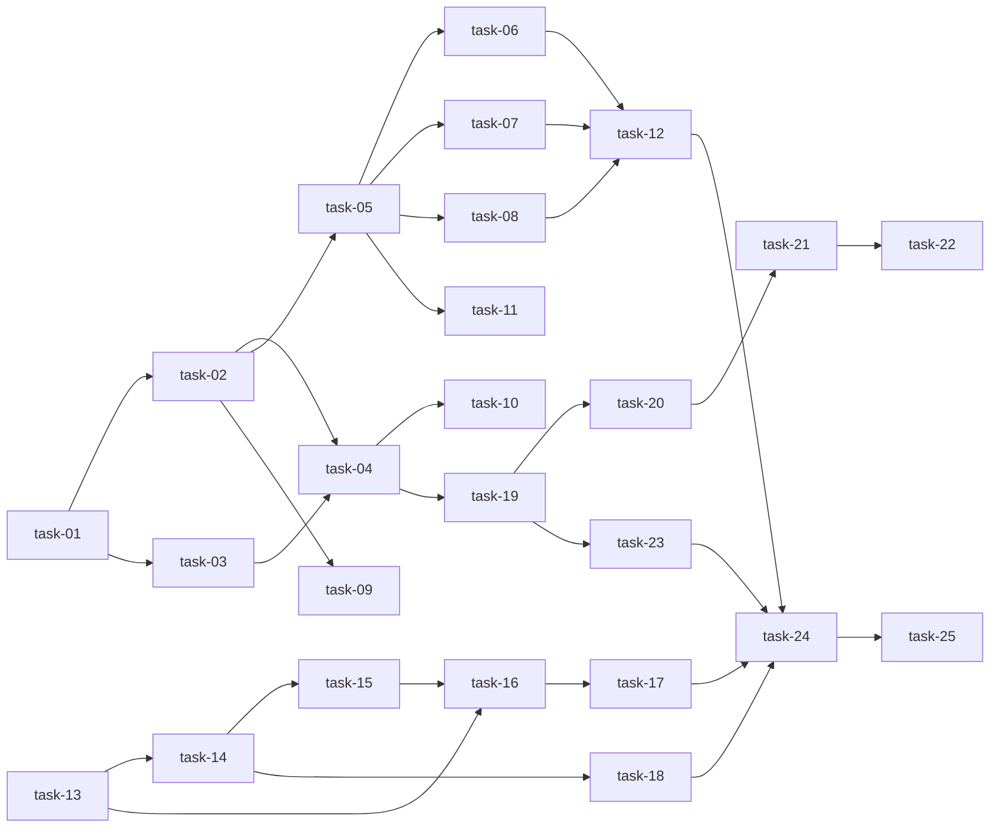

# 实现计划 — daemon-api-key

## Spike 前置验证

无 Spike。所有技术决策已在 design §5 锚定（Opaque token + bcrypt hash 复用现有 password_hasher，dependency 双 header 路径，daemon options 改造方式），无未验证集成。

## Wave 1（backend 核心，串行依赖链）

- [ ] task-01: ApiKey 数据模型 + Alembic 迁移
- [ ] task-02: ApiKeyService（create/list/revoke/authenticate）
- [ ] task-03: ApiKey Pydantic Schema
- [ ] task-04: ApiKey CRUD 端点（POST/GET/DELETE /api/auth/api-keys）
- [ ] task-05: get_current_principal dependency + _extract_api_key

## Wave 2（backend 端点切换，依赖 W1 task-05）

- [ ] task-06: daemon 端点切到 get_current_principal
- [ ] task-07: agent-runs 端点切到 get_current_principal
- [ ] task-08: spec-workspace 端点切到 get_current_principal
- [ ] task-12: API Key 端到端生命周期测试

## Wave 3a（daemon 改造，与 W3b 并行，依赖 W2 完成）

- [ ] task-13: DaemonConfig 加 api_key 字段
- [ ] task-14: HubClient 构造签名改造 + _headers 分支
- [ ] task-15: daemon.ts / task-runner.ts 同步 HubClient 构造
- [ ] task-16: cli.ts 加 --api-key 选项 + 互斥校验 + config 持久化
- [ ] task-17: daemon CLI 单测
- [ ] task-18: HubClient 单测

## Wave 3b（frontend，与 W3a 并行，依赖 W1 task-04）

- [ ] task-19: API 客户端（createKey/listKeys/revokeKey）
- [ ] task-20: 签发弹窗组件（双阶段）
- [ ] task-21: /settings/api-keys 页面
- [ ] task-22: settings 导航加入 API Keys 入口
- [ ] task-23: /runtimes CopyDaemonCommand 改造

## Wave 4（端到端 + 部署）

- [ ] task-24: 部署 stack，端到端验证
- [ ] task-25: 提交 + 推送

## 任务总表

| 编号 | 任务 | Wave | 优先级 | 估时 | 依赖 | 说明 |
|---|---|---|---|---|---|---|
| task-01 | ApiKey 模型 + Alembic 迁移 | W1 | P0 | 1h | — | model.py 追加 ApiKey 类 + 迁移 202606300900 |
| task-02 | ApiKeyService | W1 | P0 | 2h | task-01 | create/list/revoke/authenticate，复用 password_hasher + secrets.token_urlsafe |
| task-03 | ApiKey Pydantic Schema | W1 | P0 | 0.5h | task-01 | Create/Read/Created 三个 schema |
| task-04 | ApiKey CRUD 端点 | W1 | P0 | 1h | task-02, task-03 | POST/GET/DELETE /api/auth/api-keys，admin only |
| task-05 | get_current_principal | W1 | P0 | 1h | task-02 | core/auth_deps.py 新增双路径 dependency |
| task-06 | daemon 端点切换 | W2 | P0 | 0.5h | task-05 | daemon/router.py get_current_user→principal |
| task-07 | agent-runs 端点切换 | W2 | P0 | 0.5h | task-05 | agent/router.py 同上 |
| task-08 | spec-workspace 端点切换 | W2 | P0 | 0.5h | task-05 | spec_workspace/router.py 同上 |
| task-09 | ApiKeyService 单测 | W1 | P0 | 1h | task-02 | test_api_key_service.py |
| task-10 | ApiKey router 单测 | W1 | P0 | 1h | task-04 | test_api_key_router.py |
| task-11 | principal 双路径单测 | W2 | P0 | 1h | task-05 | test_auth_deps_principal.py |
| task-12 | 端到端生命周期测试 | W2 | P0 | 1h | task-06, task-07, task-08 | test_api_key_lifecycle.py |
| task-13 | DaemonConfig 加 api_key | W3a | P0 | 0.5h | — | src/config.ts |
| task-14 | HubClient 构造改造 | W3a | P0 | 1h | task-13 | src/hub-client.ts (serverUrl, {token?,apiKey?}) |
| task-15 | daemon.ts/task-runner 同步 | W3a | P0 | 0.5h | task-14 | 同步 HubClient 构造签名 |
| task-16 | cli --api-key 选项 | W3a | P0 | 1h | task-13, task-15 | src/cli.ts，互斥校验 + config 持久化 |
| task-17 | cli 单测 | W3a | P0 | 1h | task-16 | tests/cli.test.ts |
| task-18 | hub-client 单测 | W3a | P0 | 0.5h | task-14 | tests/hub-client.test.ts |
| task-19 | API 客户端 lib | W3b | P0 | 0.5h | task-04 | frontend/src/lib/api-keys.ts |
| task-20 | 签发弹窗组件 | W3b | P0 | 2h | task-19 | api-key-create-dialog.tsx，双阶段 |
| task-21 | /settings/api-keys 页面 | W3b | P0 | 2h | task-19, task-20 | settings/api-keys/page.tsx |
| task-22 | settings 导航 | W3b | P0 | 0.5h | task-21 | settings/page.tsx 加链接 |
| task-23 | runtimes 启动命令改造 | W3b | P0 | 1h | task-19 | runtimes/page.tsx CopyDaemonCommand |
| task-24 | 部署 + 端到端 | W4 | P0 | 1h | task-12, task-17, task-18, task-23 | docker compose rebuild + 签发→启动→吊销验证 |
| task-25 | 提交 + 推送 | W4 | P0 | 0.5h | task-24 | commit + push origin main |

**总估时**：21.5h（理论值，实际 execute 阶段 batch 推进会显著更快）

## 依赖关系图

## 关键路径

`task-01 → task-02 → task-05 → task-06/07/08 → task-12 → task-24 → task-25`

backend 核心链路决定整体交付节奏。daemon (W3a) 和 frontend (W3b) 在 W2 完成后并行，不进关键路径。

## 全局验收标准

- [ ] 所有 backend 测试通过：`cd backend && uv run pytest`
- [ ] 所有 daemon 测试通过：`cd sillyhub-daemon && pnpm test`
- [ ] 前端 lint 通过：`cd frontend && pnpm lint`，无 Error
- [ ] frontend build 通过：`cd frontend && pnpm build`
- [ ] Alembic current = 新 head `202606300900`
- [ ] **回归零**：现有 daemon 用 `--token` 启动行为完全不变
- [ ] 端到端：admin 签发 key → daemon 用 `--api-key` 启动 → runtime online → 吊销 → runtime offline
- [ ] CLI 互斥：`--token` 和 `--api-key` 同时传报错
- [ ] 部署后容器健康，所有原有端点（login/workspaces/agent-runs/daemon）回归通过
