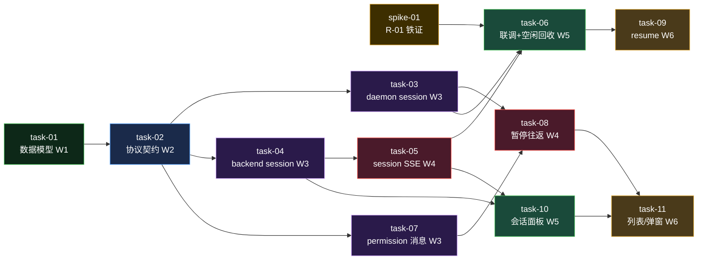

# 实现计划 — 交互式会话管控

> 设计依据：`design.md`（方案 A，四 Wave，三元关系 §8.4，8 风险，8 验收）/ `decisions.md`（D-001~D-005 全 accepted）/ `tasks.md`（四 Wave 20 任务，本计划合并精简至 11 task + 1 spike）。

## Spike 前置验证

| Spike | 验证内容 | 通过标准 | 不通过后果 |
|---|---|---|---|
| spike-01 | R-01 端到端铁证：`claude -p --input-format stream-json` 持续 stdin 注入两条 user message，验证两轮 `result`（claude）；codex `app-server` thread 复用 + 两次 `turn/start`（codex） | claude/codex 各跑通连续两轮，第二轮响应不含第一轮上下文污染 | Wave1 核心回退为伪多轮（每轮新 spawn + `--resume`），task-03/task-05 重设计（session 模式 → resume 链路） |

> spike-01 在 Wave1 之前执行，是整个方案可行性的硬门。探索阶段已被上游网关 529 阻断（仅证实协议层接受 stdin 流），此处补端到端铁证。

> Wave 按 depends_on 拓扑重排（Step 8），同 Wave 内任务无依赖可并行。功能里程碑标注：Wave1-2 地基（数据模型/协议），Wave3-4 核心交互+权限，Wave5 联调+前端基线，Wave6 resume+前端增强。

## Wave 1 — 数据模型（地基）

- [ ] task-01: 数据模型迁移（agent_sessions 表 + lease.kind + agent_runs.agent_session_id + alembic）（覆盖：FR-01, FR-09 / D-001, D-002, D-005）

## Wave 2 — 协议契约（依赖 Wave1）

- [ ] task-02: 协议契约（daemon protocol.ts ↔ backend protocol.py 新增 session_inject/interrupt/end + permission_request/response 消息常量 + payload + 契约单测）（覆盖：FR-02, FR-04, FR-05, FR-07 / NFR-05）

## Wave 3 — daemon/backend session 侧 + permission 消息（并行，依赖 Wave2）

- [ ] task-03: daemon session 侧（sessionStore + task-runner session 模式 result 不 end stdin + ws-client 接收控制消息路由 + daemon kind 分流）（覆盖：FR-01, FR-02, FR-04, FR-05, FR-09 / D-002）
- [ ] task-04: backend session 侧（REST create/inject/interrupt/end + service + ws_hub.send_session_control + placement interactive lease + main.py quick-chat 升级首 prompt 建 session）（覆盖：FR-01, FR-02, FR-04, FR-05）
- [ ] task-07: manual_approval 开关 + permission_request/response WS 消息两端接通（agent_sessions.config）（覆盖：FR-07 / Q3）

## Wave 4 — session SSE 聚合 + control_request 暂停往返（并行，依赖 Wave3）

- [ ] task-05: session 级 SSE 聚合（Redis channel `agent_session:{id}` + stream_session_logs + submit_messages 双 publish）（覆盖：FR-03 / D-005, R-08）
- [ ] task-08: claude stream-json + codex json-rpc control_request 升级为暂停往返（sessionStore pending permission map）（覆盖：FR-07，验收标准 5-6）

## Wave 5 — Wave1 联调/空闲回收 + 前端会话面板（并行，依赖 Wave4）

- [ ] task-06: Wave1 端到端联调 + 空闲回收（session_idle_timeout_sec 默认 30min + service.end_session 统一结束入口）（覆盖：FR-06 / D-004，验收标准 1-4,8）
- [ ] task-10: 会话面板（SSE 进度 + 中途追问输入框 + 打断本轮/结束会话按钮）（runtimes/page.tsx + lib/daemon.ts）（覆盖：FR-10 / Q1）

## Wave 6 — resume 持久化 + 列表/回看/权限弹窗（并行，依赖 Wave5）

- [ ] task-09: daemon sessionStore 磁盘持久化（sessions.json）+ 重启 resume 恢复（claude --resume / codex thread/resume 重 spawn）+ reconnecting 状态同步（覆盖：FR-08 / D-003，验收标准 7）
- [ ] task-11: 会话列表 + 历史回看 + 权限批准弹窗（覆盖：FR-10，FR-07 前端）

## 任务总表

| 编号 | 任务 | Wave | 优先级 | 依赖 | 覆盖 FR/D | 说明 |
|---|---|---|---|---|---|---|
| spike-01 | R-01 端到端铁证 | 前置 | P0 | — | R-01 | claude/codex stream-json 两轮 result，方案可行性硬门 |
| task-01 | 数据模型迁移 | W1 | P0 | — | FR-01,FR-09/D-001,D-002,D-005 | agent_sessions 继承 BaseModel；alembic 迁移（migrations/） |
| task-02 | 协议契约 | W2 | P0 | task-01 | FR-02,FR-04,FR-05,FR-07/NFR-05 | WS 消息两端逐字对齐 + 契约单测 |
| task-03 | daemon session 侧 | W3 | P0 | task-02 | FR-01,FR-02,FR-04,FR-05,FR-09/D-002 | task-runner session 模式 + sessionStore + ws-client 路由；**daemon 用 pnpm typecheck/test，非 pip/pytest** |
| task-04 | backend session 侧 | W3 | P0 | task-01,task-02 | FR-01,FR-02,FR-04,FR-05 | REST/service/ws_hub/placement/main.py |
| task-07 | permission WS 消息 | W3 | P1 | task-02 | FR-07/Q3 | manual_approval 开关 + 两端接通 |
| task-05 | session 级 SSE 聚合 | W4 | P0 | task-04 | FR-03/D-005,R-08 | Redis channel + stream_session_logs + 双 publish |
| task-08 | control_request 暂停往返 | W4 | P1 | task-03,task-07 | FR-07 | stream-json + json-rpc 升级 + pending map |
| task-06 | Wave1 联调+空闲回收 | W5 | P0 | task-03,task-05,spike-01 | FR-06/D-004 | 空闲 30min 回收 + end_session 统一入口 + Wave1 验收 |
| task-10 | 会话面板 | W5 | P1 | task-04,task-05 | FR-10/Q1 | runtimes/page.tsx + lib/daemon.ts |
| task-09 | resume 持久化恢复 | W6 | P1 | task-03,task-06 | FR-08/D-003 | 磁盘持久化 + 重启重 spawn + reconnecting |
| task-11 | 列表/回看/权限弹窗 | W6 | P2 | task-08,task-10 | FR-10,FR-07 | 历史回看 + 权限弹窗 |

## 关键路径

`spike-01 → task-01 → task-02 → task-04 → task-05 → task-06 → task-09`（最长依赖链，贯穿 W1→W6，决定整体交付周期）。并行支线：task-03/07（W3）与 task-04 并行；task-08（W4）与 task-05 并行；task-10（W5）与 task-06 并行；task-11（W6）与 task-09 并行。

## 依赖关系图

## 全局验收标准

- [ ] spike-01：claude + codex 各跑通 stream-json stdin 两轮 result（R-01 铁证）
- [ ] AC-1：agent 跑完第一轮后中途追问写入 stdin，看到第二轮响应（claude + codex）
- [ ] AC-2：打断本轮 = agent 停当前 turn + 会话仍 active 可继续；结束会话 = kill + status=ended
- [ ] AC-3：一个 SSE 连接贯穿整个会话，多 turn 输出实时回显 + 历史可在 AgentRunLog 回看
- [ ] AC-4：manual_approval=false（默认）自动批准不变；=true 时暂停等远程决定
- [ ] AC-5：daemon 重启后 active 会话 reconnecting → 恢复，上下文不丢（Wave3）
- [ ] AC-6：现有批处理 lease（workspace agent run）行为零变化（兼容）
- [ ] daemon 单测：`cd sillyhub-daemon && pnpm test`（vitest）通过
- [ ] backend 单测：`cd backend && uv run pytest` 通过
- [ ] frontend 构建：`cd frontend && pnpm build` 通过（Wave4）

## 覆盖矩阵（decisions.md）

| ID | 覆盖任务 | 验收证据 |
|---|---|---|
| D-001@v1 命名 AgentSession | task-01 | AC-6（不改现有 session_id） |
| D-002@v1 1 session=1 lease | task-01, task-03, task-04 | AC-1, AC-6 |
| D-003@v1 Wave1/2 不恢复 | task-09（Wave3 才做） | AC-5 |
| D-004@v1 空闲 30min | task-06 | FR-06 |
| D-005@v1 三元关系+SSE | task-01, task-05 | AC-3, AC-6 |

## 模块依赖说明

- `sillyhub-daemon` depends_on `backend`：task-03/04 协议契约（task-02）是两端共同基础。
- `frontend` depends_on `backend`：task-10/11 依赖 task-04（REST）/task-05（SSE）的 backend 端点，故 Wave4 在 Wave1 后。
- Wave 间通过 `sessionStore` API + WS 消息 + session 级 SSE channel 接口解耦，每 Wave 独立可交付、独立验收。
- ⚠️ daemon 实际 TypeScript：execute 时 daemon 任务构建/测试用 `pnpm typecheck` / `pnpm test`（vitest），CONVENTIONS.md/local.yaml/scan 标的 Python（pip/pytest）已过时。

## execute 协作点（Step 9 审查记录）

- **W3 同 Wave 同文件**：task-03 与 task-07 都改 `sillyhub-daemon/src/ws-client.ts`，但**职责正交**——task-03 加控制消息**接收**分派（`onControlMessage` 回调 + SESSION_INJECT/INTERRUPT/END），task-07 加 permission **发送**（`sendPermissionRequest`）。execute 并行时用 worktree 隔离或顺序合并；两者改不同方法，无逻辑冲突。用户决策：接受，execute 协调。
- **`daemon/service.py` end_session 协作**：task-04 建骨架（§5.6 步骤 7 留空）→ task-05 补 `session_ended` publish → task-06 三入口收敛统一入口。按 W3→W4→W5 顺序执行，无冲突。
- **`session-store.ts` 增强链**：task-03 建（create/get/inject/interrupt/end）→ task-06 加 `last_active_at`+`scanIdle` → task-08 加 `pendingPermissions` map → task-09 加 `persist/restore`。方法名各异，按 Wave 顺序增强。
