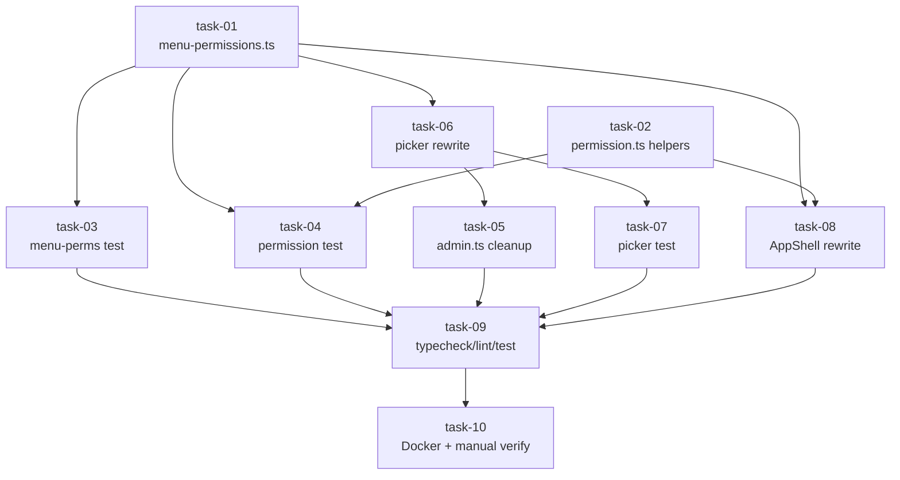

# 实现计划：菜单按权限驱动显隐

## Spike 前置验证

无技术不确定性，跳过。所有变更基于现有代码模式（picker/permission/AppShell 均已存在），无新技术栈、无隔离/性能瓶颈。

## Wave 1（数据层 + 工具函数，无依赖）

- [ ] task-01: 新增 `frontend/src/lib/menu-permissions.ts`，定义 `MenuSection` / `PermissionItem` / `MenuPermissionGroup` 类型与 19 条 `MENU_PERMISSION_GROUPS` 常量
- [ ] task-02: 修改 `frontend/src/lib/permission.ts`，新增 `hasAnyPermission` / `canSeeMenu` / `visibleMenusBySection`，`hasAdminPermission` 标 `@deprecated`

## Wave 2（数据层测试，依赖 Wave 1）

- [ ] task-03: 新增 `frontend/src/lib/__tests__/menu-permissions.test.ts`，覆盖 menuKey 唯一性 + permission key 合法性
- [ ] task-04: 新增 `frontend/src/lib/__tests__/permission.test.ts`，覆盖 3 个 helper 的 GWT 用例

## Wave 3（消费方切换，依赖 Wave 1；内部串行：task-06 先行）

- [ ] task-06: 修改 `frontend/src/components/admin-role-permission-picker.tsx`，切换数据源到 `MENU_PERMISSION_GROUPS`，按 section → menu → permission 三级渲染
- [ ] task-05: 修改 `frontend/src/lib/admin.ts`，删除 `PERMISSION_GROUPS` / `PermissionGroup` / `PermissionWithGroup` 三个 export（必须在 task-06 之后，否则 picker import 编译失败）
- [ ] task-07: 修改 `frontend/src/components/__tests__/admin-role-permission-picker.test.tsx`，适配新数据源 + 验证 section/menu/permission 三级结构 + 全选/折叠交互（与 task-06 TDD 配对）
- [ ] task-08: 修改 `frontend/src/components/app-shell.tsx`，删除 4 个 NAV 常量（`OVERVIEW_NAV` / `MANAGEMENT_NAV` / `SYSTEM_NAV` / `ADMIN_NAV`），改用 `visibleMenusBySection` 渲染

## Wave 4（验证，依赖 Wave 1-3）

- [ ] task-09: 跑 `pnpm typecheck && pnpm lint && pnpm test`，修复回归
- [ ] task-10: 重建 frontend Docker 镜像，手工验证 6 个用例矩阵（用户原始需求 §8）

## 任务总表

| 编号 | 任务 | Wave | 优先级 | 依赖 | 说明 |
|---|---|---|---|---|---|
| task-01 | menu-permissions.ts 新增 | W1 | P0 | — | 19 条数据，类型定义 |
| task-02 | permission.ts helper 新增 | W1 | P0 | — | 3 个纯函数 + hasAdminPermission 标 deprecated |
| task-03 | menu-permissions.test.ts | W2 | P0 | task-01 | 唯一性 + key 合法性 |
| task-04 | permission.test.ts | W2 | P0 | task-01, task-02 | GWT 全覆盖 |
| task-05 | admin.ts 清理 | W3 | P0 | task-01, **task-06** | 删 PERMISSION_GROUPS（task-06 切换数据源后才能删） |
| task-06 | picker 切换数据源 | W3 | P0 | task-01 | 三级渲染（W3 内最先执行） |
| task-07 | picker 测试适配 | W3 | P0 | task-06 | section/menu/perm 断言（TDD 配对） |
| task-08 | AppShell 改造 | W3 | P0 | task-01, task-02 | 删 4 个 NAV 常量 |
| task-09 | typecheck/lint/test | W4 | P0 | W1-W3 | 修复回归 |
| task-10 | Docker 重建 + 手工验证 | W4 | P0 | task-09 | 6 个用例矩阵 |

## 依赖关系图

## 关键路径

task-01 → task-06 → task-07 → task-09 → task-10

（task-02 可与 task-01 并行；task-03/04 在 task-01/02 之后并行；W3 内 task-06 先执行，然后 task-05/07/08 并行；task-09/10 串行收尾）

## 全局验收标准

- [ ] `pnpm typecheck` 通过，无 `any`
- [ ] `pnpm lint` 通过（既有 warning 不增加）
- [ ] `pnpm test` 全部通过，新增测试覆盖率 ≥ 90%
- [ ] `grep -r "PERMISSION_GROUPS\|PermissionGroup\|PermissionWithGroup" frontend/src/` 无匹配（`@deprecated` 注释中的引用除外）
- [ ] `grep -rE "OVERVIEW_NAV|MANAGEMENT_NAV|SYSTEM_NAV|ADMIN_NAV" frontend/src/` 无匹配
- [ ] 手工验证矩阵 6 个用例全部通过：
  - 只有 `user:read` → 只看到「用户」菜单
  - 只有 `organization:read` → 只看到「组织」菜单
  - 只有 `role:read` → 只看到「角色」菜单
  - 拥有任意 `task:*` 或 `tool:*` 权限 → 看到「Agent 控制台」
  - 无 admin 前缀权限的用户不显示「系统管理」section
  - `is_platform_admin = true` 时显示全部菜单
- [ ] 后端 `/api/admin/*` 行为不变（curl 验证 401/403 路径未回归）
