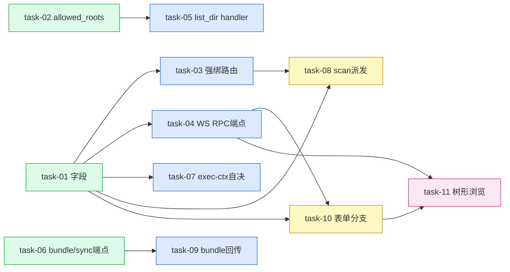

# 实现计划 — Workspace 支持 daemon 客户端路径

> Wave 已按各 task depends_on 严格拓扑重排（plan step 8）。无循环依赖。

## Spike 前置验证
无。技术方案已确定：WS RPC 复用 `ws_hub.send_to_runtime`（grill X-003 验证）；spec bundle 走标准 tar 流；daemon 端 sillyspec scan 复用现有 task-runner 执行链路。

## Wave 1（无依赖，并行）
- [x] task-01: workspaces 加 `path_source` + `daemon_runtime_id`（model/schema/migration）（覆盖：FR-01, D-004@v1）
- [x] task-02: DaemonConfig 加 `allowed_roots`（覆盖：FR-04, D-002@v1）
- [x] task-06: spec bundle/sync 端点（`GET bundle` / `POST sync`）（覆盖：FR-05, D-003@v1, D-006@v1）

## Wave 2（依赖 Wave 1）
- [x] task-03: `dispatch_to_daemon` daemon-client 强绑路由 + 离线 fail（覆盖：FR-02, D-001@v1）— depends: task-01
- [x] task-04: daemon WS RPC 通道 + `POST /runtimes/{id}/list-dir` 端点（backend）（覆盖：FR-03, FR-04, D-005@v1）— depends: task-01
- [x] task-05: list_dir RPC handler（daemon）（覆盖：FR-03, FR-04, D-005@v1）— depends: task-02
- [x] task-07: execution-context daemon-client `spec_root` 自决 + workspace_id 透传（覆盖：FR-05）— depends: task-01
- [x] task-09: spec bundle 拉取 / sync 回传（daemon task-runner）（覆盖：FR-05, D-006@v1）— depends: task-06

## Wave 3（依赖 Wave 2）
- [x] task-08: `scan`/`scan-generate` daemon 派发（覆盖：FR-06, D-003@v1）— depends: task-01, task-03
- [x] task-10: 创建表单路径来源分支 + 类型扩展（覆盖：FR-01, FR-03）— depends: task-01, task-04

## Wave 4（依赖 Wave 3）
- [x] task-11: 树形目录浏览组件 + listDir api（覆盖：FR-03, D-005@v1）— depends: task-04, task-10

## 任务总表

| 编号 | 任务 | Wave | 优先级 | 依赖 | 覆盖 FR/D |
|---|---|---|---|---|---|
| task-01 | workspaces 加 path_source + daemon_runtime_id | W1 | P0 | — | FR-01, D-004@v1 |
| task-02 | DaemonConfig 加 allowed_roots | W1 | P0 | — | FR-04, D-002@v1 |
| task-06 | spec bundle/sync 端点 | W1 | P0 | — | FR-05, D-003@v1, D-006@v1 |
| task-03 | dispatch_to_daemon 强绑路由 + 离线 fail | W2 | P0 | task-01 | FR-02, D-001@v1 |
| task-04 | daemon WS RPC 通道 + list-dir 端点 | W2 | P0 | task-01 | FR-03, FR-04, D-005@v1 |
| task-05 | list_dir RPC handler（daemon） | W2 | P0 | task-02 | FR-03, FR-04, D-005@v1 |
| task-07 | execution-context spec_root 自决 | W2 | P0 | task-01 | FR-05 |
| task-09 | spec bundle 拉取/sync 回传（daemon） | W2 | P0 | task-06 | FR-05, D-006@v1 |
| task-08 | scan/scan-generate daemon 派发 | W3 | P0 | task-01, task-03 | FR-06, D-003@v1 |
| task-10 | 创建表单路径来源分支 | W3 | P1 | task-01, task-04 | FR-01, FR-03 |
| task-11 | 树形目录浏览组件 + listDir api | W4 | P1 | task-04, task-10 | FR-03, D-005@v1 |

## 关键路径
task-01 → task-04 → task-10 → task-11（4 Wave，端到端最短交付周期，前端完整链）

后端最长链：task-01 → task-03 → task-08（scan 派发闭环，3 Wave）。

## 全局验收标准
- [ ] server-local workspace 创建/扫描/agent run 全链路行为零变化（兼容回归）
- [ ] daemon-client workspace：选在线 daemon → 树形浏览 allowed_roots 内目录 → 选定 root_path → 创建成功
- [ ] daemon-client agent run 路由到绑定 daemon；该 daemon 离线立即失败并提示目标 runtime
- [ ] daemon-client agent 执行：spec 经 bundle 下发到本地临时区、执行后 sync 回传服务器，scan_docs reparse 生效
- [ ] daemon-client scan/bootstrap 由绑定 daemon 执行，产出回传服务器
- [ ] list_dir 对 allowed_roots 之外路径返回 403
- [ ] backend `uv run ruff check . && uv run pytest` 通过
- [ ] frontend `pnpm build` 通过
- [ ] daemon TS 编译无错

## 覆盖矩阵

| ID | 覆盖任务 | 验收证据 |
|---|---|---|
| D-001@v1 | task-03 | daemon-client 强绑 daemon_runtime_id 路由 + 离线 NoOnlineDaemonError |
| D-002@v1 | task-02, task-05 | allowed_roots 白名单 + list_dir 越界 forbidden |
| D-003@v1 | task-06, task-08, task-09 | spec 服务器真理源，bundle/sync 中转 |
| D-004@v1 | task-01 | path_source + daemon_runtime_id 字段 + validator |
| D-005@v1 | task-04, task-05, task-11 | WS RPC + list_dir + 前端树形浏览 |
| D-006@v1 | task-06, task-09 | spec 按需 bundle pull / sync push，无同步引擎 |

## execute 一致性约定（step 9 审查结论）

1. **bundle/sync URL 契约**：实际挂载点 = `/api/workspaces/{workspace_id}/spec-workspace/{bundle,sync}`（task-06 读 `spec_workspace/router.py` 源码确认；design §7.2 与 task-09 已统一对齐）。`{workspace_id}` 即 workspace UUID，daemon 侧用 execution-context 透传的 workspace_id。
2. **schema.py 文件归属**（避免多任务改同一文件冲突）：
   - `workspace/schema.py` 全部字段变更归 **task-01**：WorkspaceCreate/Update/Read + **ScanGenerateRequest 加 `path_source`/`daemon_runtime_id`**。task-08 消费 ScanGenerateRequest 字段，不改 schema.py。
   - `agent/schema.py` 的 `ExecutionContextResponse` 加 `spec_root`/`workspace_id` 顶层字段归 **task-07**（execute 时 task-07 allowed_paths 含 agent/schema.py）。
3. **WS RPC 消息常量**：`daemon:rpc`（backend→daemon）/ `daemon:rpc_result`（daemon→backend），rpc_id 关联。task-04（backend `protocol.py`）与 task-05（daemon `protocol.ts`）字面对齐。

## 依赖关系图（按拓扑 Wave 染色）

