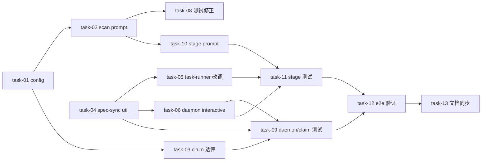

# 实现计划：spec 文档回传 backend 独占（transport 双模式）

## Spike 前置验证

无独立 Spike。技术方案核心机制（scan/stage 走 interactive 不经 task-runner、`apply_sync`
复用、spec-sync utility 抽离）均经 Design Grill 在真实代码层核实（见 design §13 X-001）。
两个低不确定性点（R-01 daemon spawn HOME/tilde 展开、R-05 `/spec-workspace/sync` 端点
放行）作为对应 task 的 AC 在实现时确认，不阻塞前置。

## Wave 1（无依赖，并行起步）

- [x] task-01: backend config 加 `spec_transport` 字段（读 `SPEC_TRANSPORT`，默认 shared，枚举校验 + field_validator 规范化） — `backend/app/core/config.py`（覆盖：FR-01, D-001@v1, D-002@v1）✅
- [x] task-04: 新增 `spec-sync.ts` 共享 utility（`pullSpecBundle`/`packSpecDir`/`resolveSpecDir`/`postSpecSync`，含首次 pull 404 容错） — `sillyhub-daemon/src/spec-sync.ts`（新增）（覆盖：FR-05, FR-06, D-003@v1, D-007@v1）✅
- [x] task-07: 核实 `/spec-workspace/sync` 端点放行 + `apply_sync` 复用 + 回退路径 — `backend/app/modules/spec_workspace/`（覆盖：FR-07, D-005@v1, R-05）✅

## Wave 2（依赖 W1）

- [x] task-02: `resolve_prompt_spec_root` helper + `build_scan_bundle` 按 transport 分支（←task-01） — `backend/app/modules/agent/context_builder.py`（覆盖：FR-02, FR-03, D-001@v1, D-004@v1, D-006@v1）✅
- [x] task-03: `build_claim_payload` interactive 分支 tar 透传 workspace_id+transport（←task-01） — `backend/app/modules/daemon/lease/context.py`（覆盖：FR-04, D-007@v1）✅
- [x] task-05: `task-runner.ts` 改调 spec-sync utility，服务 stage batch 回传（←task-04） — `sillyhub-daemon/src/task-runner.ts`（覆盖：D-007@v1, D-008@v1）✅
- [x] task-06: `daemon.ts` interactive 接入 scan only（←task-04） — `sillyhub-daemon/src/daemon.ts`（覆盖：FR-05, FR-06, D-003@v1, D-004@v1, D-007@v1, D-008@v1）✅

## Wave 3（依赖 W2）

- [x] task-08: 修正 `test_context_builder` 行 142/162 + transport 分支断言（←task-02） — `backend/tests/modules/agent/test_context_builder.py`（覆盖：FR-08, D-006@v1）✅
- [x] task-09: daemon spec-sync + interactive + claim tar 透传测试（←task-03,04,06） — `sillyhub-daemon/tests/`, `backend/tests/`（覆盖：FR-04, FR-05, FR-06, D-007@v1）✅
- [x] task-10: `start_stage_dispatch` `platform_args` 按 transport 分支（←task-02） — `backend/app/modules/agent/service.py`（覆盖：FR-03, D-001@v1）✅

## Wave 4（依赖 W3）

- [x] task-11: stage 链路测试（propose/plan/execute 走 batch 复用 spec-sync，←task-05,06,10） — `backend/tests/`, `sillyhub-daemon/tests/`（覆盖：FR-03, D-007@v1, D-008@v1）✅

## Wave 5（依赖 W4）

- [ ] task-12: 端到端验证 `SPEC_TRANSPORT=tar` 异机拓扑 scan 文件落 backend（←task-09,11） — 手动/integration（覆盖：SC-2, SC-3, SC-4）⚠️ **手动验收待部署**（需两台设备 SPEC_TRANSPORT=tar 跑 scan；代码逻辑链路已由 task-09/11 单测覆盖）

## Wave 6（依赖 W5）

- [x] task-13: scan 文档同步 ARCHITECTURE/CONVENTIONS（←task-12） — `.sillyspec/docs/`（覆盖：SC-1）✅

## 任务总表

| 编号 | 任务 | Wave | 优先级 | 依赖 | 覆盖 FR/D | 说明 |
|---|---|---|---|---|---|---|
| task-01 | config `spec_transport` 字段 | W1 | P0 | — | FR-01, D-001@v1, D-002@v1 | 全局开关，默认 shared 向后兼容 |
| task-02 | scan prompt helper + 分支 | W2 | P0 | task-01 | FR-02, FR-03, D-001@v1, D-004@v1, D-006@v1 | tar 用 daemon 本地路径，shared 不变 |
| task-03 | claim payload interactive 透传 | W2 | P0 | task-01 | FR-04, D-007@v1 | tar 不透传 spec_root、透传 workspace_id+transport |
| task-04 | spec-sync.ts 共享 utility | W1 | P0 | — | FR-05, FR-06, D-003@v1, D-007@v1 | 抽 task-runner pull/pack/sync，batch+interactive 共用 |
| task-05 | task-runner 改调 utility（服务 stage batch） | W2 | P1 | task-04 | D-007@v1, D-008@v1 | batch 步骤1.5/8.5 抽 utility；stage tar 回传靠此 |
| task-06 | daemon interactive 接入（scan only） | W2 | P0 | task-04 | FR-05, FR-06, D-003@v1, D-004@v1, D-007@v1, D-008@v1 | 仅 scan；stage 走 batch 见 task-05 |
| task-07 | sync 端点放行 + apply_sync 复用 | W1 | P0 | — | FR-07, D-005@v1, R-05 | 核实 router.py:117 当前代码 |
| task-08 | test_context_builder 修正 | W3 | P0 | task-02 | FR-08, D-006@v1 | 改测试不改代码 |
| task-09 | daemon + claim 透传测试 | W3 | P0 | task-03, task-04, task-06 | FR-04, FR-05, FR-06, D-007@v1 | 守护 interactive spec-sync 链路 |
| task-10 | stage prompt 分支 | W3 | P1 | task-02 | FR-03, D-001@v1 | propose/plan/execute 复用 helper |
| task-11 | stage 链路测试（走 batch） | W4 | P1 | task-05, task-06, task-10 | FR-03, D-007@v1, D-008@v1 | stage batch 路径覆盖 |
| task-12 | 端到端 tar 验证 | W5 | P0 | task-09, task-11 | SC-2, SC-3, SC-4 | 异机拓扑文件落 backend |
| task-13 | scan 文档同步 | W6 | P2 | task-12 | SC-1 | ARCHITECTURE/CONVENTIONS 更新 |

## 关键路径

`task-01 → task-02 → task-10 → task-11 → task-12 → task-13`（stage 全链路 + 验证 + 文档，6 节点最长链，决定最短交付周期）。次长链 `task-04 → task-06 → task-09 → task-12`（scan daemon 侧）与之在 task-12 汇合。

## 依赖关系图（非平凡，两条并行链汇聚）

## 全局验收标准

- [ ] backend `cd backend && uv run pytest` 全部通过（含 task-08/09 新增测试）
- [ ] backend `cd backend && uv run mypy` + `uv run ruff check .` 通过
- [ ] daemon `cd sillyhub-daemon && pnpm vitest run` + `tsc --noEmit` 通过（含 task-04/05/06/09 新增）
- [ ] **SC-1**：`SPEC_TRANSPORT` 未配置（默认 shared）时，现有同机 scan 行为不变（prompt 宿主路径、bind mount、不 pull 不 sync）
- [ ] **SC-2**：`SPEC_TRANSPORT=tar` scan 跑完后，spec 文档物理存在于 backend `/data/spec-workspaces/{ws}/.sillyspec/docs/`，ScanDocument 表有记录
- [ ] **SC-3**：tar 模式 daemon 本地保留 `~/.sillyhub/daemon/specs/{ws}` 缓存，agent 后续 stage 可读
- [ ] **SC-4**：tar 模式回传失败不阻塞 scan 完成（warn + `sync_status=dirty`）
- [ ] **SC-5**：`test_context_builder` 行 142/162 重写后按 transport 分支断言通过
- [ ] 无 P0/P1 设计回归（shared 分支零改动验证）

## 覆盖矩阵（decisions.md 当前版本）

| ID | 覆盖任务 | 验收证据 |
|---|---|---|
| D-001@v1 | task-01, task-02, task-10 | AC: config 不入库 + transport 正交 strategy（task-01 测试） |
| D-002@v1 | task-01 | AC: `SPEC_TRANSPORT=shared\|tar` 默认 shared（task-01 测试） |
| D-003@v1 | task-04, task-06, task-07, task-09 | AC: tar 双向同步 pull+sync+apply_sync（task-09/12） |
| D-004@v1 | task-02, task-06 | AC: shared 现状不变 + tar 一次性回传（SC-1, task-06） |
| D-005@v1 | task-07 | AC: 回退路径清 SPEC_TRANSPORT + 重 scan（task-07） |
| D-006@v1 | task-02, task-08 | AC: 双轨 prompt + 过时断言重写（task-08, SC-5） |
| D-007@v1 | task-03, task-04, task-05, task-06, task-09, task-11 | AC: interactive 路径 spec-sync + 共享 utility（task-09/11） |

无未覆盖的当前版本 D-xxx@vN。无 P0/P1 unresolved blocker。

## 调用点搜索记录（范围完整性确认）

- `spec_data_host_dir`（backend）：2 个消费点 `context_builder.py:468`（task-02）、`service.py:1017`（task-10），均纳入 helper 替换；无其他调用点。
- `build_claim_payload`（backend）：1 个运行时调用点 `lease/service.py:196`（claim 流程）+ 测试 `test_lease_service.py`/`test_dispatch_metadata.py`；task-03 改动为 additive（tar 模式新增透传字段，shared 不变），payload dict 兼容、调用点无需改；task-09 新增 tar 透传测试。
- daemon spec-sync 符号（`_pullSpecBundle`/`_packSpecDir`/`_resolveSpecDir`/`getSpecBundle`/`postSpecSync`）：`task-runner.ts:324/482-485/1417/1444/1512` + `hub-client.ts:694/737`；task-04 抽离为 `spec-sync.ts`，task-05 改 task-runner 调用点，task-06 daemon.ts 新增调用点；无遗漏。
