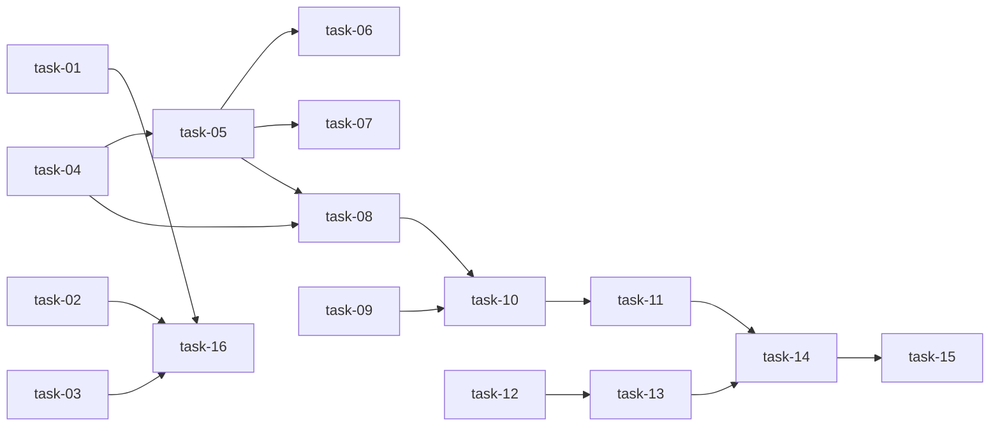

# 完整实现计划:运行时用量统计(token / 缓存 / 费用 + 时间窗 sparkline)

## 概述

运行时卡片新增「输入/输出/缓存词元 + 总费用」展示 + 卡片内 sparkline + 页面顶部时间窗切换器(当日/7天/30天)。cache 连带做(daemon 采集层 + 提交链 + DB 列 + 全链路)。共 7 Wave 16 任务(严格按 depends_on 拓扑排序),跨 daemon / backend / frontend 三子项目。正确性核心在 task-08 聚合去重(LEFT JOIN+COALESCE,D-003@v2);cache 接线关键在 task-16(提交链透传)。

## Wave 分组

> 按 depends_on 严格拓扑排序(同 Wave 内任务互无依赖,可并行)。关键路径:task-04 → task-05 → task-08 → task-10 → task-11 → task-14 → task-15(7 Wave)。

### Wave 1 · 基础层(无依赖,全部可并行)

- [x] task-01: stream-json.ts(Claude)补 cache 采集 — _accumulatedUsage/_currentTurnUsage 加 cache_read/cache_creation_tokens;message_delta 提取 event.usage.cache_*;透传。覆盖 FR-02 / D-001@v1。完成标准:tsc + vitest。**(R-01 首要实测项)**
- [x] task-02: codex-app-server-driver.ts cache 尽力而为(out.usage 加 cache_*,无则 undefined)。覆盖 FR-02 / D-001@v1。完成标准:tsc。
- [x] task-03: ndjson.ts 确认 cache_read/write_tokens 透传到 TaskResult.usage(注意 cache_write↔creation 名称映射)。覆盖 FR-02 / D-001@v1。完成标准:vitest。
- [x] task-04: migration 加 cache_read/cache_creation_tokens(nullable int);down_revision = alembic head。覆盖 FR-02。完成标准:alembic upgrade head 成功,无 backfill。
- [x] task-09: daemon/schema.py RuntimeUsage*(Window/Summary/Point/Read/ListResponse)Pydantic。覆盖 FR-03。完成标准:pydantic 校验通过。
- [x] task-12: charts/RuntimeUsageLineChart.tsx(echarts line sparkline,输入/输出双线)。覆盖 FR-04 / D-002@v1。完成标准:渲染双线 + 空数据占位。

### Wave 2(依赖 Wave 1)

- [x] task-05: agent/model.py AgentRun 加 cache_read/cache_creation_tokens(dep task-04)。覆盖 FR-02。完成标准:列与 migration 一致,mypy 通过。
- [x] task-13: charts/index.tsx next/dynamic(ssr:false)导出 + aggregations.ts toLineSeries(dep task-12)。覆盖 FR-04。完成标准:dynamic 导出避免 SSR window 报错。
- [x] task-16: daemon 提交链 cache 透传 — hub-client.ts + daemon.ts + task-runner.ts 的 usage 提取/构造/payload 加 cache_read/creation_tokens(SDK 全名→短名映射)(dep task-01/02/03)。覆盖 FR-02 / D-001@v1。完成标准:tsc + vitest 提交链透传单测。**(cache 链路关键接线 P0,补 step9 符号影响面遗漏)**

### Wave 3(依赖 Wave 2)—— 正确性核心

- [x] task-06: agent/service.py _METADATA_FIELDS 加 cache 两字段(batch 路径)(dep task-05)。覆盖 FR-02。完成标准:batch meta 带 cache 写入,mypy/pytest 通过。
- [x] task-07: run_sync/service.py 解析 cache(interactive 路径,沿用 input/output max 逻辑)(dep task-05)。覆盖 FR-02。完成标准:interactive cache 解析单测通过。
- [x] task-08: runtime/service.py RuntimeService.get_runtimes_usage(window) — LEFT JOIN + COALESCE 单查询去重(D-003@v2,SQL 见 design §7),date_trunc 按窗分组(D-002@v1),since 本地自然日(D-004@v1),方言分支(R-05)(dep task-04/05)。覆盖 FR-03 / D-002@v1 / D-003@v2 / D-004@v1。完成标准:**双路径去重单测 + 分组粒度单测**通过。

### Wave 4(依赖 Wave 3)

- [x] task-10: daemon/router.py GET /api/daemon/runtimes/usage?window=1d|7d|30d(声明在 /runtimes/{id} 之前)(dep task-08/09)。覆盖 FR-03。完成标准:curl 实测返回正确结构。

### Wave 5(依赖 Wave 4)

- [x] task-11: lib/daemon.ts getRuntimesUsage(window) + 类型(dep task-10)。覆盖 FR-01 / FR-03。完成标准:pnpm typecheck 通过。

### Wave 6(依赖 Wave 5)

- [x] task-14: runtimes/page.tsx 顶部时间窗切换器(3 tab)+ RuntimeCard 用量区(4 数字 k/M + 费用 $ + sparkline),按 runtime_id 分发批量响应(dep task-11/13)。覆盖 FR-01 / FR-04 / D-004@v1。完成标准:切窗数字+图同步变,codex 缓存显示「—」。

### Wave 7(依赖 Wave 1-6)

- [x] task-15: 三子项目单测 — daemon cache 提取、backend 双路径聚合去重 + 分组 + cache 解析(coverage≥60%)、frontend 图表渲染 + 时间窗切换 + 格式化(dep task-01~14)。覆盖 FR-01~05 / R-03。完成标准:各子项目测试通过。

## 任务总表

(关键路径见 Wave 分组开头;task-08 为正确性核心。)

| Task | Wave | 模块 | 依赖 | 覆盖 |
|---|---|---|---|---|
| task-01 | 1 | sillyhub-daemon | — | FR-02, D-001@v1, R-01 |
| task-02 | 1 | sillyhub-daemon | — | FR-02, D-001@v1 |
| task-03 | 1 | sillyhub-daemon | — | FR-02, D-001@v1 |
| task-04 | 1 | backend(migration) | — | FR-02 |
| task-09 | 1 | backend(schema) | — | FR-03 |
| task-12 | 1 | frontend(charts) | — | FR-04, D-002@v1 |
| task-05 | 2 | backend(agent/model) | task-04 | FR-02 |
| task-13 | 2 | frontend(charts/lib) | task-12 | FR-04 |
| task-16 | 2 | sillyhub-daemon(提交链) | task-01, task-02, task-03 | FR-02, D-001@v1 |
| task-06 | 3 | backend(agent/service) | task-05 | FR-02 |
| task-07 | 3 | backend(run_sync) | task-05 | FR-02 |
| task-08 | 3 | backend(runtime/service) | task-04, task-05 | FR-03, D-002@v1, D-003@v2, D-004@v1, R-05 |
| task-10 | 4 | backend(router) | task-08, task-09 | FR-03 |
| task-11 | 5 | frontend(lib) | task-10 | FR-01, FR-03 |
| task-14 | 6 | frontend(page) | task-11, task-13 | FR-01, FR-04, D-004@v1 |
| task-15 | 7 | 三子项目 tests | task-01~14 | FR-01~05, R-03 |

## 依赖关系图

(Wave 1 task-01/02/03 独立无跨 Wave 依赖;Wave 2→3→4→5 顺序,Wave 内如标注可并行。)

## 风险与应对

- **R-01** Claude CLI cache 透传:execute task-01 **首要**用真实 Claude CLI 流实测 `message_delta.event.usage` 是否带 `cache_creation_input_tokens`/`cache_read_input_tokens`;不透传则 Claude cache 回退 NULL,前端显示「—」,不阻塞主功能。
- **R-03** 聚合去重:task-08 单测**重点**验证 interactive run(同时挂 agent_session_id + lease_id)只被 SUM 一次。
- **R-02** batch cost 填充率:不排查,`SUM(COALESCE(...,0))` 忽略 NULL。
- **R-04** 30 天聚合性能:`created_at` 时间过滤收窄,必要时加索引(execute 确认)。

## 验收标准(AC)

- **AC-01**:卡片显示输入/输出/缓存/费用 4 数字 + sparkline(FR-01/FR-04)→ task-14
- **AC-02**:时间窗(当日/7天/30天)切换,数字与折线同步变(FR-03/FR-04)→ task-14
- **AC-03**:聚合不重复计算(interactive run 只算一次)(FR-03/D-003@v2/R-03)→ task-08
- **AC-04**:当日按小时 24 点 / 7天·30天按日(D-002@v1)→ task-08
- **AC-05**:cache 尽力而为(Claude 有数据 / codex 显示「—」)(D-001@v1)→ task-01/02/14
- **AC-06**:兼容(nullable,SUM 忽略 NULL,现有 `/runtimes`/`/sessions` 端点不变)(FR-05)→ task-08
- **AC-07**:三子项目测试通过(coverage≥60%)(FR)→ task-15

## 覆盖矩阵

| 决策/需求 | 覆盖任务 | 验收 AC |
|---|---|---|
| D-001@v1 | task-01, task-02, task-03, task-14 | AC-05 |
| D-002@v1 | task-08, task-12, task-14 | AC-04 |
| D-003@v2 | task-08 | AC-03 |
| D-004@v1 | task-08, task-14 | AC-02, AC-04 |
| FR-01 | task-11, task-14 | AC-01 |
| FR-02 | task-01~07 | AC-05 |
| FR-03 | task-08, task-09, task-10, task-11 | AC-02, AC-03, AC-04 |
| FR-04 | task-12, task-13, task-14 | AC-01, AC-02 |
| FR-05 | task-08 | AC-06 |

> 剩余风险:R-01(Claude CLI cache 透传未实测)、R-02(batch cost 填充率)——见 design.md §10,execute task-01 首要验证。
