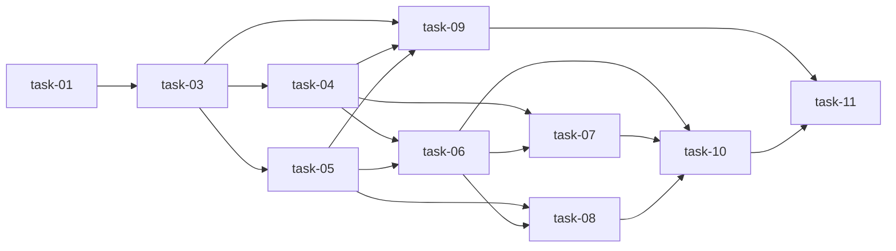

# 实现计划

## Spike 前置验证

无。技术方案沿用现有 FastAPI / SQLModel / Alembic / Next.js / apiFetch / Zustand / Ant Design 与 shadcn 组件体系，核心不确定性已在 design 阶段通过源码和模块文档确认。

## Wave 分组（严格拓扑，基于 task frontmatter depends_on）

规则：同 Wave 内任务无相互依赖、可并行；`Wave(N) = max(dep.Wave) + 1`。

### Wave 1（并行，无依赖）

- [ ] task-01: 增加后端权限、筛选分页、别名与路由顺序测试（覆盖：FR-01, FR-02, FR-03, FR-04, FR-06, D-001@v1, D-002@v1, D-003@v1, D-005@v1, D-006@v1）
- [ ] task-02: 增加前端 API client 类型契约与页面交互测试或可验证检查点（覆盖：FR-03, FR-04, FR-05, FR-06, D-004@v1, D-006@v1）

### Wave 2（依赖 Wave 1）

- [ ] task-03: 添加 display_alias 数据迁移与 ORM 字段（覆盖：FR-03, D-002@v1）

### Wave 3（依赖 Wave 2）

- [ ] task-04: 扩展 daemon runtime DTO、分页查询、别名更新和平台管理员跨 owner 管理（覆盖：FR-01, FR-02, FR-03, FR-04, FR-06, D-001@v1, D-002@v1, D-003@v1, D-005@v1, D-006@v1）
- [ ] task-05: 扩展 workspace DTO、列表筛选分页、owner 返回和别名更新（覆盖：FR-01, FR-02, FR-03, FR-04, FR-06, D-001@v1, D-002@v1, D-003@v1, D-006@v1）

### Wave 4（依赖 Wave 3）

- [ ] task-06: 更新前端 daemon/workspace API client 类型与方法（覆盖：FR-03, FR-04, FR-06, D-006@v1）
- [ ] task-09: 运行并修正 backend 模块级测试与格式检查（覆盖：FR-01, FR-02, FR-03, FR-04, FR-06, D-001@v1, D-002@v1, D-003@v1, D-005@v1, D-006@v1）

> task-06（前端 client）与 task-09（后端验证）分属前端/后端，无相互依赖，可并行。task-09 依赖的后端实现 task-03/04/05 已在 Wave 2/3 完成。

### Wave 5（依赖 Wave 4）

- [ ] task-07: 改造 /runtimes 页面筛选、人员搜索、分页、别名编辑和卡片样式（覆盖：FR-01, FR-03, FR-04, FR-05, D-003@v1, D-004@v1, D-006@v1）
- [ ] task-08: 改造 /workspaces 页面与 WorkspaceCard 筛选、人员搜索、分页、别名编辑和卡片样式（覆盖：FR-02, FR-03, FR-04, FR-05, D-002@v1, D-003@v1, D-004@v1, D-006@v1）

### Wave 6（依赖 Wave 5）

- [ ] task-10: 运行并修正 frontend 类型检查、lint 与相关测试（覆盖：FR-03, FR-04, FR-05, FR-06, D-004@v1, D-006@v1）

### Wave 7（依赖 Wave 6）

- [ ] task-11: 更新变更文档与模块影响记录，完成 verify 前自检（覆盖：FR-01, FR-02, FR-03, FR-04, FR-05, FR-06, D-001@v1, D-002@v1, D-003@v1, D-004@v1, D-005@v1, D-006@v1）

## 任务总表

| 编号 | 任务 | Wave | 优先级 | 依赖 | 覆盖 FR/D | 模块依赖与说明 |
|---|---|---|---|---|---|---|
| task-01 | 增加后端权限、筛选分页、别名与路由顺序测试 | W1 | P0 | — | FR-01, FR-02, FR-03, FR-04, FR-06, D-001, D-002, D-003, D-005, D-006 | backend tests；验证 auth → daemon/workspace 权限边界 |
| task-02 | 增加前端 API client 类型契约与页面交互测试或可验证检查点 | W1 | P1 | — | FR-03, FR-04, FR-05, FR-06, D-004, D-006 | frontend tests；覆盖 lib-daemon/lib-workspaces/app-pages/components |
| task-03 | 添加 display_alias 数据迁移与 ORM 字段 | W2 | P0 | task-01 | FR-03, D-002 | migrations + daemon/workspace model；为 API 层提供持久化字段 |
| task-04 | 扩展 daemon runtime DTO、分页查询、别名更新和平台管理员跨 owner 管理 | W3 | P0 | task-01, task-03 | FR-01, FR-02, FR-03, FR-04, FR-06, D-001, D-002, D-003, D-005, D-006 | daemon 依赖 auth/workspace；保留旧数组接口并新增 page 固定路由 |
| task-05 | 扩展 workspace DTO、列表筛选分页、owner 返回和别名更新 | W3 | P0 | task-01, task-03 | FR-01, FR-02, FR-03, FR-04, FR-06, D-001, D-002, D-003, D-006 | workspace 依赖 auth；普通账号仍走 allowed_workspace_ids |
| task-06 | 更新前端 daemon/workspace API client 类型与方法 | W4 | P0 | task-04, task-05 | FR-03, FR-04, FR-06, D-006 | lib-daemon/lib-workspaces 依赖 lib-api；提供页面数据契约 |
| task-09 | 运行并修正 backend 模块级测试与格式检查 | W4 | P0 | task-03, task-04, task-05 | FR-01, FR-02, FR-03, FR-04, FR-06, D-001, D-002, D-003, D-005, D-006 | 使用 local.yaml 后端命令；优先 daemon/workspace 模块测试；与 task-06 并行 |
| task-07 | 改造 /runtimes 页面筛选、人员搜索、分页、别名编辑和卡片样式 | W5 | P0 | task-04, task-06 | FR-01, FR-03, FR-04, FR-05, D-003, D-004, D-006 | app-pages 依赖 lib-daemon/lib-admin/stores-session/components-ui；保留 usage/session/URL恢复 |
| task-08 | 改造 /workspaces 页面与 WorkspaceCard 筛选、人员搜索、分页、别名编辑和卡片样式 | W5 | P0 | task-05, task-06 | FR-02, FR-03, FR-04, FR-05, D-002, D-003, D-004, D-006 | app-pages + components-shared 依赖 lib-workspaces/lib-admin/stores-session |
| task-10 | 运行并修正 frontend 类型检查、lint 与相关测试 | W6 | P1 | task-06, task-07, task-08 | FR-03, FR-04, FR-05, FR-06, D-004, D-006 | 使用 local.yaml 前端命令；收口 task-02 的 it.todo checkpoint |
| task-11 | 更新变更文档与模块影响记录，完成 verify 前自检 | W7 | P1 | task-09, task-10 | FR-01, FR-02, FR-03, FR-04, FR-05, FR-06, D-001, D-002, D-003, D-004, D-005, D-006 | 同步模块文档，准备 sillyspec verify |

## 关键路径

task-01 → task-03 → task-04/task-05 → task-06 → task-07/task-08 → task-10 → task-11（7 个 Wave）。

task-09 在 Wave 4 与 task-06 并行，不阻塞关键路径，但其结果由 task-11 在 Wave 7 汇总。

## 依赖关系图

## 调用点搜索记录

- `rg -n "listDaemonRuntimes|getDaemonRuntime|disableDaemonRuntime|enableDaemonRuntime|deleteDaemonRuntime|updateDaemonRuntime" frontend/src backend/app -S`：旧 `listDaemonRuntimes()` 被 `AgentProviderSelect`、`WorkspaceDaemonSwitcher`、`/workspaces`、workspace 详情、任务详情、`/runtimes` 与现有测试使用；必须保留数组返回并把新分页方法作为新增 API。
- `rg -n "listWorkspaces\(|updateWorkspace\(|WorkspaceCard|/api/workspaces|GET /api/workspaces" frontend/src backend/app .sillyspec/docs -S`：`listWorkspaces()` 被 `/workspaces`、workspace 详情组件页、多个后端模块测试和文档引用；`updateWorkspace()` 已被详情页与 daemon switcher 使用，新增 `display_alias` 不得改变既有字段语义。
- `rg -n "runtimes/page|/runtimes/usage|/runtimes/\{runtime_id\}|list_runtimes\(|delete_runtime\(|disable_runtime\(|enable_runtime\(" backend/app/modules/daemon frontend/src -S`：现有 `/runtimes/usage` 已在动态 runtime 路由前声明；新增 `/runtimes/page` 必须沿用同样顺序，并覆盖 disable/enable/delete 的跨 owner 管理分支。
- `rg -n "is_platform_admin|listUsers\(|UserListParams|owner\?\.email|owner\?\.display_name" frontend/src backend/app/modules -S`：`is_platform_admin` 已在 RBAC、session store、权限 helper、admin 页面中使用；`lib-admin.listUsers` 已有 `q/status/role/limit/offset`，人员搜索无需新建用户 API。

## 全局验收标准

> 以下为变更整体验收项（非 task，由各 task AC 与 verify 阶段共同保证），不参与 Wave 执行。

1. 平台管理员可分页查看全部 daemon runtime 与 workspace，并可按人员过滤。
2. 普通账号只能在自身可见范围内按名称、类型、状态过滤；传入其他用户 user_id 不扩大可见范围。
3. daemon runtime 与 workspace 都可保存、清空并展示 display_alias；空别名回退原始名称。
4. `GET /api/daemon/runtimes` 仍返回数组，`GET /api/daemon/runtimes/page` 返回分页对象且不会被 `{runtime_id}` 路由抢占。
5. `GET /api/workspaces` 保持 `{ items, total }` 响应结构，新增筛选分页参数不破坏默认行为。
6. 两个页面有服务端分页、筛选条、平台管理员人员搜索、别名编辑入口和符合系统风格的卡片。
7. 后端模块测试通过，前端类型检查和相关测试通过；若某项无法运行，记录原因和残余风险。

## 覆盖矩阵

| ID | 覆盖任务 | 验收证据 |
|---|---|---|
| D-001@v1 | task-01, task-04, task-05, task-09, task-11 | AC-01, AC-02, backend 权限测试 |
| D-002@v1 | task-01, task-03, task-04, task-05, task-08, task-11 | AC-03, 别名持久化与展示测试 |
| D-003@v1 | task-01, task-04, task-05, task-07, task-08, task-11 | AC-01, AC-02, user_id 越权隔离测试 |
| D-004@v1 | task-02, task-07, task-08, task-10, task-11 | AC-06, 页面验收与前端检查 |
| D-005@v1 | task-01, task-04, task-09, task-11 | AC-04, `/runtimes/page` 路由顺序测试 |
| D-006@v1 | task-01, task-04, task-05, task-06, task-07, task-08, task-11 | owner 嵌套 DTO 响应测试与前端类型检查 |
| FR-01 | task-01, task-04, task-05, task-07, task-09, task-11 | AC-01 |
| FR-02 | task-01, task-04, task-05, task-08, task-09, task-11 | AC-02 |
| FR-03 | task-01, task-02, task-03, task-04, task-05, task-06, task-07, task-08, task-09, task-10, task-11 | AC-03 |
| FR-04 | task-01, task-04, task-05, task-06, task-07, task-08, task-09, task-10, task-11 | AC-04, AC-05 |
| FR-05 | task-02, task-07, task-08, task-10, task-11 | AC-06 |
| FR-06 | task-01, task-02, task-04, task-05, task-06, task-09, task-10, task-11 | 兼容性测试与类型检查 |
