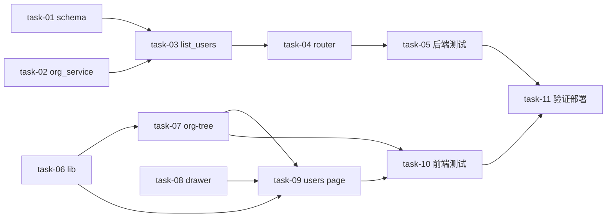

# 实现计划 — admin/users 组织树筛选

## Spike 前置验证

无技术不确定性（方案 A exists 子查询确定；`_descendant_ids` 已存在可复用；user_organizations M2N 已验证）。跳过 Spike。

## Wave 1（并行，无依赖）

- [x] task-01: 后端 schema — OrganizationRead +subtree_member_count、UserQueryParams +organization_id/include_children（覆盖 FR-02, D-003@v1）
- [x] task-02: 后端 organizations_service — +_subtree_member_count（distinct user_id 复用 _descendant_ids）、_to_read 注入（覆盖 FR-02, D-003@v1, D-005@v1）
- [x] task-06: 前端 lib/admin.ts — UserListParams +organization_id/include_children、OrganizationRead +subtree_member_count、listUsers 透传（覆盖 FR-01, FR-02）
- [x] task-08: 前端 admin-user-drawer — +defaultOrganizationIds prop，create 模式预填（覆盖 FR-05, Design Grill X-001）

## Wave 2（依赖 Wave 1）

- [x] task-03: 后端 UserService.list_users — +organization_id/include_children + exists 子查询过滤、import _descendant_ids（dep task-01/02）（覆盖 FR-01, D-004@v1）
- [x] task-07: 前端 admin-org-tree 组件（新增）— flat 组装树/全部组织节点/subtree_member_count/只显 active/展开折叠/onSelect（dep task-06）（覆盖 FR-03, D-001@v1, D-002@v1）

## Wave 3（依赖 Wave 2）

- [x] task-04: 后端 router — /api/admin/users +organization_id/include_children Query 透传（dep task-03）（覆盖 FR-01）
- [x] task-09: 前端 admin/users page — +selectedOrgId/左树右表布局/右侧顶部当前筛选/点节点刷新/新建传 defaultOrganizationIds（dep task-06/07/08）（覆盖 FR-04, FR-05）

## Wave 4（依赖 Wave 3）

- [x] task-05: 后端测试 — list_users 组织过滤用例（全部/叶子/含下级/distinct 去重/叠加 q+status+分页）（dep task-03/04）（覆盖 FR-01, FR-06）
- [x] task-10: 前端测试 — admin-org-tree 组装/点击筛选/新建带入（dep task-07/08/09）（覆盖 FR-03, FR-05）

## Wave 5（依赖 Wave 4）

- [x] task-11: 集成验证 + 部署 — ruff/mypy/pytest/tsc/lint/vitest 全绿、rebuild Docker、浏览器验收（dep 全部）（覆盖 FR-06）

## 任务总表

| 编号 | 任务 | Wave | 优先级 | 依赖 | 覆盖 FR/D | 说明 |
|---|---|---|---|---|---|---|
| task-01 | 后端 schema | W1 | P0 | — | FR-02, D-003@v1 | OrganizationRead+subtree_member_count, UserQueryParams+organization_id/include_children |
| task-02 | 后端 organizations_service | W1 | P0 | — | FR-02, D-003@v1, D-005@v1 | +_subtree_member_count 复用 _descendant_ids, _to_read 注入 |
| task-06 | 前端 lib/admin.ts | W1 | P0 | — | FR-01, FR-02 | 类型同步 + listUsers 透传 |
| task-08 | 前端 admin-user-drawer | W1 | P0 | — | FR-05, X-001 | +defaultOrganizationIds prop |
| task-03 | 后端 list_users | W2 | P0 | task-01,02 | FR-01, D-004@v1 | exists 子查询过滤, import _descendant_ids |
| task-07 | 前端 admin-org-tree | W2 | P0 | task-06 | FR-03, D-001@v1, D-002@v1 | 新增组件 |
| task-04 | 后端 router | W3 | P0 | task-03 | FR-01 | +Query 透传 |
| task-09 | 前端 users page | W3 | P0 | task-06,07,08 | FR-04, FR-05 | 左树右表 + selectedOrgId |
| task-05 | 后端测试 | W4 | P0 | task-03,04 | FR-01, FR-06 | 组织过滤用例 |
| task-10 | 前端测试 | W4 | P1 | task-07,08,09 | FR-03, FR-05 | vitest |
| task-11 | 集成验证+部署 | W5 | P0 | 全部 | FR-06 | 全绿 + rebuild + 浏览器验收 |

## 关键路径

- 后端链：task-01 → task-03 → task-04 → task-05 → task-11
- 前端链：task-06 → task-07 → task-09 → task-10 → task-11
- 两端并行，task-11 汇合；最长路径决定交付周期。

## 全局验收标准

| AC | 标准 |
|---|---|
| AC-01 | 点「全部组织」显全部用户（organization_id 不传行为不变）|
| AC-02 | 点叶子组织只显该组织用户 |
| AC-03 | 点父组织（include_children=true）显当前+下级用户 |
| AC-04 | 树节点显 subtree_member_count（fallback member_count）|
| AC-05 | 搜索+状态+组织筛选可叠加 |
| AC-06 | 分页正常；现有编辑/删除/会话/审计/重置密码不受影响 |
| AC-07 | 新建用户选中组织时 drawer 默认带入 |
| AC-08 | 后端 ruff+mypy+pytest 全绿、前端 tsc+lint+vitest 全绿 |
| AC-09 | (brownfield) organization_id 未传时 list_users 行为零变化 |

## 覆盖矩阵（decisions.md）

| ID | 覆盖任务 | 验收证据 |
|---|---|---|
| D-001@v1 | task-07, task-09 | AC-03（include_children 固定 true）|
| D-002@v1 | task-07 | AC-04（树只显 active）|
| D-003@v1 | task-01, task-02 | AC-04（subtree_member_count distinct）|
| D-004@v1 | task-03 | AC-02/03（exists 子查询）|
| D-005@v1 | task-02 | AC-04（实时算）|

## 依赖关系图

