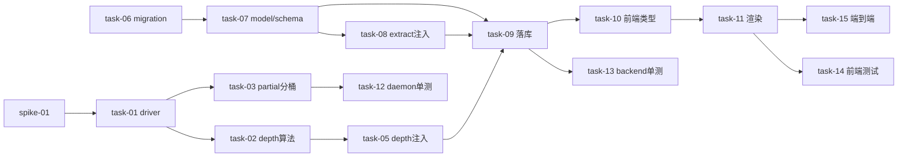

# 实现计划 · daemon 子代理日志可见性

## Spike 前置验证

| Spike | 验证内容 | 通过标准 | 不通过后果 |
|---|---|---|---|
| spike-01 | `forwardSubagentText=true` 后，真实 Claude 调 Task tool 派生子代理时，daemon `consume` 是否真的收到带 `parent_tool_use_id` 的子代理 assistant/user message（字段名/消息类型/经主流 query generator） | consume for-await 能拿到 `msg.parent_tool_use_id` 非空的子代理 assistant message，字段名与 `sdk.d.ts:2647-2666` 一致 | task-01/02/03/05 的 daemon 层假设失效，回到 design §5 Phase 2 按 SDK 实际行为重设计（R-06） |

> spike-01 在 Wave 1 前用临时日志打点轻量验证（driver start 加 forwardSubagentText 后，consume 内 console.error 打印 msg.type + parent_tool_use_id），不写正式代码。结果记录到 task-15 的端到端断言。

## Wave 1（并行基础，无相互依赖）

- [ ] task-01: driver 开 `forwardSubagentText: true`（覆盖：FR-01, D-001@v1, D-006@v1, R-06）
- [ ] task-04: `_onMessage` system/init 加 agentSessionId 防御守卫（`parent_tool_use_id` 非空跳过）（覆盖：FR-04, D-003@v1）
- [ ] task-06: alembic migration — `agent_run_logs` 加 `parent_tool_use_id`/`subagent_type`/`depth` 三列 + `ix_agent_run_logs_parent` 索引，down 接真实 head（覆盖：FR-06, D-004@v1, **R-01 P0**）
- [ ] task-07: ORM `AgentRunLog` model + `AgentRunLogEntry`/Read schema 加三 nullable 字段（覆盖：FR-06, D-004@v1）

## Wave 2（daemon 核心逻辑，依赖 task-01）

- [ ] task-02: `SessionState` 加 `subagentDepth: Map<tool_use_id, depth>` + depth 算法（assistant message 遍历 tool_use blocks 预登记，主=0/子=父+1/退化=1+warn）（覆盖：FR-05, D-007@v1, R-04）
- [ ] task-03: partial buffer 按 `parent_tool_use_id` 分桶（`_partialBuffers` 改二级 Map，`_bufferPartial`/`_clearPartialBufferSync`/`_flushPartial`/`_emitOverrideSignals`/`_resolveSegmentId` 全分桶，segmentId 带 parent 前缀）（覆盖：FR-03, D-002@v1, **R-02 P0**）

## Wave 3（backend 落库 + daemon 转发，依赖 task-02/07）

- [ ] task-05: `_onMessage` 转发前注入 `msg.depth`（查 `subagentDepth` 得）（覆盖：FR-05, D-007@v1）
- [ ] task-08: `_extract_sdk_messages` 每条 flat record 注入 `parent_tool_use_id`/`subagent_type`/`depth`（非首条 stamp，usage/session_id 仍首条）（覆盖：FR-07, D-008@v1）
- [ ] task-09: `submit_messages` 落库循环（`run_sync/service.py:377` 构造点）写三列（覆盖：FR-07）

## Wave 4（前端，依赖 Wave 3）

- [ ] task-10: 前端日志行类型（`logsToTurns` / agent-stream 类型）+ `agent-log/*` 加三字段并透传（覆盖：FR-08, D-005@v1）
- [ ] task-11: `agent-log-viewer.tsx` 读列渲染 `[子代理:<type>]` 徽标 + depth 缩进 + 同 parent 归组（覆盖：FR-08, D-005@v1）

## Wave 5（verify，依赖全部）

- [ ] task-12: daemon 单测 — partial 隔离回归（主/子并发不互清，主单代理字节等价）+ init 守卫 + depth 多层（主0/子1/孙2）（覆盖：FR-03/04/05, R-02）
- [ ] task-13: backend 单测 — `_extract_sdk_messages` 透传三字段 + 落库三列 + migration up/down 可逆（PG）（覆盖：FR-06/07, R-01）
- [ ] task-14: 前端渲染测试 — 徽标 + 深度（mock 日志快照，含多层嵌套与并发子代理）（覆盖：FR-08）
- [ ] task-15: 端到端集成 — 真实 Claude 调 Task tool 派生子代理（含嵌套），断言 consume 收到带 `parent_tool_use_id` 的子代理 message + 日志可见归属 + 刷新后归属不丢（覆盖：FR-01~FR-09, **R-06**, SC-2~SC-5）

## 任务总表

| 编号 | 任务 | Wave | 优先级 | 依赖 | 覆盖 FR/D | 说明 |
|---|---|---|---|---|---|---|
| task-01 | driver 开 forwardSubagentText | W1 | P0 | — | FR-01/D-001/D-006 | `claude-sdk-driver.ts` start options |
| task-02 | SessionState subagentDepth + depth 算法 | W2 | P0 | task-01 | FR-05/D-007 | `_onMessage` 遍历 tool_use blocks |
| task-03 | partial 按 parent 分桶隔离 | W2 | P0 | task-01 | FR-03/D-002 | **R-02 P0** 主代理字节等价回归 |
| task-04 | agentSessionId 防御守卫 | W1 | P1 | — | FR-04/D-003 | `_onMessage` system/init |
| task-05 | depth 注入转发 msg.depth | W3 | P0 | task-02 | FR-05/D-007 | session-manager 转发前注入 |
| task-06 | alembic migration 三列+索引 | W1 | P0 | — | FR-06/D-004 | **R-01 P0** down 接真实 head |
| task-07 | ORM model + schema 加字段 | W1 | P0 | task-06 | FR-06/D-004 | model.py:285 + schema.py:128 |
| task-08 | _extract_sdk_messages 每条注入归属 | W3 | P0 | task-07 | FR-07/D-008 | run_sync/service.py:956 |
| task-09 | submit_messages 落库写三列 | W3 | P0 | task-07, task-08 | FR-07 | run_sync/service.py:377 构造点 |
| task-10 | 前端日志行类型加三字段 | W4 | P1 | task-09 | FR-08/D-005 | lib + agent-log/* |
| task-11 | agent-log-viewer 徽标+深度渲染 | W4 | P1 | task-10 | FR-08/D-005 | agent-log-viewer.tsx |
| task-12 | daemon 单测（partial/init/depth） | W5 | P0 | task-01~05 | FR-03/04/05 | R-02 回归 |
| task-13 | backend 单测（extract/落库/migration） | W5 | P0 | task-06~09 | FR-06/07 | R-01 PG up/down |
| task-14 | 前端渲染测试 | W5 | P1 | task-10/11 | FR-08 | mock 快照 |
| task-15 | 端到端集成（真实 Claude Task tool） | W5 | P0 | task-01~14 | FR-01~09 | **R-06** 实测 |

## 关键路径

spike-01 → task-01 → task-02 → task-05 → task-08/09 → task-10/11 → task-15（端到端）
（并行支线：task-06 → task-07 → task-08/09，与 daemon 路线在 W3 汇合）

## 调用点搜索记录（full 自检要求）

model/schema 加列影响的所有调用点已搜索，纳入任务范围：

- `AgentRunLog(...)` 构造点：`grep -rn "AgentRunLog(" backend/app --include="*.py"`
  - `daemon/run_sync/service.py:377` ← **task-09 改**（核心落库点，传三列）
  - `daemon/session/service.py:376/554`、`agent/service.py:618/1439`（user_input/session 事件，非子代理，新列 nullable 不传，向后兼容）
- `_extract_sdk_messages` 调用点：仅 `run_sync/service.py:243`（submit_messages 内）← **task-08 改定义即可，调用点不改**
- `AgentRunLogEntry` DTO 使用点：`main.py:415` / `agent/router.py:400` / `daemon/router.py`（均 `model_validate(e)` 自动透传，**task-07 改 schema 即可，调用点不改**）

## 全局验收标准

- [ ] 所有单测通过（daemon `npm test` / backend `uv run pytest` / frontend `npm test`）
- [ ] （brownfield）未升级 daemon / 历史日志（归属列 NULL）渲染为主 agent，行为不变（SC-1, FR-09）
- [ ] migration up + down 可逆，execute 前 `grep -hE "^revision|^down_revision" backend/migrations/versions/*.py` 核对单一 head（R-01, SC-6）
- [ ] partial 隔离：主 agent 单代理场景字节等价回归通过（R-02, SC-4）
- [ ] 端到端：真实 Claude 调 Task tool 派生子代理（含嵌套），日志可见归属徽标 + depth 缩进，刷新后归属不丢（R-06, SC-2/3/5）

## 覆盖矩阵（decisions.md）

| ID | 覆盖任务 | 验收证据 |
|---|---|---|
| D-001@v1 | task-01, task-08 | AC: extract 透传 + consume 收到带 parent_tool_use_id 的 message |
| D-002@v1 | task-03 | AC: partial 隔离回归（task-12） |
| D-003@v1 | task-04 | AC: init 守卫测试（task-12） |
| D-004@v1 | task-06, task-07 | AC: migration up/down + model/schema 字段（task-13） |
| D-005@v1 | task-10, task-11 | AC: 徽标+深度渲染（task-14） |
| D-006@v1 | task-01 | AC: 只改 ClaudeSdkDriver，Codex driver 不动 |
| D-007@v1 | task-02, task-05 | AC: depth 多层正确（task-12） |
| D-008@v1 | task-08 | AC: 每条 flat record 带归属（task-13） |
