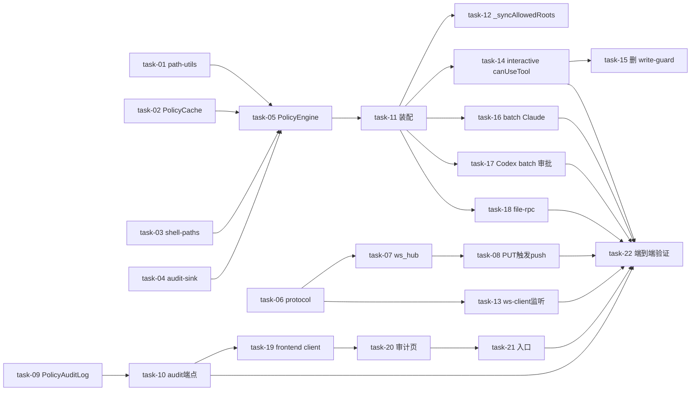

# Plan: 重构 Daemon Runtime 文件系统权限控制（Filesystem Policy Engine）

**plan_level: full**

## 来源
`design.md`（§5-§13）+ `proposal.md` / `requirements.md` / `tasks.md` / `decisions.md`（D-001~D-008 全 accepted，无 P0/P1 unresolved）。

## 范围
- **sillyhub-daemon**（主战场）：新增 `src/policy/` 5 文件 + 改 8 个接入点 + 删 `write-guard.ts`
- **backend daemon 模块**：新增 `audit/` 子模块 + `PolicyAuditLog` 表 + migration + 改 `protocol.py`/`ws_hub.py`/`router.py`
- **frontend**：新增审计页 + API client + runtime 卡片入口
- 不改 `DaemonRuntime.allowed_roots` 模型（已 per-runtime）

## 调用点搜索结论（影响任务范围）
- `isWriteWithinAllowedRoots` 唯一运行时调用 `session-manager.ts:829` + 2 测试文件（`write-guard.test.ts`、`session-manager-allowed-roots.test.ts`）需迁移覆盖到 PolicyEngine。
- `_allowedRootsProvider` 签名 `() => string[]` → 需带 runtimeId；影响 `cli.ts:528` 生产注入 + 60+ 测试构造点（多数传 null/mock 向后兼容）。
- `Daemon` 构造新增 `policyEngine`/`auditSink`/`policyCache` 3 字段；`cli.ts:544` 生产注入 + 19 测试构造点（多数传 null/mock）。
- `assertWithinAllowedRoots` 唯一调用 `file-rpc.ts:123`，`listDir` 签名需加 runtimeId。
- `buildCcSettingsJson` 唯一调用 `stream-json.ts:308`，数据源改 PolicyCache。
- `adapter.buildArgs` 调用 `task-runner.ts:455`，`json-rpc.ts:128` 需新增 allowedRoots 参数。
- `APPROVAL_RESPONSES`（`json-rpc.ts:49`）+ `parseServerRequest`（`:344`）Codex batch 自动 accept，改 PolicyEngine 决策。
- backend `PUT /runtimes/{rid}/allowed-roots` 已存在（`router.py:340`，**实为 PUT 非 PATCH**，design §5.3 措辞修正）；新增 `send_policy_update` 复用 `send_to_runtime`。

## Wave 分组与任务

### Wave 1：daemon Policy 模块基础（纯新增，无依赖）
- [ ] task-01: `policy/path-utils.ts` — `normalizePath`（strip 引号 + git bash `/x/`→`X:/` + pathResolve）+ `resolveRealPath`（realpath + 父目录 fallback + Windows 大小写归一 + 拒 UNC）+ `isPathUnderAnyRoot`（沿用 ql-20260702-007 盘符根修复）+ 单测（覆盖 symlink/junction/UNC/不存在路径/`..`）【D-005】
- [ ] task-02: `policy/runtime-policy.ts` — `RuntimePolicy{allowedRoots,version}` + `PolicyCache`（Map<rid,RP>，get/set/reload/reloadAll，**不偷偷加 homedir**）+ 单测【D-002】【D-007】
- [ ] task-03: `policy/shell-paths.ts` — Bash（`>/>>/cp/mv/install/tee/mkdir/touch`）+ PowerShell（`Set-Content/Add-Content/Out-File/New-Item/Copy-Item/Move-Item/Rename-Item/Remove-Item`）+ CMD（`copy/move/mkdir/echo >/type >/del`）写路径提取 + 单测【FR-04】
- [ ] task-04: `policy/audit-sink.ts` — `AuditEvent` + `AuditSink`（攒批 100/5s + flush POST + 指数退避 + 失败落盘 `audit-failed.jsonl`）+ 单测【D-006】【D-008】
- [ ] task-05: `policy/filesystem-policy.ts` — `PolicyEngine`（canRead 全 allow 不 audit / canWrite/canCreate/canDelete/canRename 记 audit，带 runtimeId）+ 单测【D-001】【D-008】（依赖 task-01..04）

### Wave 2：backend WS push + audit 基础（独立于 daemon）
- [ ] task-06: `daemon/protocol.py` 新增 `POLICY_UPDATE` 消息类型 + `PolicyUpdatePayload{runtime_id,allowed_roots,version}`【D-004】
- [ ] task-07: `daemon/ws_hub.py` 新增 `send_policy_update(rid, roots)`（复用 `send_to_runtime:106`）+ 单测【D-004】
- [ ] task-08: `daemon/router.py:340` `PUT /runtimes/{rid}/allowed-roots` 端点改完 DB 后触发 `ws_hub.send_policy_update` + 测试【D-004】（依赖 task-06,07）
- [ ] task-09: `daemon/audit/model.py` `PolicyAuditLog` 表（runtime_id/workspace_id/decision/provider/tool/path/reason/created_at + 索引）+ migration + 单测【D-006】
- [ ] task-10: `daemon/audit/service.py` + `router.py` — `POST /daemon/audit/batch`（claim_token 鉴权，批量插入）+ `GET /workspaces/{wid}/runtimes/{rid}/policy-audit`（分页 + 筛选 decision/provider/tool/path/时间）+ 测试【D-006】（依赖 task-09）

### Wave 3：daemon 装配 PolicyEngine（依赖 W1）
- [ ] task-11: `Daemon` 构造 `DaemonOptions` 新增 `policyEngine`/`auditSink`/`policyCache` 字段（`daemon.ts:405`）+ `cli.ts:544` 生产装配实例化注入 + 19 测试构造点评估传 null/mock【依赖 task-05】
- [ ] task-12: `daemon.ts:1682` `_syncAllowedRoots` 改写 PolicyCache（去并集，每 rid 独立 `cache.set`）+ 删 `_allowedRootsByRuntime` Map + 心跳兜底 reloadAll + 单测【D-002】（依赖 task-02,11）
- [ ] task-13: `ws-client.ts` 监听 `POLICY_UPDATE` 消息 → `PolicyCache.set(rid, roots)`（带 version 去重，旧 version 忽略）+ 单测【D-004】（依赖 task-02,06,11）

### Wave 4：各 Tool 接入点改造（依赖 W1+W3）
- [ ] task-14: `session-manager.ts:822` `_wrapWithWriteGuard` 改调 `PolicyEngine.canWrite(session.runtimeId, path)`；`SessionManagerOptions.allowedRootsProvider` 签名改带 runtimeId；`cli.ts:528` 注入改 PolicyEngine 闭包；迁移 `write-guard.test.ts` + `session-manager-allowed-roots.test.ts` 覆盖到 PolicyEngine【D-002】（依赖 task-05,11）
- [ ] task-15: 删 `interactive/write-guard.ts`（逻辑已迁 PolicyEngine，确认无残留引用）【依赖 task-14】
- [ ] task-16: `task-runner.ts:455` + `stream-json.ts:308` + `permission-rules.ts` batch Claude 改用 `PolicyCache.get(task.runtimeId)` 快照生成 CC `--settings`（数据源从全局 config 改 per-runtime）+ 测试【D-002】（依赖 task-02,11）
- [ ] task-17: `json-rpc.ts:49` 移除 `APPROVAL_RESPONSES` 自动 accept + `parseServerRequest` 接入 PolicyEngine 决策 `item/fileChange/requestApproval`/`item/commandExecution/requestApproval`（accept/decline + 中文理由）+ `task-runner.ts` batch 路径处理 server request + ⚠️ execute 验证 Codex 审批消息字段格式【R-06】（依赖 task-03,05,11）
- [ ] task-18: `file-rpc.ts:123` `listDir` 签名加 runtimeId + 改调 `PolicyEngine.canRead`（读自由，不 audit）+ `daemon.ts` list_dir RPC handler 传 runtimeId + 迁移 `file-rpc.test.ts`【D-008】（依赖 task-05,11）

### Wave 5：frontend 审计页（依赖 W2 task-10）
- [ ] task-19: `lib/daemon-audit.ts` API client（GET 审计查询 + 筛选/分页参数）【D-006】
- [ ] task-20: `app/(dashboard)/runtimes/[id]/audit/page.tsx` 审计页（统计概览 + 筛选区 + ALLOW/DENY 列表 + 分页，参照 `prototype-policy-audit.html`）【D-006】（依赖 task-19）
- [ ] task-21: `app/(dashboard)/runtimes/page.tsx` runtime 卡片加「审计日志」入口链接到审计页【依赖 task-20】

### Wave 6：端到端验证（依赖全部）
- [ ] task-22: 验证 runtime 隔离（claude/codex 各看各 roots）+ 热更新（interactive 立即 / batch 跑完再生效 / 新起 batch 用新配置）+ 各 Tool 拦截（Write/Bash/PowerShell/CMD/Copy/Move/Delete）+ Codex batch 带内审批 decline + 路径规范化（symlink/junction/UNC/`..`）+ 审计页查询筛选分页 + 兼容（旧 daemon 连新 backend 靠心跳 / 新 daemon 连旧 backend）【design §13 全 14 条】

## 任务总表

| task | 优先级 | 依赖 | Wave | 决策覆盖 |
|---|---|---|---|---|
| task-01 | P0 | — | 1 | D-005 |
| task-02 | P0 | — | 1 | D-002, D-007 |
| task-03 | P0 | — | 1 | FR-04 |
| task-04 | P0 | — | 1 | D-006, D-008 |
| task-05 | P0 | task-01..04 | 1 | D-001, D-008 |
| task-06 | P0 | — | 2 | D-004 |
| task-07 | P0 | task-06 | 2 | D-004 |
| task-08 | P0 | task-06,07 | 2 | D-004 |
| task-09 | P0 | — | 2 | D-006 |
| task-10 | P0 | task-09 | 2 | D-006 |
| task-11 | P0 | task-05 | 3 | — |
| task-12 | P0 | task-02,11 | 3 | D-002 |
| task-13 | P0 | task-02,06,11 | 3 | D-004 |
| task-14 | P0 | task-05,11 | 4 | D-002 |
| task-15 | P1 | task-14 | 4 | — |
| task-16 | P0 | task-02,11 | 4 | D-002 |
| task-17 | P0 | task-03,05,11 | 4 | R-06 |
| task-18 | P1 | task-05,11 | 4 | D-008 |
| task-19 | P1 | task-10 | 5 | D-006 |
| task-20 | P1 | task-19 | 5 | D-006 |
| task-21 | P2 | task-20 | 5 | — |
| task-22 | P0 | task-08,10,13,14,16,17,18,21 | 6 | 全部 |

## 关键路径
task-01..05（W1 Policy 模块）→ task-11（装配）→ task-14/16/17（Tool 接入）→ task-22（验证）。
W2（backend WS push + audit，task-06..10）与 W1 并行，task-13 依赖 W2 的 task-06，task-19 依赖 W2 的 task-10。
W5 frontend 依赖 W2 task-10 audit 端点，可与 W3/W4 并行。

## 决策覆盖矩阵

| 决策 | 覆盖 task |
|---|---|
| D-001 务实方案非 OS 沙箱 | task-05（canRead 全 allow + 写类记 audit），验收 task-22 #10 |
| D-002 按 runtime 隔离 | task-02, task-12, task-14, task-16 |
| D-003 batch 跑完再生效 | task-16（spawn 快照），验收 task-22 #2 #3 |
| D-004 WS push 热更新 | task-06, task-07, task-08, task-13 |
| D-005 realpath 规范化 | task-01 |
| D-006 audit 全量回传 | task-04, task-09, task-10, task-19, task-20 |
| D-007 homedir 严格按 admin | task-02（PolicyCache 不偷偷加） |
| D-008 canRead 不记 audit | task-04, task-05, task-18 |

## 全局验收（design §13，含兼容性）
1. runtime 隔离：claude/codex 各看各 roots，互不串扰。
2. interactive 热更新立即生效（sub-second）。
3. batch 跑完再生效，不中断在跑任务。
4. Write 未授权拒绝 + 统一中文错误。
5. Bash `echo > E:\a.txt` 拒绝。
6. PowerShell `Set-Content E:\a.txt` 拒绝。
7. CMD `mkdir E:\abc` 拒绝。
8. Copy-Item/Move-Item/Remove-Item 未授权拒绝。
9. Codex batch 写越界带内审批 decline + 中文理由。
10. Python `open("E:\\a.txt","w")` 降级 prompt+audit（不硬拦）。
11. 路径规范化防 symlink/junction/UNC/`..`。
12. 审计页可查 + 筛选 + 分页。
13. list_dir 行为不变（读自由）。
14. 兼容：旧 daemon 连新 backend 靠心跳兜底；新 daemon 连旧 backend 无 POLICY_UPDATE 也能工作。
15. （brownfield）未配置 allowed_roots 的 runtime 沿用默认 `["~/.sillyhub"]`，PolicyCache 未命中 fallback。

## ⚠️ execute 确认项
- **R-06**：task-17 execute 先验证 Codex app-server 审批消息字段格式（`item/fileChange/requestApproval` payload）+ decline 响应格式，再定接入实现。
- **R-03/R-04**：task-01 realpath 跨平台行为（Windows junction/UNC）+ 不存在路径 fallback，Windows CI 验证。
- **policy_engine_enabled 回退开关**（design §9 自审存疑）：task-11 判断是否需要 YAGNI 开关，不需要则不留。
- **测试构造点**：task-11 评估 19 个 Daemon 测试构造 + task-14 评估 60+ SessionManager 测试构造是否需传 mock（多数传 null 向后兼容）。

## 自检（plan_level=full）
- [x] 每个 task 有编号 task-01..22
- [x] 每个 task 在 Wave 下有 checkbox `- [ ] task-XX:`
- [x] 标注 Wave 分组 + 依赖关系
- [x] 任务总表含优先级 + 依赖列（无估时列）
- [x] 关键路径标注 + Mermaid 依赖图（非线性，W1/W2 并行 + W3/W4 串联 + W5 分支）
- [x] 全局验收标准 15 条（含兼容性 #14 #15）
- [x] 决策覆盖矩阵覆盖 D-001~D-008 全部当前版本
- [x] 无 P0/P1 unresolved blocker（R-06 已解，R-01 是 D-001 接受的约束）
- [x] brownfield 兼容性条款（验收 #14 #15）
- [x] 无实现细节（接口定义/代码示例在 design.md，不在 plan.md）
- [x] plan.md 文件变更与 design.md §6 一致（27 项分布在 task-01..21）
- [x] 构造函数/接口/DTO 变更已搜索调用点（Daemon 19 处 + SessionManager 60+ 处 + write-guard 2 处 + file-rpc 1 处 + buildArgs 1 处），纳入 task-11/14/15/18 范围
- [x] 调用点搜索输出记录在 plan.md「调用点搜索结论」节
- [x] Mermaid 依赖关系非平凡（W1/W2 并行 + W3 汇聚 + W4 分散 + W5 独立分支 + W6 汇聚）
- [x] 无泛泛风险分析（具体 R-xx 在 design.md §10，plan 只列 execute 确认项）
