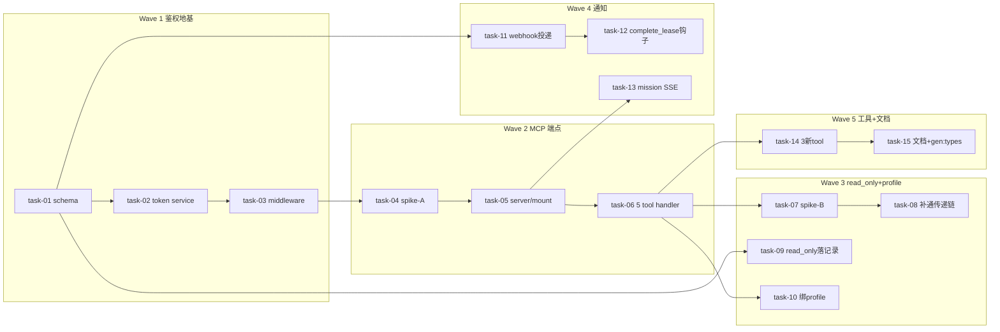

# 实现计划（Plan）— 对外暴露生产级 MCP 给第三方

> 来源：design.md（7 Phase）+ tasks.md（23 task，本 plan 合并为 15 个 ≤15 约束）。实现细节进后续 `tasks/task-NN.md`。

## Spike 前置验证

| Spike | 验证内容 | 通过标准 | 不通过后果 |
|---|---|---|---|
| spike-A（task-04） | 官方 `mcp` Python SDK + FastMCP `http_app()` mount 到现有 FastAPI + 鉴权 middleware 注入 workspace/scope 可行性（CC-07 / R-01 / R-04） | mount 后 `/mcp` 响应 initialize/tools/list，middleware 能注入上下文 | Wave 2 transport 方案重评（退回方案 B 手写 / C fastapi-mcp） |
| spike-B（task-07） | read_only worker `--allowedTools` 传递链端到端是否真通（CC-03 / R-09：`stream-json.ts:333` 已消费 vs `execution.py:14-23` docstring "不强制" vs `tool_config` 二义） | 派一个 read_only worker，实测其只能用 Read/Glob/Grep，写工具被拒 | Wave 3 范围扩大：补通 backend→daemon 传递链 + 拆 `tool_config` 二义 key（tool_governance vs credential_config） |

## Wave 1 — 鉴权地基（并行/弱依赖，其余 Wave 依赖此）
- [x] task-01: schema 迁移——`mcp_tokens` + `mcp_webhooks` 表 + `agent_runs.read_only` 列 + ORM（覆盖：FR-02, FR-06, FR-07, D-002@v1）
- [x] task-02: McpToken service + 管理 HTTP API（签发/校验/吊销 + Redis 缓存复用 ApiKeyService 模式 + CRUD）（覆盖：FR-02, D-002@v1）
- [x] task-03: Starlette middleware（校验 `Authorization: Bearer` → 注入 workspace_id/scope + scope 不足 403）（覆盖：FR-02, FR-03, D-002@v1）

## Wave 2 — 对外 MCP 端点（依赖 Wave 1）
- [x] task-04: [spike-A] 加 `mcp` SDK 依赖（锁版本）+ 验证 FastMCP mount + 鉴权注入（覆盖：FR-01, D-001@v1, D-007@v1）
- [x] task-05: `mcp_gateway/server.py` + `main.py` mount `/mcp`（FastMCP http_app ASGI）（覆盖：FR-01, D-001@v1）
- [x] task-06: `mcp_gateway/tools.py` 5 个现有 tool handler（dispatch_worker/get_worker_result/list_workers/converge_mission/report_progress）接 service 层 + scope 校验（覆盖：FR-01）

## Wave 3 — read_only 物制 + 绑 profile（依赖 Wave 2）
- [x] task-07: [spike-B] 端到端实测 read_only worker `--allowedTools` 传递链（覆盖：FR-05, D-005@v2, R-09）
- [x] task-08: 据 spike-B 结果修 `execution.py:14-23` docstring + 补通传递链/拆 `tool_config` 二义 key（覆盖：FR-05, D-005@v2）
- [x] task-09: `AgentRun.read_only` 落记录 + dispatch 流转 read_only 标志（覆盖：FR-06, D-005@v2）
- [x] task-10: dispatch 绑 AgentProfile（`DispatchWorkerRequest` 加 `agent_profile_id` + 冻结 `agent_profile_snapshot`，复用 `model.py:133-145` 不改表）（覆盖：FR-04）

## Wave 4 — 完成通知（依赖 Wave 2）
- [x] task-11: webhook 投递器 + `mcp_webhooks` CRUD API（HMAC-SHA256 签名 + 指数退避重试最多 5 次）（覆盖：FR-07, D-003@v1）
- [x] task-12: `lease/service.py::DaemonService.complete_lease` 终态钩子触发 webhook（CC-08：service 层非 router）（覆盖：FR-07, D-003@v1）
- [x] task-13: mission SSE 端点（`GET /workspaces/{wid}/missions/{mid}/events`，复用 `stream_agent_run_logs` 模式）（覆盖：FR-08, D-003@v1）

## Wave 5 — 工具补全 + 文档（依赖 Wave 2-4）
- [x] task-14: 3 个新 MCP tool（`list_agent_profiles` / `create_mission` 复用 OrchestratorService / `get_run_logs` 查 AgentRunLog）（覆盖：FR-09, D-006@v1）
- [x] task-15: `docs/mcp/` 全套文档 + `pnpm gen:types` 同步 `api-types.ts`/`openapi.json`（覆盖：FR-10, CLAUDE.md 规则 20）

## 任务总表

| 编号 | 任务 | Wave | 优先级 | 依赖 | 覆盖 FR/D | 说明 |
|---|---|---|---|---|---|---|
| task-01 | schema 迁移（2 表 + 1 列） | W1 | P0 | — | FR-02/06/07, D-002 | alembic 一次性，ORM model.py |
| task-02 | McpToken service + 管理 API | W1 | P0 | task-01 | FR-02, D-002 | 复用 ApiKeyService 缓存 |
| task-03 | 鉴权 middleware + scope 拒绝 | W1 | P0 | task-02 | FR-02/03, D-002 | 注入 workspace/scope 到 tool ctx |
| task-04 | [spike-A] mcp SDK + FastMCP mount 验证 | W2 | P0 | task-03 | FR-01, D-001/007 | 锁版本 + R-01/R-04 |
| task-05 | mcp_gateway/server.py + mount | W2 | P0 | task-04 | FR-01, D-001 | http_app ASGI mount /mcp |
| task-06 | 5 现有 tool handler | W2 | P0 | task-05 | FR-01 | 接 service 层 + scope 校验 |
| task-07 | [spike-B] read_only 传递链实测 | W3 | P0 | task-06 | FR-05, D-005@v2 | CC-03/R-09，定 W3 范围 |
| task-08 | 修 docstring + 补通/拆 tool_config | W3 | P0 | task-07 | FR-05, D-005@v2 | 据 spike-B 结果 |
| task-09 | read_only 落 run 记录 | W3 | P1 | task-01 | FR-06, D-005@v2 | agent_runs.read_only |
| task-10 | dispatch 绑 profile | W3 | P1 | task-06 | FR-04 | 复用已有字段不改表 |
| task-11 | webhook 投递器 + CRUD | W4 | P1 | task-01 | FR-07, D-003 | HMAC + 重试 |
| task-12 | complete_lease 终态钩子 | W4 | P1 | task-11 | FR-07, D-003 | lease/service.py（CC-08） |
| task-13 | mission SSE 端点 | W4 | P1 | task-05 | FR-08, D-003 | 复用 stream_agent_run_logs |
| task-14 | 3 新 tool 实现 | W5 | P1 | task-06 | FR-09, D-006 | list_profiles/create_mission/get_logs |
| task-15 | 文档 + gen:types | W5 | P1 | task-02/06/11/14 | FR-10 | docs/mcp + 类型同步（docs 软依赖 task-14 的 3 新 tool） |

## 关键路径

`task-01 → task-02 → task-03 → task-04(spike-A) → task-05 → task-06 → task-07(spike-B) → task-08 → task-14 → task-15`

（最长串行链，决定最短交付周期。spike-A/B 是两个关键不确定性点，失败会触发方案重评。）

## 依赖关系图（非平凡：5 Wave + 跨 Wave + 2 spike 分支）

## 全局验收标准
- [ ] backend pytest 全绿（`mcp_gateway` 新模块 + `agent` 子模块 + `daemon` 子模块；按 local.yaml test_strategy=module 精确跑）
- [ ] sillyhub-daemon vitest 全绿（stream-json / lease 传递链相关；按 local.yaml sillyhub-daemon 模块配置排除 fragile 用例）
- [ ] spike-A 通过：FastMCP mount + 鉴权 middleware 注入 demo 跑通（task-04）
- [ ] spike-B 通过：read_only worker 实测被限成 Read/Glob/Grep（task-07）
- [ ] 第三方 Claude Desktop/Code 配 URL + McpToken 连上 `/mcp`，8 tool 可调（含 scope 拒绝 403）
- [ ] webhook 终态投递（带 X-Signature HMAC）+ mission SSE 推状态变更
- [ ] 现有 `/api/*` 路由 / 内部 stdio MCP server / 已有 run 行**零回归**（AgentRun.read_only nullable 兼容）
- [ ] `pnpm gen:types` 同步 `api-types.ts` + `openapi.json`；ruff/mypy/eslint 通过（规则 20）

## 覆盖矩阵（decisions.md 当前版本）

| ID | 覆盖任务 | 验收证据 |
|---|---|---|
| D-001@v1 | task-04, task-05 | AC: spike-A + mount /mcp 响应 MCP 协议 |
| D-002@v1 | task-02, task-03 | AC: McpToken 绑 ws+scope，scope 不足 403 |
| D-003@v1 | task-11, task-12, task-13 | AC: webhook 终态投递 + SSE 实时 |
| D-004@v1 | （非目标 NG-1） | create_mission 复用 team_mission（task-14） |
| D-005@v2 | task-07, task-08, task-09 | AC: spike-B 实测 + read_only 落记录 |
| D-006@v1 | task-06, task-14 | AC: 8 tool 纯 MCP 闭环 |
| D-007@v1 | task-04, task-05 | AC: 官方 mcp SDK mount |

全部当前版本 D-xxx@vN 已被任务覆盖。D-005@v1（superseded）不引用。
