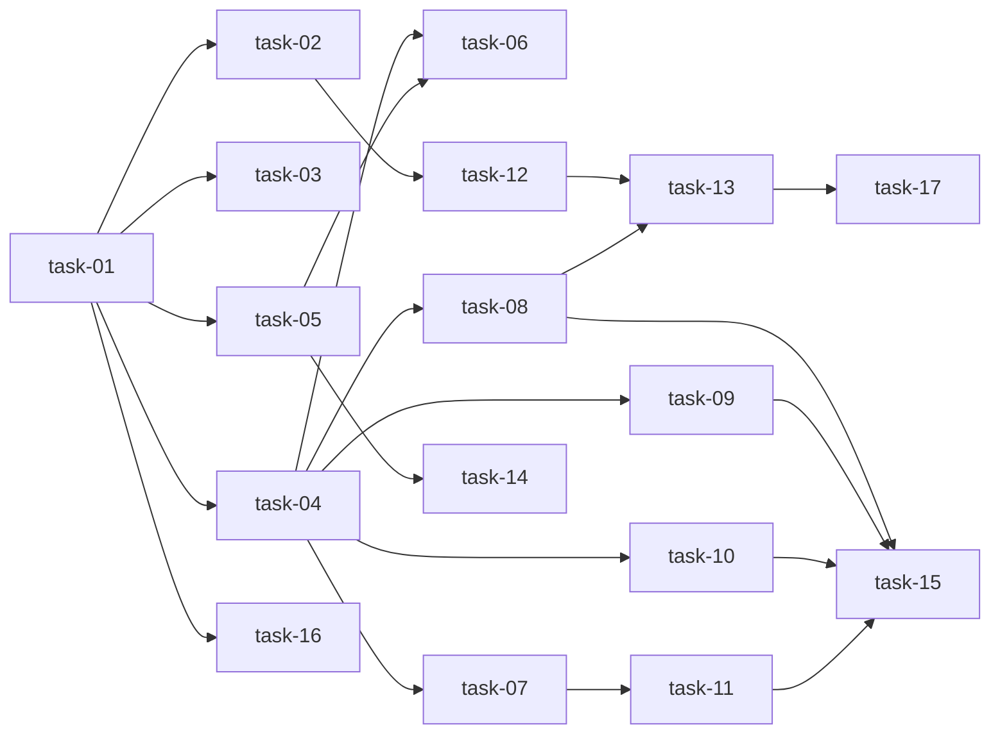

# 实现计划

## Wave 1：状态模型基础

- [x] task-01: 统一 StageEnum + 新增 HumanGate + TRANSITIONS 更新

## Wave 2：状态模型落地（全部依赖 task-01）

- [x] task-02: Schema/Response 返回 human_gate
- [x] task-03: DB 迁移 — ADD COLUMN human_gate + 旧数据映射
- [x] task-04: transition() human_gate 联动
- [x] task-05: 后端 create_change 适配 + request.md
- [x] task-16: 清理旧状态和旧逻辑

## Wave 3：Agent 自动路由 + Review Gate API + 前端基础

- [x] task-06: 创建后自动 dispatch brainstorm agent
- [x] task-07: auto_dispatch_next_step gate 检查 + intake 路由
- [x] task-08: proposal-review API + Schema
- [x] task-09: plan-review API + Schema
- [x] task-10: human-test API + Schema
- [x] task-12: 前端类型 + review API 调用
- [x] task-14: 简化新建变更表单

## Wave 4：验证闭环 + 前端交互重构

- [x] task-11: verify 自动修复闭环（stages JSON 计数 + max 3 轮）
- [x] task-13: 详情页按 gate 渲染操作面板

## Wave 5：测试 + E2E 验证

- [x] task-15: 后端测试（gate 转换 + review API + verify 自动修复）
- [ ] task-17: 前端 E2E 手工验证

---

## 任务总表

| 编号 | 任务 | Wave | 优先级 | 估时 | 依赖 | 说明 |
|---|---|---|---|---|---|---|
| task-01 | StageEnum + HumanGate + TRANSITIONS | W1 | P0 | 2h | — | model.py 移除 rework_required/accepted，新增 blocked + HumanGate 枚举，更新 TRANSITIONS 邻接表 |
| task-02 | Schema 返回 human_gate | W2 | P0 | 1h | task-01 | ChangeRead/ChangeSummary 增加 human_gate 字段 |
| task-03 | DB 迁移 + 旧数据映射 | W2 | P0 | 1h | task-01 | Alembic migration: ADD COLUMN + UPDATE rework_required→verify+blocked, accepted→verify+need_archive_confirm |
| task-04 | transition() human_gate 联动 | W2 | P0 | 3h | task-01 | transition() 完成后根据目标 stage 自动设置 human_gate；统一两套 transition 路径 |
| task-05 | create_change 适配 | W2 | P0 | 2h | task-01 | 创建时 current_stage=draft, human_gate=none；写入 request.md 保存原始需求 |
| task-06 | 创建后自动 dispatch brainstorm | W3 | P0 | 2h | task-04, task-05 | 创建 Change 后自动 dispatch brainstorm stage agent（intake 路由） |
| task-07 | gate 检查 + intake 路由 | W3 | P1 | 3h | task-04 | auto_dispatch_next_step() 增加 human_gate 检查；brainstorm agent 完成后根据结果设 propose/need_requirement_input |
| task-08 | proposal-review API | W3 | P0 | 2h | task-04 | POST /changes/{id}/proposal-review；approve→plan dispatch, revise→re-propose, unclear→brainstorm |
| task-09 | plan-review API | W3 | P0 | 2h | task-04 | POST /changes/{id}/plan-review；approve→execute dispatch, replan/back_to_propose/back_to_brainstorm |
| task-10 | human-test API | W3 | P0 | 2h | task-04 | POST /changes/{id}/human-test；pass→archive gate, bug→quick dispatch, doc_mismatch→propose |
| task-11 | verify 自动修复闭环 | W4 | P1 | 3h | task-07 | verify 不通过自动 dispatch quick，再 verify，stages JSON 记录 _auto_fix_count，max=3 |
| task-12 | 前端类型 + API 调用 | W3 | P0 | 1h | task-02 | change.ts 增加 human_gate 类型、3 个 review API 函数 |
| task-13 | 详情页 gate 操作面板 | W4 | P0 | 4h | task-12, task-08 | 替换 WORKFLOW_TRANSITIONS 按钮为 human_gate 面板；6 种 gate 状态渲染 |
| task-14 | 简化新建变更表单 | W3 | P1 | 2h | task-05 | create-change-dialog 只保留需求描述（必填）+ 模块（可选） |
| task-15 | 后端测试 | W5 | P0 | 4h | task-08~11 | 覆盖 gate 转换、3 个 review API、verify 自动修复、旧数据迁移 |
| task-16 | 清理旧逻辑 | W2 | P1 | 2h | task-01 | 清理 rework_required/accepted 引用、旧 guard 规则、旧按钮逻辑 |
| task-17 | 前端 E2E 验证 | W5 | P0 | 2h | task-13 | 手工跑完整链路 + 模糊需求链路 |

## 依赖关系图

## 关键路径

task-01 → task-04 → task-08 → task-13 → task-17

（状态模型 → transition 联动 → review API → 前端 gate 面板 → E2E 验证）

## 全局验收标准

- [ ] 新建变更只填需求描述即可创建，Agent 自动分析并路由
- [ ] propose 完成后暂停等待人工确认，不会自动进入 plan
- [ ] plan 确认通过后自动触发 execute
- [ ] verify 不通过自动修复，超过 3 次阻塞
- [ ] 人工测试发现 BUG 触发 quick，文档不符回 propose
- [ ] 前端按 human_gate 渲染业务语义操作按钮，不暴露技术阶段名
- [ ] 旧数据迁移后行为不变
- [ ] 所有新增后端测试通过
- [ ] 未使用新功能时旧行为不变（backward compatible）
