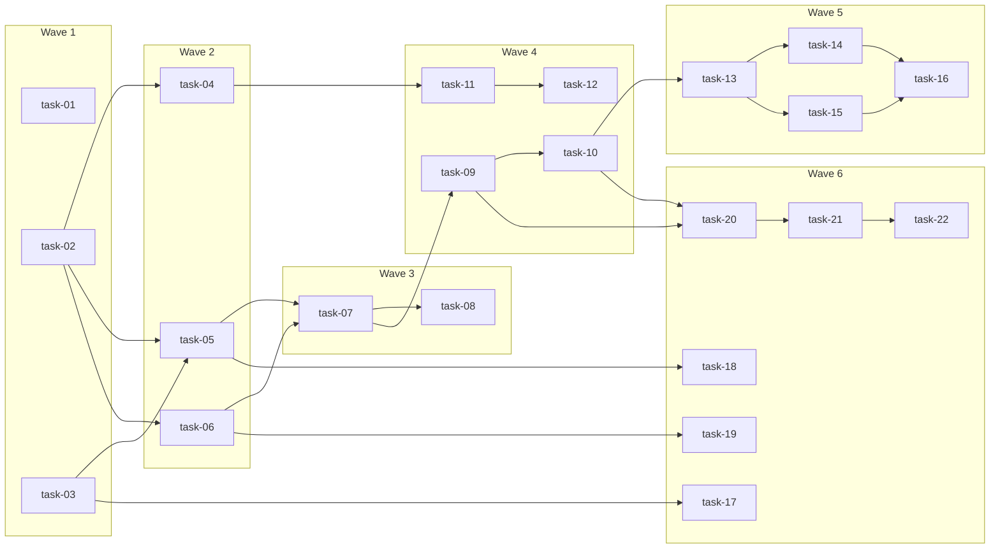

# 实现计划：Agent Stage Dispatch 统一调度

## 变更概览

将三套重叠的 Agent 调度逻辑统一为单一入口 `SillySpecStageDispatchService`，修复 Agent prompt 丢失、阶段配置不完整、状态同步断裂等问题。

- **设计文档**：design.md（7 Phase）
- **需求数量**：10 个 FR
- **文件变更**：15 个文件（10 后端 + 3 前端 + 3 测试文件）
- **影响模块**：agent、change、change_writer、frontend/api、frontend/pages

## Spike 前置验证

> 无需 Spike。所有技术方案基于现有架构模式（适配器模式、feature-slice 模块），无新技术栈或未验证集成。

## Wave 1 — 基础设施（并行，无依赖）

> 为后续 Wave 奠定数据结构和配置基础。三个任务互不依赖，可并行执行。

- [ ] task-01: 废弃 start_sillyspec_run 子进程路径
- [ ] task-02: 扩展 AgentSpecBundle 添加 stage_dispatch 字段
- [ ] task-03: 补齐 STAGE_AGENT_CONFIG 阶段配置

## Wave 2 — 核心 Prompt 修复（依赖 Wave 1）

> 修复 Agent prompt 构建链路：bundle 构造 → CLAUDE.md 渲染 → adapter 生成。三个任务依赖 task-02 的 bundle 扩展。

- [ ] task-04: 修复 _execute_stage_run 中 CLAUDE.md 覆盖问题
- [ ] task-05: 新增 build_stage_bundle() 上下文构建函数
- [ ] task-06: 修正 adapter 生成明确的 sillyspec 阶段命令 prompt

## Wave 3 — 统一调度服务（依赖 Wave 2）

> 创建核心调度服务并完成旧路径迁移。task-07 依赖 task-05/06 的 bundle 和 prompt 能力。

- [ ] task-07: 新建 SillySpecStageDispatchService.dispatch_next_step()
- [ ] task-08: 迁移 change_writer 路由到新调度服务

## Wave 4 — 状态同步与工作区（依赖 Wave 3）

> 实现阶段完成后的状态同步链路和工作目录策略。task-09/10 是核心同步逻辑。

- [ ] task-09: 实现 sync_stage_status 状态同步逻辑
- [ ] task-10: 实现 step 完成后自动调度下一个 AgentRun
- [ ] task-11: 修复只读路径判断（拼接 workspace root）
- [ ] task-12: 实现写阶段运行目录策略与 worktree 检查

## Wave 5 — API 与前端契约（依赖 Wave 4）

> 修正前后端 API 契约，确保 transition 返回正确的 dispatch 信息。

- [ ] task-13: 新增 DispatchResponse + TransitionResponse schemas
- [ ] task-14: 更新 change router 返回 TransitionResponse
- [ ] task-15: 修正前端 transitionChange 返回类型
- [ ] task-16: 更新变更详情页展示 SillySpec 步骤进度

## Wave 6 — 测试闭环（依赖 Wave 5）

> 全量测试覆盖，从单元测试到集成测试。

- [ ] task-17: 单测 — STAGE_AGENT_CONFIG 配置完整性
- [ ] task-18: 单测 — AgentSpecBundle stage 字段 + build_stage_bundle
- [ ] task-19: 单测 — adapter prompt 生成
- [ ] task-20: 单测 — SillySpecStageDispatchService 调度与同步
- [ ] task-21: 集成测试 — dispatch + sync 单阶段链路
- [ ] task-22: 集成测试 — draft → propose → plan 完整链路

## 任务总表

| 编号 | 任务 | Wave | 优先级 | 估时 | 依赖 | 说明 |
|------|------|------|--------|------|------|------|
| task-01 | 废弃 start_sillyspec_run 子进程路径 | W1 | P0 | 1h | — | coordinator.py 添加 @deprecated + 日志警告，保留方法体 |
| task-02 | 扩展 AgentSpecBundle 添加 stage_dispatch 字段 | W1 | P0 | 1h | — | base.py 新增 stage_dispatch/change_key/stage/spec_root/step_prompt/read_only 字段，全部有默认值 |
| task-03 | 补齐 STAGE_AGENT_CONFIG 阶段配置 | W1 | P0 | 2h | — | dispatch.py 补 archive/quick、修正 propose/plan read_only=False、键改为 StageEnum 常量 |
| task-04 | 修复 _execute_stage_run 中 CLAUDE.md 覆盖 | W2 | P0 | 2h | task-02 | service.py 移除 _execute_stage_run 中直接写 CLAUDE.md 的逻辑，改由 adapter 统一渲染 |
| task-05 | 新增 build_stage_bundle() 上下文构建 | W2 | P0 | 3h | task-02, task-03 | context_builder.py 新增函数，加载 Change + 已有文档 + spec_root，返回完整 AgentSpecBundle |
| task-06 | 修正 adapter 生成 sillyspec 阶段 prompt | W2 | P0 | 2h | task-02 | claude_code.py 当 stage_dispatch=True 时生成明确的 `sillyspec run <stage>` 命令 prompt |
| task-07 | 新建 SillySpecStageDispatchService | W3 | P0 | 4h | task-05, task-06 | dispatch.py 新增类，dispatch_next_step() 创建 AgentRun 并启动执行，构造 bundle 调用 adapter |
| task-08 | 迁移 change_writer 路由到新调度 | W3 | P0 | 2h | task-07 | change_writer/router.py 替换 coordinator.start_sillyspec_run 为 dispatch_next_step() |
| task-09 | 实现 sync_stage_status 状态同步 | W4 | P0 | 4h | task-07 | dispatch.py 读取 sillyspec.db → 同步 Change.current_stage + Change.stages → 投影步骤状态 |
| task-10 | 实现 step 完成后自动调度下一个 AgentRun | W4 | P0 | 3h | task-09 | sync_stage_status 内部判断 pending step → 自动 dispatch_next_step()；stage completed 则停止 |
| task-11 | 修复只读路径判断 | W4 | P1 | 1h | task-04 | service.py 修正 change.path 拼接 workspace root 后再 is_dir() 判断 |
| task-12 | 实现写阶段运行目录策略 | W4 | P1 | 2h | task-11 | 有 git identity → worktree repo；无 → workspace root（审计记录）；worktree 内 .sillyspec 目录检查 |
| task-13 | 新增 DispatchResponse + TransitionResponse | W5 | P1 | 1h | task-10 | schemas.py 新增两个 response model，向后兼容 |
| task-14 | 更新 change router 返回 TransitionResponse | W5 | P1 | 2h | task-13 | router.py transition 端点 response_model=TransitionResponse，调用 dispatch 返回 agent_dispatch |
| task-15 | 修正前端 transitionChange 返回类型 | W5 | P1 | 1h | task-13 | changes.ts 返回类型改为 TransitionResponse，新增 DispatchResponse 接口 |
| task-16 | 更新变更详情页展示步骤进度 | W5 | P2 | 3h | task-14, task-15 | page.tsx 展示当前 stage + step + AgentRun 状态 + 下一步动作按钮 |
| task-17 | 单测 — STAGE_AGENT_CONFIG 配置 | W6 | P0 | 1h | task-03 | 验证 8 个阶段配置存在、read_only 标记正确、StageEnum 键匹配 |
| task-18 | 单测 — AgentSpecBundle + build_stage_bundle | W6 | P0 | 2h | task-05 | 验证 bundle stage 字段正确、build_stage_bundle 返回完整 bundle |
| task-19 | 单测 — adapter prompt 生成 | W6 | P0 | 1h | task-06 | 验证 stage_dispatch=True 时 prompt 包含 sillyspec run 命令 |
| task-20 | 单测 — SillySpecStageDispatchService | W6 | P0 | 3h | task-09, task-10 | 验证 dispatch_next_step 创建正确 AgentRun、sync 更新状态、自动调度逻辑 |
| task-21 | 集成测试 — dispatch + sync 单阶段 | W6 | P0 | 4h | task-20 | 验证 AgentRun 完成后状态同步、step pending 自动 dispatch、stage completed 停止 |
| task-22 | 集成测试 — draft → propose → plan 全链路 | W6 | P0 | 4h | task-21 | 验证完整流转：创建变更 → propose dispatch → 完成 → plan dispatch → 完成 |

## 依赖关系图



## 关键路径

```
task-02 → task-05 → task-07 → task-09 → task-10 → task-13 → task-14 → task-16 → (task-21) → task-22
```

**最长路径**：1h + 3h + 4h + 4h + 3h + 1h + 2h + 3h + 4h + 4h = **29h（串行估时）**

实际并行执行后，按 Wave 估算总交付周期：

| Wave | 最长任务 | 累计 |
|------|---------|------|
| W1 | 2h | 2h |
| W2 | 3h | 5h |
| W3 | 4h | 9h |
| W4 | 4h | 13h |
| W5 | 3h | 16h |
| W6 | 4h | 20h |

**最短交付周期约 20h**（每 Wave 内并行执行）。

## 风险与缓解

| # | 风险 | Wave | 缓解措施 |
|---|------|------|---------|
| 1 | sillyspec.db 格式变化导致同步失败 | W4 | fallback 记录 warning，不中断主流程 |
| 2 | worktree 内无 .sillyspec 目录 | W4 | task-12 启动前检查并从主 repo 复制 |
| 3 | 多次 dispatch 竞争创建重复 AgentRun | W3 | has_active_run 检查 + idempotency_key |
| 4 | service.py 多处修改冲突（task-04 + task-11） | W2/W4 | 合并到同一次 service.py 改动中执行 |
| 5 | 前端 TypeScript 类型不匹配 | W5 | task-15 单独验证编译通过 |

## 全局验收标准

- [ ] Agent 执行阶段时 prompt 包含 `sillyspec run <stage> --change <key>` 格式命令
- [ ] STAGE_AGENT_CONFIG 覆盖全部 8 个阶段，propose/plan/archive/quick 标记为写阶段
- [ ] `start_sillyspec_run` 无新调用，全局搜索仅剩 deprecated 方法体
- [ ] AgentRun 完成后 Hub 能从 sillyspec.db 同步当前步骤状态
- [ ] 前端 `transitionChange` 返回 `TransitionResponse` 类型，TypeScript 编译通过
- [ ] pytest 全部通过，dispatch.py 测试覆盖率 > 80%
- [ ] draft → propose → plan 链路端到端可用
