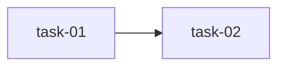

# 实现计划：Agent 控制台日志回显宽度调整

## Spike 前置验证

无。本次变更为纯 CSS 类名移除（1行代码），技术方案完全确定，不存在不确定性。

## Wave 1（并行，无依赖）

- [x] task-01: 移除 agent 页面 max-w-6xl 宽度限制

## Wave 2（依赖 Wave 1）

- [x] task-02: 视觉验证日志区域宽度效果

## 任务总表

| 编号 | 任务 | Wave | 优先级 | 估时 | 依赖 | 说明 |
|---|---|---|---|---|---|---|
| task-01 | 移除 agent 页面 max-w-6xl 宽度限制 | W1 | P0 | 5min | — | 修改 `frontend/src/app/(dashboard)/workspaces/[id]/agent/page.tsx` 第380行，移除 `max-w-6xl` 和 `mx-auto` |
| task-02 | 视觉验证日志区域宽度效果 | W2 | P0 | 10min | task-01 | 在浏览器中确认日志区域宽度填满 AppShell 主内容区，长日志行可完整显示 |

## 依赖关系图

## 关键路径

task-01 → task-02（总估时 15min）

## 全局验收标准

- [x] agent/page.tsx 第380行不再包含 `max-w-6xl` 和 `mx-auto`
- [x] 在 1920px 屏幕上日志区域宽度接近 viewport 减去 sidebar 宽度（约 1660px）
- [x] 在 1280px 屏幕上页面布局正常，内容不溢出
- [x] 页面其他元素（头部、表格、按钮）功能不受影响
- [x] 未引入新的 TypeScript 编译错误
