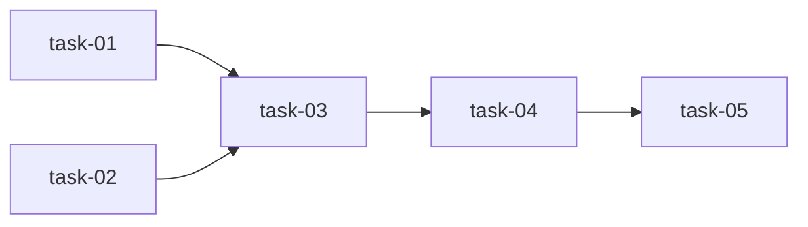

# 实现计划：变更中心列展示优化

## Wave 1（并行，无依赖）

- [x] task-01: Parser 新增 `_infer_change_type()` 目录结构推断方法
- [x] task-02: Parser 新增 `_infer_affected_components()` 模块名提取方法

## Wave 2（依赖 Wave 1）

- [x] task-03: Parser `_parse_change()` 末尾调用推断方法写入 ParsedChange

## Wave 3（依赖 Wave 2）

- [x] task-04: `_apply_parsed()` 添加 change_type 和 affected_components 的 reparse 覆盖逻辑

## Wave 4（依赖 Wave 3）

- [x] task-05: 前端状态列改用 human_gate 展示、阶段列 null 兜底、类型列颜色映射

## 任务总表

| 编号 | 任务 | Wave | 优先级 | 估时 | 依赖 | 说明 |
|---|---|---|---|---|---|---|
| task-01 | 新增 `_infer_change_type()` | W1 | P0 | 1h | — | 根据 tasks/ 子目录、prototype 文件、目录名推断 feature/quick/prototype |
| task-02 | 新增 `_infer_affected_components()` | W1 | P0 | 2h | — | 读取 tasks.md 提取文件路径，匹配 module-map 返回模块名列表 |
| task-03 | `_parse_change()` 调用推断方法 | W2 | P0 | 0.5h | task-01, task-02 | 在 `_parse_change()` 末尾调用推断方法并写入 ParsedChange |
| task-04 | `_apply_parsed()` reparse 覆盖 | W3 | P0 | 0.5h | task-01, task-02, task-03 | change_type 仅 null 时覆盖，affected_components 始终覆盖 |
| task-05 | 前端列表页展示优化 | W4 | P0 | 1.5h | task-04 | human_gate 待办 Badge + 阶段 null 兜底 draft + 类型颜色映射 |

## 依赖关系图

## 关键路径

task-01/02 → task-03 → task-04 → task-05（全长约 5h）

## 全局验收标准

- [ ] reparse 后类型列显示推断值（feature/quick/prototype），不再全显示 "—"
- [ ] 有 human_gate 的变更在状态列显示"待XX"Badge
- [ ] 阶段列 current_stage 为 null 时显示 "draft" badge
- [ ] 影响组件列从 tasks.md 提取并显示模块名标签
- [ ] 旧数据（无 tasks.md 的变更）仍正常展示，不报错
- [ ] DB 中已有 change_type 非空的记录不被覆盖
