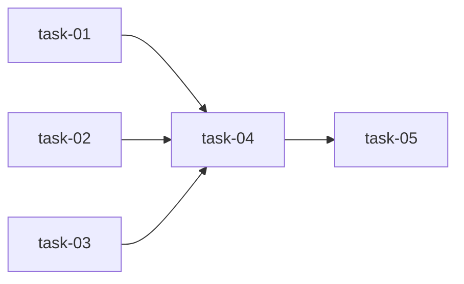

# 实现计划

## Spike 前置验证

无。所有技术方案均为确定方案（扩展现有 UserService + 新增端点），无新技术栈或未验证集成。

## Wave 1（并行，无依赖）

- [x] task-01: 单个会话撤销 + 批量撤销端点（后端）
- [x] task-02: 密码重置审计标记增强（后端）
- [x] task-03: 用户 Workspace 角色查询（后端）

## Wave 2（依赖 Wave 1）

- [x] task-04: 前端 API 客户端 + 操作列简化

## Wave 3（依赖 Wave 2）

- [x] task-05: Drawer 增强（Workspace Tab + 会话撤销 + 密码增强）

## 任务总表

| 编号 | 任务 | Wave | 优先级 | 估时 | 依赖 | 说明 |
|------|------|------|--------|------|------|------|
| task-01 | 单个会话撤销 + 批量撤销端点 | W1 | P0 | 1h | — | UserService 新增 revoke_session / revoke_all_sessions；Router 新增 DELETE + POST 端点 |
| task-02 | 密码重置审计标记增强 | W1 | P0 | 0.5h | — | 扩展 ResetPasswordRequest DTO，reset_password 方法接受 force_change_on_next_login 并写入审计日志 |
| task-03 | 用户 Workspace 角色查询 | W1 | P0 | 1h | — | UserService 新增 list_workspaces，Router 新增 GET 端点，新增 UserWorkspaceRead DTO |
| task-04 | 前端 API 客户端 + 操作列简化 | W2 | P0 | 1h | task-01, task-02, task-03 | settings.ts 新增 revokeSession / revokeAllSessions / listUserWorkspaces；操作列改为"详情"链接 |
| task-05 | Drawer 增强 | W3 | P0 | 1.5h | task-04 | 新增"所属 Workspace" Tab；会话 Tab 增加撤销按钮；密码重置增加 force_change 复选框 |

## 依赖关系图

## 关键路径

task-01 → task-04 → task-05（3 个 Wave，最短交付约 3.5h）

## 全局验收标准

- [ ] 管理员可撤销单个或全部会话，写入审计日志
- [ ] 密码重置支持 force_change_on_next_login 标记并写入审计日志
- [ ] 用户详情可查看所属 Workspace 及角色
- [ ] 操作列只有"详情"链接
- [ ] Drawer 包含 Workspace Tab、会话撤销按钮、密码增强复选框
- [ ] Python ruff lint 通过
- [ ] TypeScript tsc --noEmit 零错误
- [ ] 现有 API 端点路径和响应格式不变
