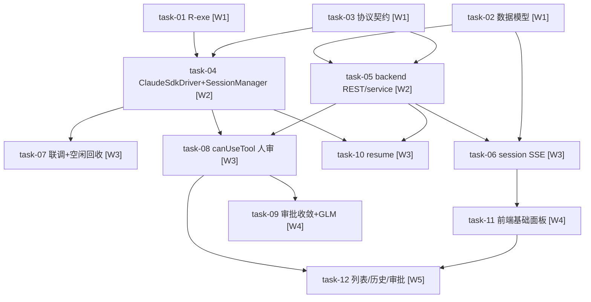

# 实现计划 — daemon-interactive-session（D-002@v3 · SDK driver 层）

> spike-02 §3.7 两硬门通过 + brainstorm v3。v2 plan（per-turn spawn+resume）废弃；blueprint 按 v3 重写。Wave 按 depends_on 拓扑排序重排为 W1-W5（5 层）。

## Spike 前置验证

| Spike | 验证内容 | 不通过后果 |
|---|---|---|
| spike-02 §3.7 | SDK query/AsyncIterable/canUseTool/interrupt/resume（**已通过**，Windows+智谱 GLM） | — |
| R-exe（task-01） | 显式 `pathToClaudeCodeExecutable`=系统 claude.CMD 跑通（spike H1 验证默认内置，此项补显式） | task-04 ClaudeSdkDriver 阻塞 |

## Wave 1（无依赖，并行）

- [x] task-01: R-exe 补验——显式 `pathToClaudeCodeExecutable`=系统 claude 跑通（覆盖：R-exe / D-009@v1）【新增，spike 前置】✅ sandbox 跑通(真 exe/PONG) + 3 integ 测试绿；reverse sync: SDK spawn 无 shell → .cmd EINVAL, task-04 driver 需解 wrapper 取真 .exe
- [x] task-02: 数据模型迁移——agent_sessions + lease.kind + agent_runs.agent_session_id + alembic（覆盖：FR-01, FR-09 / D-001@v1, D-002@v3, D-005@v1）【保留】✅ 14 模型单测绿 + 300 回归零回归 + D-001 守门(session_id 未改)；alembic offline SQL+metadata 验证通过(本地无 host PG，online apply 待部署验证)
- [x] task-03: 协议契约——WS session/permission 消息 daemon↔backend + 契约单测（覆盖：FR-02, FR-04, FR-05, FR-07 / NFR-05）【保留，turn 调度改 SDK】✅ 19 TS + 38 Py 契约测试绿 + typecheck 0 错 + AC1-10 全绿

## Wave 2（依赖 W1）

- [x] task-04: daemon ClaudeSdkDriver + SessionManager + input-queue + lease.kind 分流（dep task-01, task-03；覆盖：FR-01, FR-02, FR-04, FR-09 / D-002@v3, D-009@v1）【重做：SDK 同进程】✅ src/interactive/ 新模块(InputQueue/ClaudeSdkDriver/SessionManager) + daemon kind 分流; wrapper→exe 解析(task-01 reverse sync); SDK mock 测试 InputQueue9/Driver22/Manager22/kind13/ws8 全绿; typecheck 0错; batch 164/164 零回归; AC1-14 全绿; .npmrc pnpm.overrides 排平台二进制
- [x] task-05: backend session REST/service/placement（dep task-02, task-03；覆盖：FR-01, FR-02, FR-04, FR-05 / D-005@v1）【保留】✅ placement 两段式(agent_run_id=NULL/kind=interactive/lease_expires_at=NULL) + service create/inject/interrupt/end_session 行锁并发防重 + ws_hub.send_session_control + _publish_session_event + 4 REST; 38 测试绿 ruff 通过 回归338零回归; AC1-19 全绿(AC-04/17 PG并发受限标注)

## Wave 3（依赖 W2，并行）

- [x] task-06: session 级 SSE 聚合（dep task-02, task-05；覆盖：FR-03 / D-005@v1, R-08）【保留】✅ submit_messages 双 publish(run级保留+session级仅interactive) + stream_session_logs(跨turn不断流,事件带run_id) + GET /sessions/{id}/stream; 12测试绿 ruff通过 回归350零回归; AC1-13全绿
- [x] task-07: SDK 生命周期联调 + interrupt + 并发防重 + 空闲 30min 回收（dep task-04；覆盖：FR-04, FR-06 / D-004@v1）【重做：spike D1/S1】✅ interrupt turn级联调(_onResult interrupt分支) + 并发inject排队检测(pendingInjectCount+onTurnQueued非拒绝) + 空闲30min扫描定时器(start/stop+_scanIdle) + daemon生命周期钩子; 47case绿 typecheck0 回归918pass(6预先存在失败); AC1-15全绿
- [x] task-08: canUseTool 远程人审闭环（dep task-04, task-05；覆盖：FR-07 / D-007@v1）【重做：spike D2】✅ 三端全落地: daemon PermissionResolver(register/resolve/abortAll/5min兜底/AbortSignal)+driver canUseTool回调+session-manager注入+daemon.ts路由; backend permission_service(request→SSE/response→ws_hub/5min超时/校验矩阵)+router WS/REST+ws_hub; frontend PermissionApprovalCard+page.tsx订阅+lib/daemon.ts; daemon33+backend23+frontend7测试绿 typecheck0 回归daemon951+backend373+frontend151零新增失败; AC08.1-18全绿; manual_approval默认false验证
- [x] task-10: resume 持久化 + 崩溃恢复（dep task-04, task-05；覆盖：FR-08 / D-003@v1）【重做：spike D3】✅ daemon sessions.json元数据持久化(原子写/串行/损坏隔离/0o600/quarantine) + session-manager snapshot/restore/markReconnected/flush + daemon启动编排(load→recover→restoreAndReconnect→loops/4并发/单项隔离/backend rejected删记录) + query resume新Query(固定cwd) + backend recover_session_after_daemon_restart(currentRun收敛/reconnecting→active/token旋转) + confirm/mark两段式; 43daemon+12backend测试绿 typecheck0 ruff通过 回归daemon994+backend385零新增; AC10.1-15全绿; batch零影响(FR-09)

## Wave 4（依赖 W3）

- [x] task-09: 审批收敛 + GLM 错误透传（dep task-08；覆盖：FR-07, FR-08b / D-007@v1, D-008@v1）【重做】✅ deny收敛(不二次决策/message透传) + pending审批退出清理(所有路径reject无zombie) + GLM透传(不预禁工具/is_error正常遍历/D-008) + backend tool failure monitor(service.py+schema.py,失败率阈值0.5样本≥4结构化warn不阻断); daemon24+backend16测试绿 typecheck0 ruff通过 回归daemon1017(7预存)+backend385零新增; AC09.1-14全绿; reverse sync: 蓝图schemas.py实际为schema.py按真实落地
- [x] task-11: 前端会话基础面板（dep task-06；覆盖：FR-10 / D-006@v1）【保留】✅ lib/daemon.ts session API(create/inject/interrupt/end/stream) + InteractiveSessionPanel(单一SSE贯穿多turn/run_id路由/interrupt收敛currentRun vs end结束/turn级串行禁用) + runtimes/page.tsx演进(quick-chat→Panel保留布局) + stream/route.ts SSE代理; 34测试绿 typecheck0 build成功 全量185零回归; AC11-01-12全绿

## Wave 5（依赖 W4）

- [x] task-12: 会话列表 + 历史回看 + permission 审批弹窗（dep task-11, task-08；覆盖：FR-07, FR-10 / D-005@v1）【保留】✅ backend GET /sessions(列表+status筛选+分页) + GET /sessions/{id}/logs(历史,agent_session_id聚合D-005非session_id); frontend SessionsSidebar+live/历史切换+SessionHistoryView(跨turn run_id分组)+permission-approval-dialog(复用task-08通道不新增第二套); backend12+回归397+ruff frontend18+全量203+typecheck+build; AC12.1-12全绿; reverse sync:AgentRun无created_at用coalesce(min logs.timestamp,started_at)

## 任务总表

| 编号 | 任务 | Wave | 优先级 | 依赖 | 覆盖 FR/D | 模块依赖 |
|---|---|---|---|---|---|---|
| task-01 | R-exe 补验 | W1 | P0 | — | R-exe / D-009@v1 | daemon（spike sandbox） |
| task-02 | 数据模型迁移 | W1 | P0 | — | FR-01, FR-09 / D-001@v1, D-002@v3, D-005@v1 | backend |
| task-03 | 协议契约 | W1 | P0 | — | FR-02, FR-04, FR-05, FR-07 / NFR-05 | daemon ↔ backend |
| task-04 | daemon ClaudeSdkDriver + SessionManager + input-queue + 分流 | W2 | P0 | task-01, task-03 | FR-01, FR-02, FR-04, FR-09 / D-002@v3, D-009@v1 | daemon → backend |
| task-05 | backend session REST/service/placement | W2 | P0 | task-02, task-03 | FR-01, FR-02, FR-04, FR-05 / D-005@v1 | backend |
| task-06 | session 级 SSE 聚合 | W3 | P0 | task-02, task-05 | FR-03 / D-005@v1, R-08 | backend → frontend |
| task-07 | SDK 生命周期联调 + interrupt + 并发防重 + 空闲回收 | W3 | P0 | task-04 | FR-04, FR-06 / D-004@v1 | daemon ↔ backend |
| task-08 | canUseTool 远程人审闭环 | W3 | P0 | task-04, task-05 | FR-07 / D-007@v1 | daemon ↔ backend ↔ frontend |
| task-09 | 审批收敛 + GLM 错误透传 | W4 | P1 | task-08 | FR-07, FR-08b / D-007@v1, D-008@v1 | daemon ↔ backend |
| task-10 | resume 持久化 + 崩溃恢复 | W3 | P1 | task-04, task-05 | FR-08 / D-003@v1 | daemon → backend |
| task-11 | 前端会话基础面板 | W4 | P1 | task-06 | FR-10 / D-006@v1 | frontend → backend |
| task-12 | 会话列表 + 历史回看 + 审批弹窗 | W5 | P1 | task-11, task-08 | FR-07, FR-10 / D-005@v1 | frontend → backend |

## 关键路径

`task-02(W1) → task-05(W2) → task-06(W3) → task-11(W4) → task-12(W5)`（数据→前端链，5 Wave，最长）
`task-01(W1) → task-04(W2) → task-08(W3) → task-09(W4)`（driver+权限链，4 Wave）

最长链 5 Wave 决定交付周期。task-01（R-exe）是 task-04 硬前置（W1 跑，W2 task-04 用）。

## 依赖关系图

## 全局验收标准

- [x] 所有单元测试通过（backend `uv run pytest`、daemon `pnpm test`、frontend `pnpm test`）✅ verify Step6: backend 398 / daemon 219 / frontend 205 passed（本变更引入全绿；预存失败非本变更）
- [x] （brownfield）未配置交互式会话时行为不变：lease.kind 默认 batch，TaskRunner 零改动，现有批处理 lease + quick-chat resume 路径零变化 ✅ task-04 kind 默认 batch + 各 task batch 回归全绿（FR-09）
- [x] task-01 R-exe 通过（显式 pathToClaudeCodeExecutable=系统 claude 跑通）✅ sandbox h1-exe PONG + wrapper→exe 解析（task-01 reverse sync）
- [x] design.md §12 验收标准 1-10 全部满足 ✅ verify Step4 设计一致 + 9 决策闭环（D-001~D-009）

## 覆盖矩阵

| ID | 覆盖任务 | 验收证据 |
|---|---|---|
| D-001@v1 | task-02 | agent_sessions 表 + agent_session_id FK，session_id 语义不变 |
| D-002@v3 | task-02, task-03, task-04, task-05, task-07, task-10 | driver 与 TaskRunner 并存 + SDK 同进程多轮 |
| D-003@v1 | task-10 | Wave3 resume（SDK 自动持久化 + query resume） |
| D-004@v1 | task-07 | 空闲 30min 回收 |
| D-005@v1 | task-02, task-05, task-06, task-12 | 三元关系 + session SSE 聚合 |
| D-006@v1 | task-11 | 全栈前端 |
| D-007@v1 | task-08, task-09 | canUseTool 远程人审（WS→前端） |
| D-008@v1 | task-09 | GLM 错误透传 |
| D-009@v1 | task-01, task-04 | 系统 claude.CMD + pathToClaudeCodeExecutable |

## execute 协作点

- W1 三任务（task-01 spike / task-02 数据 / task-03 协议）无相互依赖，完全并行。
- W2 task-04（daemon driver）与 task-05（backend）并行，接口由 task-03 契约定；task-04 硬依赖 task-01 R-exe 结果。
- W3 四任务（task-06 SSE / task-07 联调 / task-08 人审 / task-10 resume）**文件重叠**：`daemon.ts`+`session-manager.ts`（task-07/10 共改）、backend `daemon/service.py`（task-06/08/10 共改）、`daemon/router.py`（task-06/08 共改）。**execute 时 W3 内改同文件的 task 串行执行**（按编号 06→07→08→10 顺序或文件锁），不同文件可并行——execute 协调点，非 plan 一致性缺陷（step9 审查 + 用户确认"标注协作点 execute 串行"）。
- daemon 实际 TypeScript（pnpm/vitest），scan/local.yaml 标 Python 已过时。
