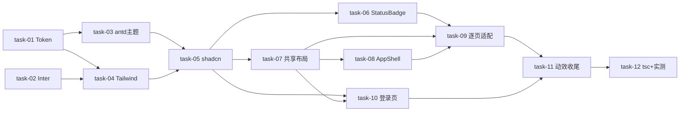

# 实现计划 — 前端样式系统重设计(现代明亮活力 / 方案 B)

> 无 Spike:技术方案确定(antd6 Design Token / shadcn copy-in / next/font-local 均成熟)。
> Wave 按 depends_on 严格拓扑排序(同 Wave 内无依赖可并行),无循环依赖。

## Wave 1（地基 · 并行无依赖）
- [x] task-01: 建立 Design Token 单一源 `styles/tokens.ts`(覆盖:FR-01, D-005@v1, D-006@v1)
- [x] task-02: 引入 Inter(`@fontsource/inter` + `next/font/local`)(覆盖:FR-07, D-004@v2)

## Wave 2（主题层 · 依赖 W1）
- [x] task-03: antd ConfigProvider 全面定制 `antd-providers.tsx`(覆盖:FR-01, D-005@v1)
- [x] task-04: Tailwind config 映射 + globals.css 重构(覆盖:FR-01)

## Wave 3（组件基础 · 依赖 W2）
- [x] task-05: shadcn 视觉组件 copy-in `components/ui/*`(覆盖:FR-02, D-006@v1)

## Wave 4（语义/布局组件 · 依赖 W3,并行）
- [x] task-06: StatusBadge 统一状态语义(覆盖:FR-03, D-005@v1)
- [x] task-07: 共享布局组件 `components/layout/*`(覆盖:FR-04)

## Wave 5（框架 + 登录页 · 依赖 W3/W4,并行）
- [x] task-08: AppShell 重做(侧栏 lucide + 新增顶栏)(覆盖:FR-05, D-003@v1)
- [x] task-10: 登录页重做(同色系明亮 hero)(覆盖:FR-06, D-002@v1)

## Wave 6（逐页适配 · 依赖 W4/W5）
- [x] task-09: 逐页适配(看板 PALETTE→token / 列表统一容器消除内联 width / 拓扑色阶→brand / milestone / work-hour)(覆盖:FR-02, FR-04, D-006@v1)

## Wave 7（动效收尾 · 依赖 W5/W6）
- [x] task-11: 动效(fade/hover-lift/skeleton)+ 收尾(滚动条/focus/reduced-motion/清理冗余 CSS)(覆盖:FR-02)

## Wave 8（验证 · 依赖 W7）
- [x] task-12: tsc + Docker rebuild 实测核心页 + 截图对比原型(覆盖:验收)

## 任务总表
| 编号 | 任务 | Wave | 优先级 | 依赖 | 覆盖 FR/D | 说明 |
|---|---|---|---|---|---|---|
| task-01 | Design Token 单一源 | W1 | P0 | — | FR-01, D-005, D-006 | tokens.ts:色板/圆角/阴影/字体/间距 |
| task-02 | Inter 字体引入 | W1 | P0 | — | FR-07, D-004@v2 | @fontsource/inter + next/font/local |
| task-03 | antd ConfigProvider 全面定制 | W2 | P0 | task-01 | FR-01, D-005 | colorPrimary/状态色/borderRadius/fontFamily/组件 token |
| task-04 | Tailwind 映射 + globals.css 重构 | W2 | P0 | task-01, task-02 | FR-01 | colors/fontFamily/boxShadow/animation;删原生 table 覆盖 |
| task-05 | shadcn 视觉组件 copy-in | W3 | P0 | task-03, task-04 | FR-02, D-006 | Button/Card/Badge/Tag/Avatar/Skeleton/Tooltip/Dropdown/Dialog/EmptyState |
| task-06 | StatusBadge | W4 | P0 | task-05 | FR-03, D-005 | 统一 info/success/warning/error/neutral |
| task-07 | 共享布局组件 | W4 | P0 | task-05 | FR-04 | PageContainer/PageHeader/SectionCard/DataTable/SearchBar/FormLayout |
| task-08 | AppShell 重做 | W5 | P0 | task-05, task-07 | FR-05, D-003 | 侧栏 lucide + 新增顶栏(面包屑/搜索/通知/用户) |
| task-10 | 登录页重做 | W5 | P1 | task-05, task-07 | FR-06, D-002 | 明亮蓝同色系 hero |
| task-09 | 逐页适配 | W6 | P0 | task-06, task-07, task-08 | FR-02, FR-04, D-006 | kanban/project-plans/task-plans/milestone/work-hour/topology |
| task-11 | 动效 + 收尾 | W7 | P1 | task-09, task-10 | FR-02 | fade/hover-lift/skeleton/reduced-motion |
| task-12 | tsc + 实测 + 截图 | W8 | P0 | task-11 | 验收 | Docker rebuild + 核心页截图对比原型 |

## 关键路径
task-01 → task-03 → task-05 → task-07 → task-08 → task-09 → task-11 → task-12
（Token → antd 主题 → shadcn → 共享布局 → AppShell → 逐页适配 → 动效 → 验证,8 Wave 决定最短交付周期）

## 依赖关系图

## 全局验收标准
- [x] 散落蓝 `#1e3a5f`/`#20437a`/`#1a2a6c`/`#1677ff`/`#3b82f6` → 单一 `#2563eb`(grep 验证)
- [x] 状态色双轨 → 统一 StatusBadge 语义 token(无硬编码 emerald/amber/red)
- [x] max-w 四种写法 → 统一 PageContainer
- [x] 侧边栏 emoji → lucide 图标
- [x] 登录页深蓝紫 → 同色系明亮
- [x] antd ConfigProvider token 全面定制(>3 个 token)
- [x] `tsc` 通过
- [x] Docker rebuild 后核心页(看板/列表/登录/工作区)实测 + 截图对比 prototype(代码层 npm run build 通过全路由;Docker 部署实测待运行环境)

## 覆盖矩阵（decisions.md 当前版本）
| ID | 覆盖任务 | 验收证据 |
|---|---|---|
| D-001@v1 | (非目标) | 暗色模式排除,无任务 |
| D-002@v1 | task-10 | 登录页同色系 |
| D-003@v1 | task-08 | 侧边栏 lucide 图标 |
| D-004@v1 | task-02(superseded) | 按 D-004@v2 执行 |
| D-004@v2 | task-02 | @fontsource/inter |
| D-005@v1 | task-01, task-03, task-06 | 状态色统一语义 token |
| D-006@v1 | task-05, task-09 | 双库边界 |

## FR 覆盖矩阵
| FR | 覆盖任务 |
|---|---|
| FR-01 Token 单一源 | task-01, task-03, task-04 |
| FR-02 现代明亮活力视觉 | task-05, task-09, task-11 |
| FR-03 状态色统一 | task-06 |
| FR-04 共享布局组件 | task-07, task-09 |
| FR-05 AppShell 升级 | task-08 |
| FR-06 登录页同色系 | task-10 |
| FR-07 Inter 字体 | task-02 |
