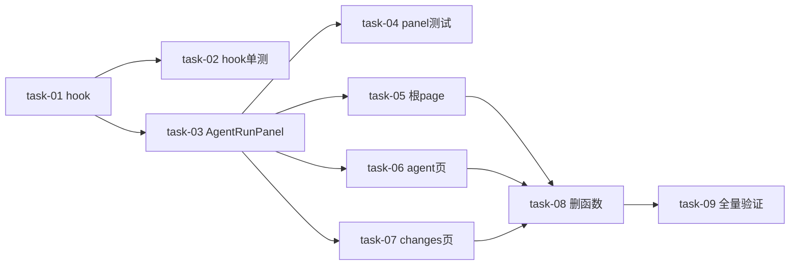

# 实现计划 — 统一 Agent Run SSE 客户端

变更：`2026-06-22-unify-agent-run-sse-hook`
依据：design.md / requirements.md / tasks.md / decisions.md（D-001@v1, D-002@v1, D-003@v1 全 accepted，无 P0/P1 unresolved blocker）

## Spike 前置验证

无。技术不确定性低 —— 底层 `AgentRunStreamClient` 已具备全部能力（重连/预取/permission 解析），hook 是其状态化封装，4 调用点是机械迁移。design.md §13 Design Grill 已 passed。

## Wave 1 — hook 引擎（起点，无依赖）

- [x] task-01: 新增 `useAgentRunStream` hook（覆盖：FR-02, FR-06, FR-07, D-001@v1, D-003@v1） ✅ W1

## Wave 2 — hook 测试 + 面板组件（依赖 W1，可并行）

- [x] task-02: hook 单测 `use-agent-run-stream.test.ts`（覆盖：FR-02, FR-04, FR-06） ✅ W2
- [x] task-03: 新增 `AgentRunPanel` 组件（覆盖：FR-03, FR-05, D-002@v1） ✅ W2

## Wave 3 — panel 测试 + 3 调用点迁移（依赖 W2，可并行）

- [x] task-04: panel 集成测试 `agent-run-panel.test.tsx`（覆盖：FR-04） ✅ W3
- [x] task-05: 根 `page.tsx` Bootstrap run 迁移到 `<AgentRunPanel>`（覆盖：FR-01） ✅ W3
- [x] task-06: `agent/page.tsx` 活跃 run 迁移到 `<AgentRunPanel>`；历史展开保持直接 `AgentLogViewer`（覆盖：FR-01, FR-04） ✅ W3
- [x] task-07: `changes/[cid]/page.tsx` 两触发点（:523 dispatch + :599 connectLogStream）合并为单 `<AgentRunPanel>`（覆盖：FR-01, FR-04；风险 R-06） ✅ W3

## Wave 4 — 删除（依赖 W3 全部迁移完成）

- [x] task-08: 删除 `streamAgentRunLogs`（agent.ts:117-162）+ 清理残留 import（覆盖：FR-01） ✅ W4

## Wave 5 — 全量验证（依赖 W4）

- [x] task-09: 全量验证 lint/typecheck/test + grep 确认（覆盖：全部 FR + 成功标准） ✅ W5

> Wave 按蓝图 depends_on 拓扑排序（Step8 重排）。同 Wave 内任务无依赖、可并行。task-02/04 是测试旁支（不阻塞主路径），task-05/06/07 是调用点迁移主路径。

## 任务总表

| 编号 | 任务 | Wave | 优先级 | 依赖 | 覆盖 FR / D | 说明 |
|---|---|---|---|---|---|---|
| task-01 | 新增 useAgentRunStream hook | W1 | P0 | — | FR-02, FR-06, FR-07, D-001@v1, D-003@v1 | 封装 AgentRunStreamClient；isActive 语义；fetchPendingDialogs 恢复；dismissPerm（不调 API，D-003） |
| task-02 | hook 单测 | W2 | P0 | task-01 | FR-02, FR-04, FR-06 | mock AgentRunStreamClient；permission 增减/isActive=false 不连/runId 切换重连/input submit+replied |
| task-03 | 新增 AgentRunPanel 组件 | W2 | P0 | task-01 | FR-03, FR-05, D-002@v1 | 调 hook；注入 logs/perms/input(适配)/loading；透传 AgentLogViewer 定制 prop |
| task-04 | panel 集成测试 | W3 | P0 | task-03 | FR-04 | perms 非空 → 渲染审批卡片（端到端覆盖 bug） |
| task-05 | 根 page.tsx 迁移 | W3 | P0 | task-03 | FR-01 | 删 connectBootstrapStream/bootstrapLogs/bootstrapPerms/bsInput* |
| task-06 | agent/page.tsx 迁移 | W3 | P0 | task-03 | FR-01, FR-04 | 活跃 run 改 AgentRunPanel；历史展开(expandedLogs+下载)保持直接 AgentLogViewer |
| task-07 | changes/[cid] 迁移 | W3 | P0 | task-03 | FR-01, FR-04 | :523+:599 合一；删 eventSourceRef/dispatchOwnsSseRef/loadHistoryLogs/connectLogStream；R-06 用 localRunId 兜底 |
| task-08 | 删 streamAgentRunLogs | W4 | P0 | task-05, task-06, task-07 | FR-01 | agent.ts:117-162；删前 grep 确认无残留；tsc 兜底 |
| task-09 | 全量验证 | W5 | P0 | task-08 | 全部 | cd frontend && pnpm lint && pnpm typecheck && pnpm test；grep streamAgentRunLogs 无结果 |

## 依赖关系图

依赖非平凡（存在测试旁支 task-02/task-04），生成 Mermaid：

## 关键路径

task-01 → task-03 → task-05（或 06/07）→ task-08 → task-09（主路径，5 Wave 深）

task-02（hook 单测）与 task-04（panel 测试）为旁支，不阻塞主路径，可与其同 Wave 的任务并行推进。

## 调用点搜索记录（client 方法变更：删 streamAgentRunLogs）

`grep -rn streamAgentRunLogs frontend/src` 结果（brainstorm 调研）：

| 位置 | 类型 | 纳入任务 |
|---|---|---|
| `frontend/src/lib/agent.ts:117` | 定义（函数体 :117-162） | task-08 删除 |
| `frontend/src/app/(dashboard)/workspaces/[id]/agent/page.tsx:33` | import | task-06 清理 |
| `frontend/src/app/(dashboard)/workspaces/[id]/agent/page.tsx:397` | 调用 | task-06 迁移 |
| `frontend/src/app/(dashboard)/workspaces/[id]/changes/[cid]/page.tsx:41` | import | task-07 清理 |
| `frontend/src/app/(dashboard)/workspaces/[id]/changes/[cid]/page.tsx:523` | 调用（dispatch） | task-07 迁移 |
| `frontend/src/app/(dashboard)/workspaces/[id]/changes/[cid]/page.tsx:599` | 调用（connectLogStream） | task-07 迁移 |

所有调用点已纳入 W3（task-05/06/07 迁移）+ W4（task-08 删除）。**execute task-08 前重新 grep 确认无新增调用方**。根 `page.tsx` 用的是 `AgentRunStreamClient`（class），不涉及 streamAgentRunLogs，无需改 import。

## 全局验收标准

> 以下为验收条目（非 task，由 task-09 全量验证逐条核验）。task 定义见上方 Wave/任务总表。

- `/agent` 页 scan run 触发 AskUserQuestion → 审批卡片弹出（FR-04，原 5min 兜底消失）
- `changes/[cid]` 页 task 执行 AskUserQuestion → 卡片弹出（FR-04）
- `grep -r streamAgentRunLogs frontend/src` 无结果（FR-01）
- 4 调用点均渲染 `<AgentRunPanel>`，无残留 `connectBootstrapStream`/`eventSourceRef`/`dispatchOwnsSseRef`/`connectLogStream` 胶水（FR-01/FR-03）
- 三处 pending_input UI 命名/样式/行为一致（FR-05）
- `cd frontend && pnpm lint && pnpm typecheck && pnpm test` 全过（exit 0）
- hook 单测 + panel 集成测试通过（FR-02/FR-04）
- 后端/daemon 零改动（`git diff backend sillyhub-daemon` 为空）
- （brownfield）未使用 AgentRunPanel 的页面行为不变

## 覆盖矩阵

| 决策 / FR | 覆盖任务 | 验收证据 |
|---|---|---|
| D-001@v1（非活跃 run 仅 prefetch） | task-01, task-02 | hook isActive 语义 + 单测 isActive=false 不连 SSE |
| D-002@v1（hook + 面板） | task-03, task-05, task-06, task-07 | AgentRunPanel 组件 + 4 调用点渲染 |
| D-003@v1（决策 API 不归 hook） | task-01, task-04 | hook 暴露 dismissPerm（非 resolvePermission）+ 卡片自调 API |
| FR-01（单一 SSE 客户端） | task-05, task-06, task-07, task-08 | grep streamAgentRunLogs 无结果 + 调用点迁移 |
| FR-02（hook 封装） | task-01, task-02 | hook 实现 + 单测 |
| FR-03（AgentRunPanel） | task-03 | 组件实现 + 调用点使用 |
| FR-04（permission 卡片渲染） | task-02, task-04, task-06, task-07 | 集成测试 perms→卡片 + /agent、changes 页验收 |
| FR-05（pending_input 纳入 + UI 统一） | task-03 | input 适配 AgentLogInputControls |
| FR-06（非活跃 run） | task-01, task-02 | isActive 语义 + 单测 |
| FR-07（dialog 恢复） | task-01 | fetchPendingDialogs 在 hook 内 |
