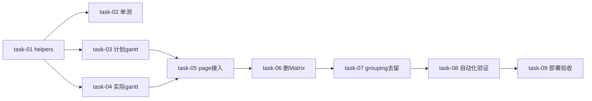

# plan: kanban 时间轴甘特图

plan_level: full
关联:`design.md` / `proposal.md` / `requirements.md` / `prototype-kanban-gantt.html`

## 概述
把 `/ppm/kanban` 主体从「人员×日期矩阵」改成「时间轴甘特图」(自研方案 A)。新增 `kanban-gantt-helpers`(纯函数 + 单测)+ `KanbanGantt`/`KanbanActualGantt` 两组件,替换两个 Matrix,`page.tsx` 接入,清理死代码。

## 依赖图

## Wave 1 — 核心算法与组件(T1.2/T1.3/T1.4 依赖 T1.1,可并行)

- [x] task-01: 新增 `_components/kanban-gantt-helpers.ts`
  - 导出常量 `LANE_HEIGHT=36`/`DATE_ROW_HEIGHT=48`/`DAY_WIDTH=90`
  - `computeBarLayout(taskStart, taskEnd, rangeStart, rangeEnd, dayWidth)` → `{left, width, clippedStart, clippedEnd}`(dayjs 算天数 + 裁剪到范围)
  - `assignLanes(tasks)` → `{ laneMap: Map<id, laneIndex>, rowCount }`(贪心:按 start 排序,分配首个 end≤start 的槽)
  - 完成标准:纯函数无副作用,边界覆盖(单边缺失返回 null/未排期、跨范围裁剪、start>deadline 兜底单日)
  - 依赖:无

- [x] task-02: 新增 `_components/kanban-gantt-helpers.test.ts`
  - `computeBarLayout`:正常跨度 / 跨范围裁剪 / start>deadline 兜底 / 单边缺失
  - `assignLanes`:无并行(1行)/ 多并行(多行)/ 空数组(rowCount=1)
  - 完成标准:vitest 全过,覆盖 design §4.4 边界
  - 依赖:task-01

- [x] task-03: 新增 `_components/kanban-gantt.tsx`(计划甘特)
  - 左侧行头(sticky,每人 rowCount 行,任务数取 `KanbanUserColumn.task_count`)+ 右侧时间轴(日期刻度 sticky top + 周末高亮 + 今天竖线)
  - 任务条形绝对定位(`start_time→deadline`,项目色 projectColorMap,标题 truncate + tag null 兜底)
  - 多行泳道(assignLanes)+ 未排期区(按 user 归人,null user 全局)
  - props 对齐 `KanbanMatrix`:`users`/`tasks`/`startDate`/`endDate`/`selectedUserId`/`onSelectUser`/`onTaskClick`/`onTaskContextMenu`/`projectColorMap`(均必填)
  - 完成标准:渲染对照原型,typecheck 过
  - 依赖:task-01

- [x] task-04: 新增 `_components/kanban-actual-gantt.tsx`(实际甘特)
  - 结构同 task-03,数据 `executes: TaskExecuteWithPlan[]`,条形 `actual_start_time→actual_end_time`,固定 token 色(无 projectColorMap)
  - 未排期区按 `execute_user_id` 归人;`plan_task=null` 标题兜底 `"(无关联任务)"`
  - props 对齐 `KanbanActualMatrix`:`onEdit`(必填,无 onTaskContextMenu/无 projectColorMap,selected 可选)
  - 完成标准:渲染对照原型,typecheck 过
  - 依赖:task-01

## Wave 2 — 接入与清理(依赖 Wave 1)

- [x] task-05: 改 `page.tsx`
  - tab plan children:`KanbanMatrix` → `KanbanGantt`(props 不变)
  - tab actual children:`KanbanActualMatrix` → `KanbanActualGantt`(不传 onTaskContextMenu/projectColorMap)
  - 删旧 Matrix import,加 Gantt import
  - 完成标准:两 tab 渲染甘特,复用功能(SearchBar/DateNav/WorkHourChart/CRUD 弹窗/ContextMenu/DetailDrawer/ActualEditModal)不破坏,typecheck 过
  - 依赖:task-03, task-04

- [x] task-06: 删旧 Matrix 组件
  - grep 全 `frontend/src` 确认 `kanban-matrix`/`kanban-actual-matrix`/`kanban-actual-cell` 仅被 page.tsx(已改)引用 → 删除三文件
  - 完成标准:grep 无残留引用,typecheck 过
  - 依赖:task-05

- [x] task-07: `lib/ppm/kanban-grouping.ts` 去留
  - grep `groupByUserAndDate`/`groupByUserAndExecuteDate`/`dateRangeKeys`/`weekdayMeta` + 文件其余导出(`TaskDateBucket` 等)全 `frontend/src`
  - 仅 Matrix 用的函数删;整文件无其他引用则删文件;有其他引用则保留文件仅删死函数
  - 完成标准:无死代码,typecheck 过
  - 依赖:task-06

## Wave 3 — 验证(依赖 Wave 2)

- [x] task-08: 自动化验证
  - `cd frontend && pnpm typecheck`
  - `cd frontend && pnpm exec vitest run kanban-gantt-helpers`(单测全过)
  - `cd frontend && pnpm exec vitest run kanban`(现有 kanban 测试不回归)
  - 完成标准:三项全过
  - 依赖:task-07

- [x] task-09: 部署 + 人工验收
  - `cd deploy && docker compose up -d --build frontend`
  - 刷新 `/ppm/kanban` 对照 `design.md` §9 验收(8 条:甘特渲染/多行泳道/未排期/今天竖线/计划实际/复用不回归/单测/样式)
  - 完成标准:8 条验收标准通过
  - 依赖:task-08

## 任务总表

| task | Wave | 文件 | 依赖 | 类型 |
|------|------|------|------|------|
| task-01 | W1 | kanban-gantt-helpers.ts(新) | - | 算法 |
| task-02 | W1 | kanban-gantt-helpers.test.ts(新) | 01 | 测试 |
| task-03 | W1 | kanban-gantt.tsx(新) | 01 | 组件 |
| task-04 | W1 | kanban-actual-gantt.tsx(新) | 01 | 组件 |
| task-05 | W2 | page.tsx(改) | 03,04 | 接入 |
| task-06 | W2 | 删 matrix/actual-matrix/actual-cell | 05 | 清理 |
| task-07 | W2 | kanban-grouping.ts(grep) | 06 | 清理 |
| task-08 | W3 | typecheck + vitest | 07 | 验证 |
| task-09 | W3 | docker rebuild + 人工验收 | 08 | 验证 |

## 估时
W1 ~3h(算法+2组件+单测) · W2 ~1h(接入+清理) · W3 ~0.5h(验证) · 合计 ~4.5h(AI execute 实际更短)
