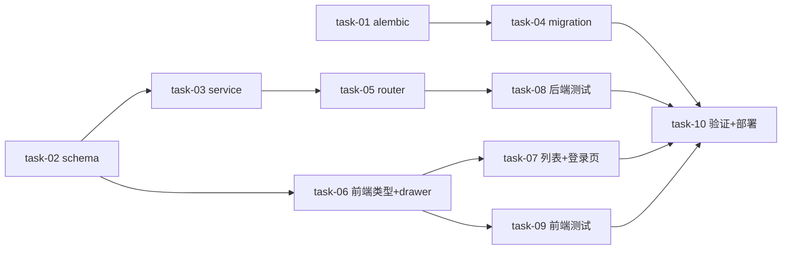

# 实现计划 — username-login

## Spike 前置验证

| Spike | 验证内容 | 不通过后果 |
|---|---|---|
| spike-01 | execute task-03 前查 `SELECT count(*) FROM users WHERE username IS NULL`；`alembic current` 核实生产 DB 版本 | 若有空 username 行：task-03 前先补默认登录名（email 前缀）再上纯 username 登录，否则这些用户登录锁死 |

> alembic 链断裂（task-01 修复）是技术确定性方案（删空 merge），非 Spike。

## Wave 1（并行，无依赖）
- [x] task-01: 修复 alembic 链断裂（origin/main `2ae5e4d6` 已删坏 merge，worktree 核实 head=`202606241300` 单一无 KeyError，本任务无需改动）（覆盖 D-005@v1）
- [x] task-02: 后端 schema 改造 — `auth/schema.py` `UserRead.email` 改 Optional；`admin/schema.py` `UserCreateRequest`(email Optional、username 必填)、`UserUpdateRequest`(增 username/email)、`UserRead`(email Optional)（已落地：ruff+mypy 通过，2 既有测试 breaking 待 task-08）（覆盖 D-001/D-003/D-004@v1）

## Wave 2（依赖 Wave 1）
- [x] task-03: 后端 service — `auth/service.py` `login()` 移除 email 分支纯 username（保留 `_lookup_active_user_by_email`）；`users_service.py` `create_user`(email 可选、username 必填、display_name 用 username 兜底)、`update_user`(增 username/email 唯一校验)、`_resolve_username` 容忍 email=None；bootstrap seed 沿用 admin（覆盖 D-001/D-002/D-004@v1）
- [x] task-04: DB migration — 新 revision(`down_revision=202606241300`，origin/main 真实 head)：`ALTER TABLE users ALTER COLUMN email DROP NOT NULL`，保留 `ux_users_email_active` 唯一索引（覆盖 D-003@v1）
- [x] task-06: 前端类型 + admin-user-drawer — `lib/admin.ts` 类型同步；`admin-user-drawer.tsx` 加「登录名」(必填、可编辑、冲突报错)、email 改可选（dep task-02）（覆盖 D-001/D-004@v1）

## Wave 3（依赖 Wave 2）
- [x] task-05: 后端 router 透传 — `admin/router.py` + `settings/router.py` 的 create/update 端点手动透传补 username（create）/ username+email（update）（dep task-03）（覆盖 D-004@v1）
- [x] task-07: 前端用户列表 + 登录页 — `admin/users/page.tsx` 列表加登录名列、各处展示改 username 优先；`login/page.tsx` 文案改「登录名」、默认回填 admin（dep task-06）（覆盖 D-001@v1）
- [x] task-09: 前端测试 — `admin-user-drawer.test.tsx` 登录名必填、email 可选用例更新（dep task-06）（覆盖 SC-1）

## Wave 4（依赖 Wave 3）
- [x] task-08: 后端测试 — login 纯 username、create username 必填/缺失 422、update username 冲突 409、email 可选、UserRead email 可空（dep task-05）（覆盖 SC-1/2/3/5/6）

## Wave 5（依赖 Wave 4）
- [x] task-10: 集成验证 + 部署 — `alembic upgrade head` 成功；backend ruff/mypy/pytest + frontend tsc/lint/test 全绿；重建前后端 Docker 并部署（dep task-04/07/08/09）（覆盖 SC-6/7）

## 任务总表

| 编号 | 任务 | Wave | 优先级 | 依赖 | 覆盖 D/SC | 说明 |
|---|---|---|---|---|---|---|
| task-01 | 修复 alembic 链断裂 | W1 | P0 | — | D-005 | 删 `202606281200`，head=`202606241001` |
| task-02 | 后端 schema（auth/admin） | W1 | P0 | — | D-001/003/004 | username 必填、email Optional |
| task-03 | 后端 service（login/create/update） | W2 | P0 | task-02 | D-001/002/004 | login 纯 username、唯一校验 |
| task-04 | DB migration（email nullable） | W2 | P0 | task-01 | D-003 | down_revision=202606241001 |
| task-05 | 后端 router 透传（admin/settings） | W3 | P0 | task-03 | D-004 | 两 router create/update 补字段 |
| task-06 | 前端类型 + drawer | W2 | P0 | task-02 | D-001/004 | 登录名必填可编辑、email 可选 |
| task-07 | 前端列表 + 登录页 | W3 | P0 | task-06 | D-001 | 列表显登录名列、登录页文案 |
| task-08 | 后端测试 | W4 | P0 | task-05 | SC-1/2/3/5/6 | login/create/update/email 用例 |
| task-09 | 前端测试 | W3 | P1 | task-06 | SC-1 | drawer 用例更新 |
| task-10 | 集成验证 + 部署 | W5 | P0 | task-04/07/08/09 | SC-6/7 | alembic upgrade + 全绿 + Docker |

## 关键路径

task-02 → task-03 → task-05 → task-08 → task-10（最长路径，决定最短交付周期）

## 依赖关系图

## 全局验收标准

- [x] SC-1 新建用户必填登录名、email 可不填，可用登录名登录
- [x] SC-2 编辑可改登录名，重复时 409 友好报错
- [x] SC-3 登录页只引导登录名，email 无法登录
- [x] SC-4 存量用户沿用原 username 正常登录（零数据迁移）
- [x] SC-5 非空 email 全局唯一，多个空 email 共存不报错
- [x] SC-6 `alembic heads` 单一 head，`alembic upgrade head` 成功
- [x] SC-7 backend ruff/mypy/pytest + frontend tsc/lint/test 全绿

## 覆盖矩阵（decisions.md）

| ID | 覆盖任务 | 验收证据 |
|---|---|---|
| D-001@v1（纯登录名登录） | task-02/03/06/07 | SC-3 |
| D-002@v1（存量 username 沿用） | task-03 + spike-01 | SC-4 |
| D-003@v1（非空 email 仍唯一） | task-02/04 | SC-5/SC-6 |
| D-004@v1（username 可编辑） | task-02/03/05/06 | SC-2 |
| D-005@v1（方案 A + 删 merge） | task-01/04 | SC-6 |

## 调用点搜索记录（自检）

grep 搜索变更符号的所有调用点，确认 task 范围无遗漏：

| 变更符号 | 调用点 | 覆盖 task |
|---|---|---|
| `UserService.create_user` | `admin/router.py:394`、`settings/router.py:145` | task-05 |
| `UserService.update_user` | `admin/router.py:419`、`settings/router.py:165` | task-05 |
| `UserUpdateRequest` | `admin/router.py`、`settings/router.py` | task-02(schema) + task-05(透传) |
| `AuthService.login` | `auth/router.py`（router 不变，task-03 改 service 内部分支） | task-03 |
| `UserRead` | 后端各返回端点（email Optional 自动兼容序列化）+ 前端 `lib/admin.ts` | task-02 + task-06/07 |

结论：create/update_user 仅 admin + settings 两 router 调用，task-05 覆盖全部透传点，无遗漏。
