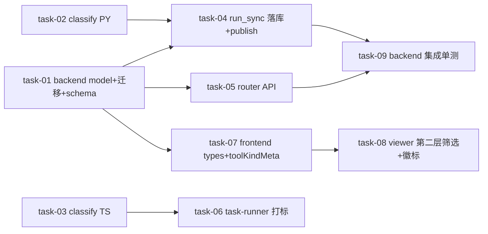

# 实现计划 · Agent 执行日志类型细分

## Spike 前置验证

无 Spike。技术方案确定（D-003@v1 方案 B，参照 `AgentArtifact.kind` 先例），识别逻辑明确（D-001/002），无新技术栈或未经验证的集成。

## 依赖关系图

## Wave 1（并行，无依赖）

- [x] task-01: backend `AgentRunLog` 加 `tool_kind` 列 + alembic 迁移 + `AgentRunLogEntry` schema（覆盖：FR-01；D-003@v1；R-01）
- [x] task-02: backend `classify_tool_kind` Python 识别函数 + 单测（覆盖：FR-02 Python 侧；D-001@v1, D-002@v1）
- [x] task-03: daemon `classifyToolKind` TS 识别函数 + 单测（与 Python 同逻辑/共享用例表）（覆盖：FR-02 TS 侧；D-001@v1, D-002@v1；R-05）

## Wave 2（依赖 Wave 1）

- [x] task-04: backend `run_sync/service.py` 双路径落库 + 两处 publish payload 加 `tool_kind`（覆盖：FR-04, FR-05, FR-06；R-02, R-08；依赖 task-01 列 + task-02 识别）
- [x] task-05: backend `router.py` GET `/logs` 加 `?tool_kind=` 多选 query（覆盖：FR-07；依赖 task-01 列）
- [x] task-06: daemon `task-runner.ts` tool_use 分支打 `tool_kind`（覆盖：FR-03；依赖 task-03 TS 识别）
- [x] task-07: frontend `lib/agent.ts` 类型 + `agent-log/tool-kind-meta.ts` 徽标映射（覆盖：FR-08, FR-09；依赖 task-01 schema 定）

## Wave 3（依赖 Wave 2）

- [x] task-08: frontend `agent-log-viewer.tsx` 第二层筛选按钮组（多选）+ 工具徽标渲染（含旧日志兼容）+ 单测（覆盖：FR-10, FR-11；R-03, R-07；依赖 task-07 toolKindMeta）
- [x] task-09: backend 集成单测（迁移正反 + 落库填列 + publish 含 tool_kind + API 筛选）（覆盖：FR-01, FR-04, FR-05, FR-06, FR-07；R-01 PG 验证；依赖 task-01~05）

## 任务总表

| task | 子项目 | 优先级 | 依赖 | 覆盖 FR | 覆盖决策/风险 |
|---|---|---|---|---|---|
| task-01 | backend | P0 | — | FR-01 | D-003@v1; R-01 |
| task-02 | backend | P0 | — | FR-02(PY) | D-001@v1, D-002@v1 |
| task-03 | daemon | P0 | — | FR-02(TS) | D-001@v1, D-002@v1; R-05 |
| task-04 | backend | P0 | task-01, task-02 | FR-04, FR-05, FR-06 | D-003@v1; R-02, R-08 |
| task-05 | backend | P1 | task-01 | FR-07 | D-003@v1 |
| task-06 | daemon | P0 | task-03 | FR-03 | D-001@v1, D-003@v1 |
| task-07 | frontend | P1 | task-01 | FR-08, FR-09 | D-001/002/003@v1 |
| task-08 | frontend | P1 | task-07 | FR-10, FR-11 | D-003@v1; R-03, R-07 |
| task-09 | backend | P1 | task-01~05 | FR-01,04,05,06,07 | R-01(PG) |

## 关键路径

- backend 链：`task-01 → task-04 → task-09`（数据基础 → 双路径落库 → 集成单测，3 步）
- frontend 链：`task-01 → task-07 → task-08`（schema → 类型+映射 → 筛选渲染，3 步）
- daemon 链：`task-03 → task-06`（识别 → 打标，2 步，可与 backend/frontend 并行）

最长关键路径 = backend 链或 frontend 链（均 3 步，并行推进）。

## 全局验收标准

- [ ] `agent_run_logs.tool_kind` 列 + 索引存在，迁移 upgrade/downgrade 可逆
- [ ] DB 中 tool_call 行 `tool_kind` 正确填充，其他 channel 为 NULL
- [ ] daemon batch 路径（task-runner）+ backend interactive 路径（`_extract_sdk_messages`）双打标
- [ ] backend publish 两处 payload（`published_logs` + `session_payload`）含 `tool_kind`
- [ ] GET `/logs?tool_kind=sillyspec,skill` 筛选生效；不传返回全部（向后兼容）
- [ ] frontend 第二层「工具类型」按钮多选筛选，两层正交可叠加
- [ ] 每条 tool_call 日志渲染彩色工具徽标；旧日志（tool_kind=NULL）显示灰色通用徽标
- [ ] daemon 与 backend 两份 `classify_tool_kind` 同输入同输出
- [ ] backend pytest + daemon jest + frontend jest 三端全绿，零回归
- [ ] **（brownfield 兼容）** 旧日志 tool_kind=NULL 不报错；旧 daemon 上报无 tool_kind 时 backend 兜底；API/前端不传 tool_kind 行为不变
- [ ] alembic 迁移 `down_revision` 接当前真实 head（执行时 `alembic heads` 确认），PG 验证不只 SQLite

## 覆盖矩阵

| 决策/FR | 覆盖 task |
|---|---|
| D-001@v1 SillySpec 子串识别（不分子命令） | task-02, task-03, task-06, task-07 |
| D-002@v1 MCP 统一一类 | task-02, task-03, task-07 |
| D-003@v1 加 tool_kind 结构化列（方案 B） | task-01, task-04, task-05, task-07, task-08 |
| FR-01 列+迁移+schema | task-01 |
| FR-02 classify 函数（PY+TS） | task-02, task-03 |
| FR-03 daemon task-runner 打标 | task-06 |
| FR-04 backend interactive 打标 | task-04 |
| FR-05 backend batch 兜底 | task-04 |
| FR-06 publish 两处带 tool_kind | task-04 |
| FR-07 GET /logs ?tool_kind= | task-05 |
| FR-08 frontend types | task-07 |
| FR-09 toolKindMeta 映射 | task-07 |
| FR-10 第二层筛选 | task-08 |
| FR-11 徽标渲染+兼容 | task-08 |

## 自检

- [x] 每个 task 有编号（task-01~09）
- [x] 每个 task 在 Wave 下有 checkbox（`- [ ] task-XX:` 格式）
- [x] Wave 分组 + 依赖标注（Wave 1 无依赖 / Wave 2 依赖 Wave 1 / Wave 3 依赖 Wave 2）
- [x] 任务总表含优先级 + 依赖列，**无估时列**
- [x] 关键路径标注（backend/frontend/daemon 三链）
- [x] 全局验收标准（含 brownfield 兼容条款）
- [x] D-001/002/003@v1 全在覆盖矩阵
- [x] 无 P0/P1 unresolved blocker（D-001/002/003 全 accepted）
- [x] 无实现细节（接口签名/代码在 design.md，task 细节留 task-NN.md）
- [x] plan.md 与 design.md 文件变更清单一致（13 文件全覆盖）
- [x] **调用点搜索自检**：`AgentRunLog(...)` 构造点共 4 处——`run_sync/service.py:381`（task-04 改，传 tool_kind）、`agent/service.py:618`（user_input，不改，默认 None）、`daemon/session/service.py:403,589`（user_input，不改，默认 None）。结论：仅 run_sync 落库点需传 tool_kind，其余 3 处 user_input 走默认 None（非工具调用）。
- [x] **文件覆盖自检**：design 文件变更清单 13 文件 → task-01(model/migration/schema) + task-02(tool_kind.py+test) + task-03(tool-kind.ts+test) + task-04(run_sync) + task-05(router) + task-06(task-runner) + task-07(agent.ts+tool-kind-meta.ts) + task-08(agent-log-viewer.tsx+test) + task-09(backend test)，全覆盖。
- [x] **跨任务契约自检**：task-02→04（classify 函数）、task-03→06（classify 函数）、task-01→04/05/07（tool_kind 列/字段）、task-07→08（toolKindMeta）—— consumer 在 TaskCard expects_from 声明、provider 在 provides 承诺。
- [x] Mermaid 图非平凡（3-Wave 树形分叉，非线性）
- [x] 无泛泛风险分析（风险已在 design.md §10 具体化）
