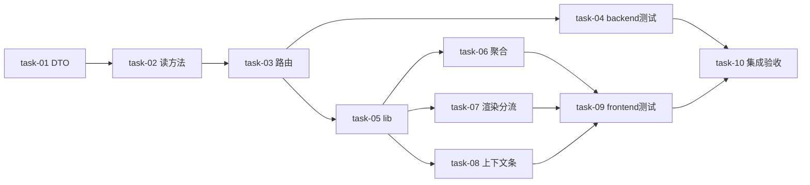

# 实现计划（Plan）

## Spike 前置验证
无。技术方案确定——brainstorm Design Grill 已验证关键假设：JOIN 路径（SessionDialogRequest→AgentRun→AgentRunWorkspace，AgentSession 无 workspace_id 列）、跳转路由（`/runtimes?session=`）、字段真实性（AgentRun 无 prompt 列→D-003 取 lease.metadata.prompt/AgentRunLog）；链路通（D-001，runtime 弹窗有卡片）。纯前端聚合/渲染 + 只读端点，无新技术栈/未验证集成。

## Wave 1（backend，端点先通）
- [x] task-01: 新增 `WorkspaceDialogRead` DTO（`daemon/schema.py`，扩展现有 `SessionDialogRead` + 来源字段 `workspace_name`/`session_type`/`run_summary` 全可选）（覆盖：FR-6, D-003）
- [x] task-02: 新增 `list_pending_dialogs_for_workspace` 读方法（`daemon/permission_service.py`，三表 JOIN `SessionDialogRequest→AgentRun→AgentRunWorkspace` 过滤 workspace_id；session_type 推导 change_id/config.mode；run_summary 取 lease.metadata.prompt 或首条 user AgentRunLog，空→null）（覆盖：FR-6, D-001, D-003；依赖 task-01）
- [x] task-03: 挂载 `GET /workspaces/{id}/dialogs` 路由（`agent/router.py`，`require_permission(TASK_READ)` 成员校验 + 调 task-02 读方法，URL `/api/workspaces/{id}/dialogs`）（覆盖：FR-6；依赖 task-02）
- [x] task-04: backend 测试（端点权限 403 / JOIN 正确 / 跨 session / 上下文字段 / session_type 三类 / run_summary 空）（覆盖：FR-6, NFR-3；依赖 task-03）

## Wave 2（frontend，依赖 W1 端点）
- [x] task-05: `lib/daemon.ts` 扩展（`SessionPermissionRequest` 加可选来源字段 + 新 `listWorkspaceDialogs(workspaceId)` + `parseSessionPermissionEvent` 兼容来源字段缺省）（覆盖：FR-4, FR-5；依赖 task-03 端点契约）
- [x] task-06: `approvals/page.tsx` 聚合范围 scan→scan+chat + 查询兜底（`listWorkspaceAgentSessions` 去 mode 参数 + 初始加载/约 10s `refetchInterval` 调 `listWorkspaceDialogs`）（覆盖：FR-3, FR-5；依赖 task-05）
- [x] task-07: `session-permission-panel.tsx` 渲染分流 + SSE/查询去重（`dialog_kind`→`AskUserDialogCard`/`PermissionApprovalCard`；按 `request_id` 合并，查询回填覆盖 SSE 占位）（覆盖：FR-1, FR-2, FR-5；依赖 task-05）
- [x] task-08: 新组件 `DialogContextBar` + 集成（兄弟包裹层不侵入 `AskUserDialogCard`；渲染来源上下文条 工作区/场景/会话/运行/时间/run_summary 占位 + 跳转 `/runtimes?session=id` + 「查看会话」按钮）（覆盖：FR-4, D-002；依赖 task-05）
- [x] task-09: frontend 测试（渲染分流 / 聚合去重 / 上下文条 / 跳转 / SSE 占位→查询回填）（覆盖：NFR-3；依赖 task-06,07,08）

## Wave 3（集成验收）
- [x] task-10: 三端集成验收 + 既有行为零回归（AC-1~8 全过；runtime 会话弹窗/工具网关审批不受影响；性能 `list_workspace_active_sessions` 加 limit top 50 + 前端 SSE 连接数硬上限）（覆盖：FR-1~6, NFR-1, D-001；依赖 task-04,09）

## 任务总表
| 编号 | 任务 | Wave | 优先级 | 依赖 | 覆盖 FR/D | 说明 |
|---|---|---|---|---|---|---|
| task-01 | WorkspaceDialogRead DTO | W1 | P0 | — | FR-6, D-003 | daemon/schema.py 新增 |
| task-02 | list_pending_dialogs_for_workspace | W1 | P0 | task-01 | FR-6, D-001, D-003 | daemon/permission_service.py 三表 JOIN |
| task-03 | GET /workspaces/{id}/dialogs 路由 | W1 | P0 | task-02 | FR-6 | agent/router.py 挂载 |
| task-04 | backend 测试 | W1 | P0 | task-03 | FR-6, NFR-3 | 权限/JOIN/上下文 |
| task-05 | lib/daemon.ts 扩展 | W2 | P0 | task-03 | FR-4, FR-5 | 类型+查询 lib |
| task-06 | approvals/page.tsx 聚合+兜底 | W2 | P0 | task-05 | FR-3, FR-5 | scan+chat 聚合 |
| task-07 | session-permission-panel 渲染分流+去重 | W2 | P0 | task-05 | FR-1, FR-2, FR-5 | dialog_kind 分流 |
| task-08 | DialogContextBar 组件+集成 | W2 | P0 | task-05 | FR-4, D-002 | 来源上下文条+跳转 |
| task-09 | frontend 测试 | W2 | P0 | task-06,07,08 | NFR-3 | 渲染/聚合/上下文 |
| task-10 | 集成验收+零回归 | W3 | P0 | task-04,09 | FR-1~6, NFR-1, D-001 | AC-1~8 |

## 关键路径
task-01 → task-02 → task-03 → task-05 → task-07 → task-09 → task-10（backend DTO→读方法→路由→前端 lib→渲染分流→前端测试→集成验收，最长链路）

## 依赖关系（W2 task-06/07/08 并行分叉，非平凡）

## 全局验收标准
- [x] AC-1 scan/stage 触发 AskUserQuestion，`/approvals` 显示问答卡（header/question/options）
- [x] AC-2 普通对话触发 AskUserQuestion，`/approvals` 同样显示问答卡
- [x] AC-3 卡片含来源上下文条 + 跳转（`/runtimes?session=id`）
- [x] AC-4 刷新 `/approvals` 后未回答卡片仍在（数据库兜底，≤10s 回填）
- [x] AC-5 新 AskUserQuestion 实时弹（SSE <2s），来源字段占位→回填
- [x] AC-6 无 `dialog_kind` 的普通审批仍渲染 PermissionApprovalCard（allow/deny）
- [x] AC-7 backend `GET /workspaces/{id}/dialogs` 权限（403）/ JOIN 正确 / 跨 session / 上下文（session_type/run_summary）
- [x] AC-8 三端测试全绿 + 既有行为零回归（runtime 弹窗/工具网关审批不受影响）
- [x] backend pytest + frontend vitest 全绿（backend 覆盖率门槛 60%）
- [x] （brownfield）未挂新端点 / 前端 filter 改回 scan 时既有行为不变

## 覆盖矩阵（decisions.md）
| ID | 覆盖任务 | 验收证据 |
|---|---|---|
| D-001@v1（不修 PERMISSION_REQUEST 链路） | 全 plan（无 daemon task） | AC-8 零回归 |
| D-002@v1（来源上下文 + 跳转） | task-08 | AC-3 |
| D-003@v1（run_summary/session_type 规则） | task-02 | AC-7 |
