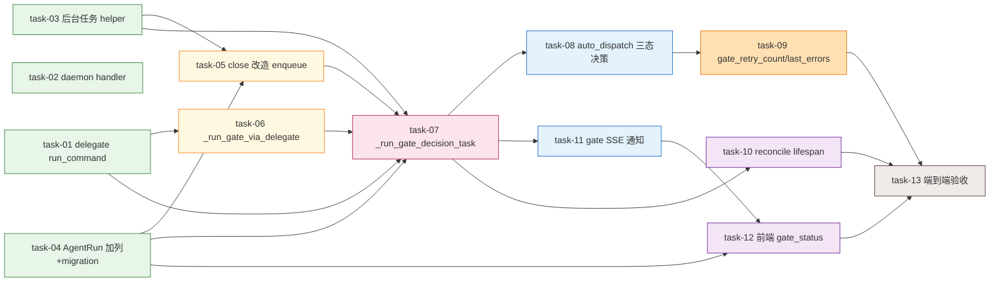

# 实现计划（Plan）— P3 Driver Gate Pilot

> 本次 plan 的 Wave 按**依赖执行顺序 + 同文件串行**编排，与 design `tasks.md` 按模块分组的 Wave 编号不同。任务总表附「design 对照」列回溯到 `tasks.md` 的 T 编号。
> 实现细节（函数签名 / 代码片段 / 接口契约）见 design §7 / §7.5 与 `tasks/task-NN.md`，本 plan 不重复。

## 前置条件（开工前必须，非代码 task）

| 前置 | 状态 | 说明 |
|---|---|---|
| sillyspec `npm version patch + publish`（解锁 gate 子命令） | 本机已 `npm link` 开发版可用；生产部署前必须发版 | T0.1；verify stage 强制 gate，未发版则 Z1 探测 exit 2 阻断（fail-loud，R4） |
| `alembic heads` 确认 main 目标 head | ✅ 已确认：当前唯一 head `419d34f8e33f` | T0.2；曾经的「14 head 碎片化」已被 change-detail-session（commit 6bf7b4a0）等收敛。task-04 migration `down_revision` 直接写 `419d34f8e33f`，开工仍复核一次作保险 |

> 无 P0/P1 unresolved blocker：`decisions.md` 不存在，design 已内联 R1–R12 风险登记 + H1–H4 / M2–M5 / Z1 修正项，无外部阻断决策。
> 无 Spike 节：design v6 经 6 轮 review，方案确定性高；唯一待实证的是 `sillyspec gate verify --json` 的 `raw_envelope` 结构，在 task-06 实现时跑一次确认即可（本机已 link），无需独立 Spike。

## 同文件串行约束（Wave 编排依据）

两个文件被多个 task 共享，为避免 execute 阶段并行改同一文件冲突，相关 task **跨 Wave 串行**（同 Wave 内的 task 互不涉同一文件）：

- **`backend/app/modules/change/dispatch.py`** 串行链：task-06 → task-08 → task-09 → task-10（分处 W2→W4→W5→W6）
- **`backend/app/modules/daemon/run_sync/service.py`** 串行链：task-03 → task-05 → task-07 → task-11（分处 W1→W2→W3→W4）

其余 task 在各自 Wave 内可与同 Wave 任务并行（文件互斥）。

## 依赖关系图

> Mermaid 只画**逻辑依赖**（depends_on）。dispatch.py / run_sync 的同文件串行由 Wave 分组保证（见上节），不画成依赖边以免误读为逻辑依赖。

## Wave 1（并行 · 基础设施，文件互斥）

契约由 design §7 / §7.5 锁死，三子项目并行动工。

- [x] task-01: HostFsDelegate 加第 9 方法 `run_command` + `send_rpc` 协议加 `timeout` 参数 + 命令白名单安全层（覆盖：FR-8, R2, R3, M5；design 对照 T2.1+T2.2）
- [x] task-02: daemon 侧 `host-fs-handler.ts` 加 `run_command` handler（命令白名单 + execFile）+ `daemon.ts` `_registerHostFsRpcHandler` 注册（覆盖：FR-8；design 对照 T2.3+T2.4）
- [x] task-03: RunSyncService 提取 `_fire_background_task` + `_background_tasks: set` + `_on_bg_task_done`（H4 范式，抄 `agent/service.py:358-386`）（覆盖：FR-5, R5；design 对照 T1.1）
- [x] task-04: AgentRun 加 `gate_result` JSON + `gate_status` str 列 + Alembic migration（`down_revision=419d34f8e33f`）（覆盖：FR-1, FR-2, R8；design 对照 T3.1+T0.2）

## Wave 2（并行 · gate 执行单元就绪，task-05 与 task-06 文件互斥）

- [x] task-05: 改 `close_interactive_run:684`——删 v4 R2 末尾 callback；`gate_status='pending'` 随终态映射区（`:784`）在 `:876` commit 前 set；commit 后 `_fire_background_task` enqueue gate 任务 → 快速返回 HTTP（<30s）（覆盖：FR-4, M2；design 对照 T1.2）
- [x] task-06: `dispatch.py` 新增 `_run_gate_via_delegate`（含 Z1 启动探测 gate 子命令存在性，缺失 exit 2）+ `_read_gate_result`（解析 gate JSON → {exit_code, errors, raw_envelope}；实现时跑 `sillyspec gate verify --json` 实证 raw_envelope 结构）（覆盖：FR-1, FR-11, Z1；design 对照 T3.2）

## Wave 3（依赖 Wave 2 · gate 决策任务核心）

- [x] task-07: RunSyncService 新增 `_run_gate_decision_task`——H1 `get_session_factory()()` 独立 session；R3 cas `gate_status` pending→running（rowcount==0 return 防双发）；跑 gate；存 gate_result/decided；H2 内联 `sync_stage_status` + `auto_dispatch_next_step`（用 gate_session，**不调**写死 self._session 的 `_trigger_stage_completion_callback`）；异常 → gate_status=failed + exit 2（覆盖：FR-1, FR-4, FR-5, FR-6, H1, H2, H4, R3, R5, R6, R7；design 对照 T1.3）

## Wave 4（并行 · task-08 与 task-11 文件互斥）

- [x] task-08: `auto_dispatch_next_step:197` stage_completed 分支读 `AgentRun.gate_result` 三态决策（exit 0 推进 / 1 打回 / 2 卡住）；verify stage（`:221-222`）gate 替代 `read_verify_result`，**强制 gate 无 flag**（exit 2 阻断 fail-loud）（覆盖：FR-2, FR-3；design 对照 T3.3）
- [x] task-11: gate 任务完成（gate_status→decided/failed）时发 Redis `gate_status_changed` 事件，复用 `agent_run:{id}` SSE channel（对齐 close 的 status_changed 模式 `run_sync/service.py:879-900`）（覆盖：FR-9；design 对照 T3.5）

## Wave 5（依赖 task-08 · dispatch.py 串行接力）

- [x] task-09: `change.stages last_dispatch` 加 `gate_retry_count`（exit 1 +1，>=3 升级 exit 2 报警人工）+ `gate_last_errors`（exit 1 写本 run errors 摘要，跨 run 持久）（覆盖：FR-3, FR-10；design 对照 T3.4）

## Wave 6（并行 · task-10 与 task-12 文件互斥）

- [x] task-10: `dispatch.py` 新增 `reconcile_pending_gate_decisions` 挂 `main.py:73-81` lifespan startup（启动扫 completed + gate_status in(pending,running) 全重置 pending + 重 enqueue；孤儿无超时阈值）（覆盖：FR-7, R1, R10, M3；design 对照 T1.4）
- [x] task-12: 前端 change detail 页 gate_status 展示（"客观核验中"徽标 + 失败摘要读 `gate_last_errors` + SSE `gate_status_changed` 实时更新）（覆盖：FR-9, FR-10；design 对照 T4.1）

## Wave 7（依赖全部 · 验收）

- [x] task-13: verify 试点端到端验收 AC-1~AC-9（多 turn verify 三态 + 重启 reconcile 恢复 + double-fire cas 防护 + 命令白名单注入拒绝 + 前端 SSE 实时更新）（覆盖：全部 AC；design 对照 T5.1）

## 任务总表

| 编号 | 任务 | Wave | 优先级 | 依赖 | 主要文件 | 覆盖 FR | design 对照 |
|---|---|---|---|---|---|---|---|
| task-01 | HostFsDelegate `run_command` + send_rpc timeout + 命令白名单 | W1 | P0 | — | delegate.py | FR-8 | T2.1+T2.2 |
| task-02 | daemon `run_command` handler + 注册 | W1 | P0 | — | host-fs-handler.ts, daemon.ts | FR-8 | T2.3+T2.4 |
| task-03 | RunSyncService 后台任务 helper（H4） | W1 | P0 | — | run_sync/service.py | FR-5 | T1.1 |
| task-04 | AgentRun 加 gate 列 + migration | W1 | P0 | — | agent/model.py, migrations/ | FR-1,FR-2 | T3.1+T0.2 |
| task-05 | close_interactive_run 改造 enqueue（M2） | W2 | P0 | task-03, task-04 | run_sync/service.py | FR-4 | T1.2 |
| task-06 | `_run_gate_via_delegate` + Z1 探测 | W2 | P0 | task-01 | dispatch.py | FR-1,FR-11 | T3.2 |
| task-07 | `_run_gate_decision_task` 核心（H1/H2/H4/R3） | W3 | P0 | task-01,task-03,task-04,task-05,task-06 | run_sync/service.py | FR-1,FR-4,FR-5,FR-6 | T1.3 |
| task-08 | auto_dispatch 三态决策 + verify 强制 gate | W4 | P0 | task-07 | dispatch.py | FR-2,FR-3 | T3.3 |
| task-11 | gate 完成发 Redis SSE | W4 | P0 | task-07 | run_sync/service.py | FR-9 | T3.5 |
| task-09 | gate_retry_count + gate_last_errors | W5 | P0 | task-08 | dispatch.py | FR-3,FR-10 | T3.4 |
| task-10 | reconcile 挂 lifespan（M3） | W6 | P0 | task-07 | dispatch.py, main.py | FR-7 | T1.4 |
| task-12 | 前端 gate_status 展示 + SSE | W6 | P0 | task-04,task-11 | frontend/src/ | FR-9,FR-10 | T4.1 |
| task-13 | AC-1~AC-9 端到端验收 | W7 | P0 | task-08,task-09,task-10,task-12 | tests/ | 全部 AC | T5.1 |

> 13 task ≤ 15 上限。Wave 内任务文件互斥可并行；同文件 task（dispatch.py：06→08→09→10；run_sync：03→05→07→11）跨 Wave 串行。

## 关键路径

`task-01 → task-06 → task-07 → task-08 → task-09 → task-10 → task-13`（dispatch.py 串行链 + 验收）。两条汇入：
- `task-04 → task-05 → task-07`（run_sync 链在 task-07 汇入主链）
- `task-11 → task-12 → task-13`（SSE+前端旁路在末端汇入验收）

task-07（gate 决策任务）是全图逻辑汇点。dispatch.py 串行链（task-06→08→09→10）决定最短交付周期。

## 全局验收标准

- [ ] verify stage 跑 `sillyspec gate verify`，实测通过才推进（agent 写假 PASS 不再过）（AC-1）
- [ ] gate exit 1 打回 + errors 反馈，`gate_retry_count` 3 次上限后 exit 2 报警人工（AC-2, AC-3）
- [ ] gate 异常 / sillyspec 未发版 → exit 2 阻断 fail-loud（verify 强制 gate）（AC-4）
- [ ] close 快速返回 HTTP（<30s，daemon 不重试），gate 后台异步不阻塞前端（AC-5）
- [ ] backend 重启 → reconcile 扫孤儿 gate 任务重 enqueue → stage 最终推进（AC-6）
- [ ] 同一 run double-fire（reconcile + 原任务）→ R3 cas 只一个跑（AC-7）
- [ ] 命令白名单拒非 gate 命令（AC-8）
- [ ] 前端 gate_status 实时更新（客观核验中 → 已通过 / 失败）（AC-9）
- [ ] backend pytest 全绿（含新 gate / reconcile / 决策单测，覆盖率 ≥60% 门槛）
- [ ] sillyhub-daemon vitest 全绿（run_command handler + 命令白名单单测）
- [ ] frontend vitest 全绿（gate_status 徽标 + SSE 更新）
- [ ] **（brownfield 兼容）** gate_result / gate_status 列可空，老 agent_run 无值时非 verify stage fallback 当前声明态行为不变；HostFsDelegate 加第 9 方法不影响现有 8 方法调用方；所有改动可独立回退（删新方法 / 列 / migration down）

## 覆盖矩阵（FR → task）

> 无 `decisions.md`；design 修正项 H1–H4 / M2–M5 / Z1 / R1–R12 已内联到对应 task 的「覆盖」标注，此处只追踪 requirements.md 的 FR / AC。

| FR | 覆盖任务 | 验收证据 |
|---|---|---|
| FR-1 gate 经 run_command 跑并存 gate_result | task-04, task-06, task-07 | AC-1 |
| FR-2 auto_dispatch 三态决策 | task-04, task-07, task-08 | AC-1, AC-2 |
| FR-3 exit 1 打回 + retry_count 3 上限 | task-08, task-09 | AC-2, AC-3 |
| FR-4 close 快速返回 + 后台异步 | task-05, task-07 | AC-5 |
| FR-5 独立 session + 强引用防 GC | task-03, task-07 | AC-5, AC-6 |
| FR-6 cas 防双发 | task-07 | AC-7 |
| FR-7 reconcile 挂 lifespan | task-10 | AC-6 |
| FR-8 命令白名单 | task-01, task-02 | AC-8 |
| FR-9 gate SSE 通知 | task-11, task-12 | AC-9 |
| FR-10 errors 摘要 + 审计 + 跨 run | task-09, task-12 | AC-2, AC-9 |
| FR-11 Z1 探测 | task-06 | AC-4 |
