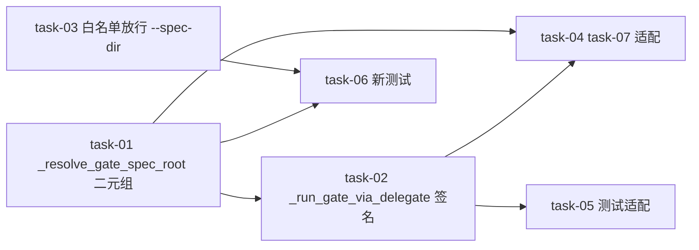

# 实现计划（Plan）— gate-cwd-specdir-fix

> P3 坑 3 SillyHub 侧修复。实现细节见 design §4.5/§5/§7 + tasks/task-NN.md。

## 同文件串行约束（Wave 编排依据）

- **`backend/app/modules/daemon/run_sync/service.py`**：task-01（`_resolve_gate_spec_root`）→ task-04（task-07 适配）
- **`backend/app/modules/change/dispatch.py`**：task-02（`_run_gate_via_delegate`）
- **`backend/app/modules/daemon/host_fs/delegate.py`**：task-03（白名单）

## 依赖关系图

## Wave 1（并行 · 文件互斥）

- [x] task-01: `_resolve_gate_spec_root` 分离返回 `(code_root, spec_dir)` 二元组（`service.py`；daemon-client: workspace.root_path + SpecWorkspace.spec_root；server-local: None,None；brownfield: fallback code_root/.sillyspec）
- [x] task-03: `_enforce_command_whitelist` 尾部 flag 白名单加 `--spec-dir`（`delegate.py`；成对 flag+value，值校验 within allowed roots，仿 `--stage` :799-815）

## Wave 2（依赖 task-01）

- [x] task-02: `_run_gate_via_delegate` 改签名 `(session, workspace, change_name, code_root, spec_dir, stage)`，cwd=code_root，spec_dir 非 None 时 args 加 `--spec-dir`（`dispatch.py`）

## Wave 3（依赖 task-01/02 · service.py 串行接力）

- [x] task-04: `task-07 _run_gate_decision_task` 适配——解构 `_resolve_gate_spec_root` 二元组，传 `_run_gate_via_delegate`（`service.py`）

## Wave 4（依赖 task-01/02/03 · 并行）

- [x] task-05: 测试适配——`test_gate_via_delegate.py` 7 测试改参数（spec_root→code_root+spec_dir）+ `test_run_sync_gate_decision_task.py` mock 签名 + `test_gate_e2e.py` mock
- [x] task-06: 新增测试——白名单 `--spec-dir` 放行/拒恶意路径（`test_delegate_run_command.py`）+ cwd=code_root 传对（`test_gate_via_delegate.py` 扩）

## 任务总表

| 编号 | 任务 | Wave | 依赖 | 文件 | FR | 
|---|---|---|---|---|---|
| task-01 | `_resolve_gate_spec_root` 二元组 | W1 | — | service.py | FR-1 |
| task-03 | 白名单放行 `--spec-dir` | W1 | — | delegate.py | FR-3 |
| task-02 | `_run_gate_via_delegate` 签名 | W2 | task-01 | dispatch.py | FR-2 |
| task-04 | task-07 适配 | W3 | task-01/02 | service.py | FR-4 |
| task-05 | 测试适配 | W4 | task-02 | 测试 | FR-5 |
| task-06 | 新测试 | W4 | task-01/03 | 测试 | AC-1/2 |

## 关键路径

`task-01 → task-02 → task-04 → task-05`（_resolve_gate_spec_root 改返回 → _run_gate_via_delegate 签名 → task-07 适配 → 测试）。

## 全局验收标准

- [ ] gate verify-test 在 daemon-client 跑通（cwd=code_root + specBase=specDir via --spec-dir）（AC-1）
- [ ] `--spec-dir` 注入被拒（白名单 within allowed roots）（AC-2）
- [ ] 现有测试适配零回归（backend 全量绿）（AC-3）
- [ ] brownfield（无 SpecWorkspace）fallback——不加 --spec-dir，兼容（AC-4）
- [ ] server-local gate 仍 raise（不变）（AC-5）

## 前置

- sillyspec gate CLI `index.js:323` 接线 specBase（已改本会话 + 45 测试绿，待 sillyspec commit/push）
