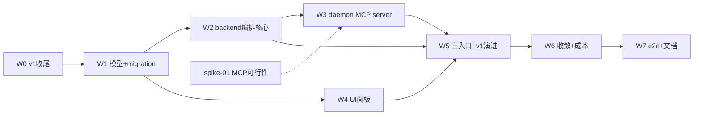

# 实现计划（Plan）— team 主 agent 动态编排（v2）

> 变更：`2026-07-12-team-main-agent-orchestration`
> 依据：design.md（方案 B 主 agent 真 agent）+ tasks.md（6 Phase）+ decisions.md（D-001~007@v2）
> plan_level: full（跨 backend+frontend+daemon 3 模块 + migration + 状态机）
> 默认 single（v1 D-003 沿用），team 全 opt-in，零回归（FR-9 / 全局验收守护）

## 概述

team = 主 agent（真 agent，走 daemon interactive lease + MCP tool）+ 用户预设 worker 列表。主 agent 像项目经理：读 worker 实际产出再决策（派 / 补 / 收敛）。演进 v1（mode=single 走 v1 原路径；mode=team 走 v2 主 agent；GLM fallback）。

底座已就绪（6 点代码调研确认）：
- interactive lease 永不过期（`lease/service.py:186`）+ session 恢复链路（`restoreAndReconnect`）→ 主 agent 长生命周期零新机制
- AgentArtifact(kind=patch) + converge 链路（finalizer + collect_artifacts）→ worker 收口复用
- hub-client 反向通道成熟 → 仿 change-write 三段式（`hub-client.ts:842`）+ X-Claim-Token（`:543`）
- mcp-config 注入管线（`mcp-config.ts:214`）+ tool_kind 已支持 `mcp__` 前缀（`tool-kind.ts:62`）

本变更接通编排层（主 agent OrchestratorService + daemon 内置 MCP server + per-worker worktree + UI 面板 + 三入口）。

## Spike 前置验证

| Spike | 验证内容 | 通过标准 | 不通过后果 |
|---|---|---|---|
| spike-01 | daemon 内置 stdio MCP server 可行性：主 agent（claude/codex）经 `--mcp-config` 注入能否调到 daemon 进程内 MCP server，tool_call 能否路由到 hub-client → backend 派 worker | 主 agent 能调 `dispatch_worker` tool 并收到 worker 状态回执 | task-05 推翻，退方案 A（backend 主动 GLM 决策循环，主 agent 无工具能力） |

> 仅 MCP server 集成有技术不确定性（6 点调研点 1）。lease / 反向通道 / 决策循环 / 复用路径调研已确认零不确定性。

## Wave 0 — v1 收尾 + 基线（前置，独立）

**目标**：v1 Wave1+2（mode 选择 UI + mode/session_id 透传 + execute stage team toggle，203 行 + 593 测试）apply 进 main 作为 v2 复用基础；v1 Wave3-5 标停转交 v2。
**依赖**：无
- [x] task-01: apply v1 Wave1+2 到 main（worktree `sillyspec/2026-07-12-team-mode-platform-wide` 的 9 源码 + 2 测试 cp 到 main + main commit + backend pytest agent/change 模块 + frontend vitest mission-console/changes 零回归）+ v1 标停（plan.md/decisions 标 Wave3-5 转交 v2，不走完整 archive）（覆盖：复用 v1 D-003/D-004 mode UI + 透传）

## Wave 1 — 数据模型 + migration（基础）

**目标**：AgentMission/AgentRun schema 扩展承载 worker_preset + 主 agent 配置。
**依赖**：W0
- [x] task-02: backend `agent/model.py` + alembic migration（AgentMission 加 `worker_preset` JSON + `main_agent_config` JSON；AgentRun `role` 扩展 `'orchestrator'` 值 + 加 `worktree_branch`）+ worker_preset JSON schema 定稿（每条 worker：agent_type/model/objective/role；main_agent_config：agent_type/provider/model）（覆盖：FR-2, D-002@v2, D-005@v2）

## Wave 2 — backend 编排核心（依赖 W1）

**目标**：主 agent OrchestratorService + MCP endpoint，旁路 GLM CoordinatorPlanner。
**依赖**：W1
- [x] task-03: backend `agent/orchestrator.py`（新）OrchestratorService（主 agent 调度循环 + 三重收敛骨架）+ `agent/mcp_tools.py`（新）endpoint（dispatch_worker / get_worker_result / list_workers / converge_mission / report_progress）+ `agent/router.py` create_mission 旁路 CoordinatorPlanner（mode=team 走主 agent 路径，不调 planner.plan，调用点搜索留 TaskCard）+ 复用现有 converge 链路（finalizer + collect_artifacts）（覆盖：FR-1, FR-4, D-001@v2, D-006@v2, D-007@v2）
- [x] task-04: backend `agent/execution.py`（collect_completed_artifacts 采 patch）+ `agent/finalizer.py`（converge 路由：有 patch 调 finalize_execute_mission，无 patch 回退 finalize_bootstrap_mission；修 v1 断点 diff_summary → AgentArtifact kind=patch）（覆盖：FR-6, D-005@v2 patch 采集）
- [x] task-04b: per-worker 独立 worktree 隔离（HostFsDelegate.git_worktree_add + daemon host-fs-handler + execution.py 接线 + finalizer git merge，D-005@v2 完整，含 daemon 改动，拆自 task-04）（覆盖：FR-3, D-003@v2, D-005@v2 worktree）。**处置：拆出新变更单独实现（用户决策），本 execute 不含；task-04 已做 patch 采集，worktree 隔离 + git merge 留新变更。**

## Wave 3 — daemon MCP server + 反向通道（依赖 W2）

**目标**：主 agent 通过 MCP tool 反向调 backend。
**依赖**：W2（+ spike-01 先行）
- [x] task-05: daemon 新建内置 stdio MCP server（5 tool handler：dispatch_worker / get_worker_result / list_workers / converge_mission / report_progress）+ `hub-client.ts` 加方法（仿 change-write 三段式 `hub-client.ts:842` + X-Claim-Token 二级鉴权 `:543`）+ platform_default MCP 配置注入（`mcp-config.ts:214` 复用）（覆盖：FR-4, D-007@v2）
- [x] task-06: daemon 主 agent lease 长生命周期（复用 interactive lease 永不过期 `lease/service.py:186` + session 恢复 `restoreAndReconnect`，零新续期机制）+ MCP tool 转发进 interactive driver（`driver.ts` consume 循环不改，仅 tool 注入）（覆盖：FR-1, R-01）

## Wave 4 — UI 配置面板（依赖 W1，与 W2/W3 并行）

**目标**：用户配 team（主 agent + worker 列表）+ 进度可见。
**依赖**：W1（schema 定稿后 UI 才能绑字段）
- [x] task-07: frontend `mission-console.tsx` team 配置面板（主 agent 类型/模型选择 + worker 列表[类型/模型/任务/role]，照前端样式系统原型）+ `lib/agent.ts` CreateMissionInput 加 worker_preset / main_agent_config（覆盖：FR-2, FR-6, D-002@v2, D-003@v2）
- [x] task-08: frontend `changes/[cid]/page.tsx` stage team 配置（execute + verify worker 预设）+ `interactive-session-panel.tsx`「用团队分析」+ 主 agent 绑 session_id + 新组件 team 进度（主 agent 决策日志 + worker 进度 + CostBar，复用 mission-console 组件）（覆盖：FR-8）

## Wave 5 — 三入口接通 + v1 演进（依赖 W2/W3/W4）

**目标**：三入口全通 + mode 分流 + GLM fallback。
**依赖**：W2 + W3 + W4
- [x] task-09: backend + frontend 三入口接通（mission 页 / execute·verify stage / 会话）+ mode 分流（single → v1 原路径零回归，team → v2 主 agent orchestrator）+ verify gate 策略 A 复用 v1 D-005（merge_gate_results：全 exit=0 才过，任一非 0 取最严重）（覆盖：FR-7, FR-8, FR-9, D-004@v2）
- [x] task-10: GLM fallback（主 agent 不可用 / 用户选 GLM 模型时，mode=team 退化走 v1 GLM Coordinator/Finalizer 链路；保留 v1 链路不删）（覆盖：FR-7, D-004@v2）

## Wave 6 — 收敛 + 成本控制（依赖 W5）

**目标**：三重收敛完整 + 预算硬截断。
**依赖**：W5
- [x] task-11: OrchestratorService 三重收敛完整逻辑（worker 全完 / 主 agent 判断目标达成 / 预算超时硬截断）+ budget_usd 硬截断（mission 级监控 + 强制 converge）+ CostBar 实时展示（主 agent + worker cost 聚合）（覆盖：FR-5, D-006@v2）

## Wave 7 — 端到端 + 文档（依赖 W1-W6）

**目标**：全量回归 + e2e + 文档同步。
**依赖**：W1-W6 全完成
- [x] task-12: backend pytest 全量（local.yaml: `uv run pytest`）+ frontend vitest 全量（`pnpm test`）+ daemon vitest（`pnpm test`）零回归 + mypy/ruff（`uv run mypy app` + `ruff check`）全过
- [x] task-13: e2e 三入口真跑（mission team / execute·verify team / 会话 team，AC-9 需真 daemon + 多 provider 配置）+ 模块文档同步（backend.md / frontend.md / sillyhub-daemon.md 变更索引）+ ROADMAP 更新（v1 标停 + v2 接管）。**处置：文档同步已完成（backend/frontend/sillyhub-daemon 变更索引 + ROADMAP v1 标被接管/v2 加入）；e2e 真跑归 verify 运行时验证（plan §风险 明确「运行时验证，不阻塞单测交付」，AC-9 需真 daemon + 多 provider 部署）。**

## 任务总表

| 编号 | 任务 | Wave | 优先级 | 依赖 | 覆盖 FR/D | 说明 |
|---|---|---|---|---|---|---|
| task-01 | apply v1 Wave1+2 + v1 标停 | W0 | P0 | — | 复用 v1 D-003/D-004 | cp worktree → main，v2 复用基础 |
| task-02 | model.py + migration + worker_preset schema | W1 | P0 | task-01 | FR-2, D-002, D-005 | AgentMission 加 worker_preset/main_agent_config |
| task-03 | OrchestratorService + mcp_tools + create_mission 旁路 planner | W2 | P0 | task-02 | FR-1, FR-4, D-001, D-006, D-007 | 编排核心，复用 converge 链路 |
| task-04 | execution per-worker worktree + finalizer 合并 patch + 修 v1 断点 | W2 | P0 | task-02 | FR-3, FR-6, D-003, D-005 | 并发写隔离 |
| task-05 | daemon MCP server + hub-client 方法 + 配置注入 | W3 | P0 | task-03, spike-01 | FR-4, D-007 | 仿 change-write 三段式 |
| task-06 | 主 agent lease 长生命周期 + MCP tool 转发 | W3 | P0 | task-03 | FR-1, R-01 | 复用 interactive lease |
| task-07 | mission-console team 面板 + lib/agent.ts | W4 | P0 | task-02 | FR-2, FR-6, D-002, D-003 | 照原型 |
| task-08 | stage 配置 + 会话「用团队分析」+ 进度组件 | W4 | P1 | task-02 | FR-8 | 三入口 UI |
| task-09 | 三入口接通 + mode 分流 + verify gate 策略 A | W5 | P0 | task-03..08 | FR-7, FR-8, FR-9, D-004 | single 零回归 |
| task-10 | GLM fallback | W5 | P1 | task-09 | FR-7, D-004 | 保留 v1 链路 |
| task-11 | 三重收敛完整 + budget 硬截断 + CostBar | W6 | P0 | task-09 | FR-5, D-006 | 成本兜底 |
| task-12 | 全量单测 + lint 零回归 | W7 | P0 | task-01..11 | — | module 测试策略 |
| task-13 | e2e 三入口 + 文档同步 + ROADMAP | W7 | P0 | task-12 | AC-9, AC-10 | 真部署验证 |

## 关键路径

task-01 → task-02 → task-03 → task-05 → task-09 → task-11 → task-12 → task-13
（W0 → W1 → W2 → W3 → W5 → W6 → W7，最长路径，含 MCP server + 三入口 + 收敛 + e2e）

## 依赖图

> W2/W3（backend 编排）与 W4（UI）从 W1 后并行推进；W5 汇聚三支。依赖非平凡（非线性），故生成 Mermaid。

## 全局验收标准

- AC-1 mission 页配 team（主 agent + worker 列表）→ 主 agent 接管 → 按列表派 worker（各独立 worktree）→ 读产出 → 收敛合并
- AC-2 execute stage team → 多 impl worker 并行写（独立 worktree）→ 主 agent 合并 patch（人审 apply-back）
- AC-3 verify stage team → 多 verify worker 并行核验 → gate 策略 A 合并
- AC-4 会话「用团队分析」→ 主 agent（绑 session）team
- AC-5 主 agent + worker 自由组合 agent 类型 + 模型（UI 可选 + 数据层 + lease 透传）
- AC-6 三重收敛任一触发即收敛
- AC-7 GLM fallback（主 agent 不可用 / 选 GLM 时退化 v1 链路）
- AC-8 backend pytest + frontend vitest + daemon vitest 全绿零回归 + mypy/ruff 全过
- AC-9 e2e 三入口真跑（需真 daemon + 多 provider 配置，运行时验证）
- AC-10 模块文档同步（backend.md / frontend.md / sillyhub-daemon.md 变更索引）
- （brownfield 兼容）mode=single 行为完全不变（v1 原路径，FR-9 守护）；未配 team 时所有入口默认 single 零回归；v1 Wave1+2 mode UI / 透传统用

## 覆盖矩阵

| ID | 覆盖任务 | 验收证据 |
|---|---|---|
| D-001@v2（主 agent 动态编排） | task-03 | AC-1 |
| D-002@v2（worker 用户预设） | task-02, task-07 | AC-1 |
| D-003@v2（自由组合 agent/模型） | task-04, task-07 | AC-5 |
| D-004@v2（v1 演进 GLM fallback） | task-09, task-10 | AC-7 |
| D-005@v2（per-worker worktree） | task-02（schema）, task-04 | AC-2 |
| D-006@v2（三重收敛） | task-03（骨架）, task-11（完整） | AC-6 |
| D-007@v2（MCP 反向调用） | task-05 | AC-1 |

## 6 点 plan 细化落点（design §11 自审遗留）

| 待细化点 | plan 落点 | 调研依据 |
|---|---|---|
| MCP 协议（传输层） | task-05 | daemon 内置 stdio MCP server + mcp-config 注入（`mcp-config.ts:214`）+ tool_kind 已支持 `mcp__` 前缀（`tool-kind.ts:62`） |
| lease 续期 | task-06 | 复用 interactive lease 永不过期（`lease/service.py:186`）+ session 恢复（`restoreAndReconnect`），零新机制 |
| worker_preset schema | task-02 | AgentMission 加 worker_preset JSON（constraints 已自由 schema 先例）+ main_agent_config JSON |
| daemon→backend 反向通道 | task-05 | hub-client 加方法仿 change-write 三段式（`hub-client.ts:842`）+ X-Claim-Token（`:543`） |
| 主 agent 决策循环 | task-06 | 复用 interactive driver consume 循环（`driver.ts:170`）+ SessionManager，主 agent = interactive session |
| v1 Wave3-5 关系 | task-01 + 详见下节 | 废弃，v2 三入口接管；v1 D-005 gate 策略 A 复用 |

## v1 关系（v1 → v2 演进）

v1（`2026-07-12-team-mode-platform-wide`）Wave1+2 apply 进 main（task-01），v2 复用其 mode 选择 UI + mode/session_id 透传链路 + single 零回归 + GLM 链路。v1 Wave3-5（verify team / 会话 team / e2e，GLM 风格）**废弃**，v2 三入口（task-08 / task-09）用主 agent 方式接管。v1 D-005 verify gate 策略 A（merge_gate_results）被 v2 task-09 复用（stage gate 合并逻辑独立于 mission converge）。v1 D-006 共享 worktree 被 v2 D-005 per-worker 独立 worktree 推翻。

## 风险与遗留（具体，非泛泛）

- 🟠 MCP server 集成（spike-01）：主 agent 能否调 daemon 内置 MCP tool 是最大技术不确定性；spike-01 不通过则 task-05 推翻退方案 A。缓解：spike 前置于 W3。
- 🟠 per-worker worktree 合并冲突（R-03）：主 agent converge 时 git merge 冲突。缓解：人审 apply-back（D-005）；worker 按文件分工减少冲突。
- 🟡 多 agent 烧 token（R-04）：主 agent + 多 worker 并行。缓解：budget_usd 硬截断（task-11）+ CostBar 实时。
- 🟡 主 agent 决策质量（R-05）：依赖 LLM 判断力。缓解：建议强模型（claude-opus）+ 用户预设 worker 降低决策负担。
- 🟡 e2e 需真 daemon + 多 provider（AC-9）：运行时验证，不阻塞单测交付（task-12 守护单测，task-13 列运行时）。

## 自检

- ✅ 13 task ≤ 15 上限
- ✅ 每 task 在 Wave 下有 `- [ ] task-XX:` checkbox
- ✅ Wave 分组 + 依赖关系标注（W0 → W1 → {W2, W4} → W3 → W5 → W6 → W7）
- ✅ 任务总表（优先级 / 依赖 / 覆盖 FR/D，**无估时列**）
- ✅ 关键路径 + Mermaid（依赖非平凡：W2/W3 vs W4 并行 + W5 汇聚）
- ✅ 全局验收（AC-1~10 + brownfield 兼容性条款 mode=single 零回归）
- ✅ 覆盖矩阵覆盖全部 D-001~007@v2
- ✅ 无 P0/P1 unresolved blocker（decisions 全 resolved）
- ✅ 无实现细节（接口定义 / 代码示例留 task-NN.md）
- ✅ plan.md 与 design §6 文件清单一致（见下文件覆盖自检）
- ✅ 文件覆盖自检：design §6 每个源码文件都被 task 覆盖
  - `agent/model.py` → task-02｜`agent/orchestrator.py`（新）→ task-03｜`agent/execution.py` → task-04｜`agent/finalizer.py` → task-04｜`agent/mcp_tools.py`（新）→ task-03｜`agent/router.py` → task-03｜daemon `interactive/driver` → task-06｜`mission-console.tsx` → task-07｜`changes/[cid]/page.tsx` → task-08｜`interactive-session-panel.tsx` → task-08｜migration → task-02
- ⚠️ 跨任务契约自检（provides / expects_from）留 per-task TaskCard 步骤（task-NN.md）细化
- ⚠️ 调用点搜索（create_mission 旁路 CoordinatorPlanner 影响 planner 调用方）留 task-03 TaskCard 记录
- ✅ 风险具体（每条带缓解，非泛泛）
