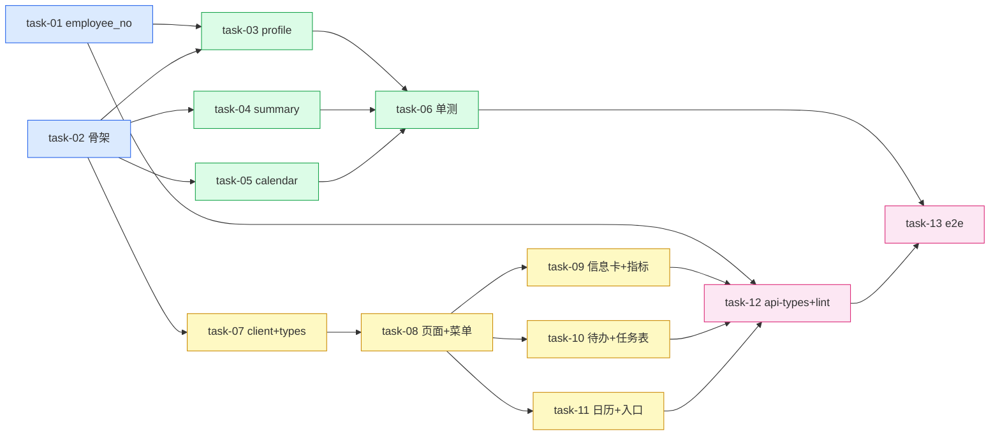

# 实现计划（Plan）

## Spike 前置验证
无需 Spike。技术方案已在前置调研中验证确定：`now_handle_user = str(user.id)`（problem/service.py:433/459/610/703）、PlanTask 字段口径、迁移链单 head（`20260713_fix_session_zombie`）、当前登录人 dependency（`get_current_user`）均已核实，无未经验证的集成点。

## Wave 1 — 后端数据层与骨架（并行）
- [x] task-01: users 表加 employee_no（alembic migration down=20260713_fix_session_zombie + User ORM + UserRead schema）（覆盖：FR-02, D-002@v1）
- [x] task-02: workbench 子域骨架（schema DTO + service 空类 + router 3 接口 + main.py 挂载到 /api/ppm，权限 PPM_TASK_READ）（覆盖：FR-01, FR-12, D-001@v1, D-009@v1）

## Wave 2 — 后端聚合 service 实现（依赖 Wave 1）
- [x] task-03: profile 聚合（工号直取 + user_organizations JOIN organizations 取部门 + workspaces role_name）（覆盖：FR-03, FR-04, D-003@v1, D-004@v1）
- [x] task-04: summary 指标 + 待办派生（start_time 区间过滤 5 指标 + now_handle_user split 匹配 + 非终态 plan_task）（覆盖：FR-05, FR-06, FR-09, FR-10, D-006@v1, D-008@v1, D-010@v1）
- [x] task-05: calendar 日历聚合（start_time 落点计数 + load/alert 分档 + 延期预警）（覆盖：FR-08, D-010@v1）
- [x] task-06: workbench service 单测（指标口径 / task_count=0 边界 / now_handle_user 派生匹配 / 日历分档 / profile 部门关联）（覆盖：FR-05, FR-06, FR-08）

## Wave 3 — 前端页面与组件（依赖 Wave 2 接口就绪）
- [x] task-07: lib/ppm/workbench.ts API client + types.ts 加 workbench 类型（覆盖：FR-01）
- [x] task-08: /ppm/workbench 页面容器（page.tsx）+ 数据装配（apiFetch+useEffect）+ app-shell 菜单加「个人工作台」项（覆盖：FR-01, D-001@v1）
- [x] task-09: ProfileSummaryCard 个人信息卡 + PersonalMetricStrip 5 指标卡（覆盖：FR-02, FR-03, FR-04, FR-05, D-002@v1, D-003@v1, D-004@v1）
- [x] task-10: TodoListPanel 待办列表 + WorkbenchTaskTable 任务操作表（复用 personal-task-plan，当日完成二次确认）（覆盖：FR-06, FR-07, D-005@v1, D-006@v1）
- [x] task-11: WorkCalendarPanel 双圆点日历 + QuickEntryGrid + RuleNotePanel + 消息通知/绩效考评 EmptyState 占位（覆盖：FR-08, FR-11, D-007@v1）

## Wave 4 — 联调与验收（依赖 Wave 3）
- [x] task-12: 前端 api-types 重生成（UserRead.employee_no）+ 类型对齐 + frontend lint/typecheck/test（覆盖：FR-02）
- [x] task-13: 端到端验证（页面三栏渲染 / 指标与库数据一致 / 待办派生 / 日历双圆点 / 占位空状态）（覆盖：FR-01~FR-12）

## 任务总表
| 编号 | 任务 | Wave | 优先级 | 依赖 | 覆盖 FR/D | 涉及文件 |
|---|---|---|---|---|---|---|
| task-01 | users 加 employee_no | W1 | P0 | — | FR-02, D-002 | migrations/20260714_add_user_employee_no.py, auth/model.py, auth/schema.py |
| task-02 | workbench 子域骨架 | W1 | P0 | — | FR-01, FR-12, D-001, D-009 | ppm/workbench/{__init__,schema,service,router}.py, main.py |
| task-03 | profile 聚合 | W2 | P0 | task-01, task-02 | FR-03, FR-04, D-003, D-004 | ppm/workbench/service.py, router.py |
| task-04 | summary 指标+待办 | W2 | P0 | task-02 | FR-05, FR-06, FR-09, FR-10, D-006, D-008, D-010 | ppm/workbench/service.py, router.py |
| task-05 | calendar 聚合 | W2 | P1 | task-02 | FR-08, D-010 | ppm/workbench/service.py, router.py |
| task-06 | workbench 单测 | W2 | P0 | task-03, task-04, task-05 | FR-05, FR-06, FR-08 | ppm/workbench/tests/test_workbench_service.py |
| task-07 | lib client + types | W3 | P0 | task-02 | FR-01 | lib/ppm/workbench.ts, lib/ppm/types.ts |
| task-08 | 页面容器 + 菜单 | W3 | P0 | task-07 | FR-01, D-001 | app/(dashboard)/ppm/workbench/page.tsx, components/app-shell.tsx |
| task-09 | 信息卡 + 指标条 | W3 | P0 | task-07, task-08 | FR-02~FR-05, D-002~D-004 | ppm/workbench/_components/{profile-summary-card,personal-metric-strip}.tsx |
| task-10 | 待办 + 任务表 | W3 | P0 | task-07, task-08 | FR-06, FR-07, D-005, D-006 | ppm/workbench/_components/{todo-list-panel,workbench-task-table}.tsx |
| task-11 | 日历 + 入口 + 占位 | W3 | P1 | task-07, task-08 | FR-08, FR-11, D-007 | ppm/workbench/_components/{work-calendar-panel,quick-entry-grid,rule-note-panel,message-placeholder}.tsx |
| task-12 | api-types 重生成 + lint/test | W4 | P0 | task-01, task-09~11 | FR-02 | lib/api-types.ts（生成）, frontend lint/typecheck/test |
| task-13 | 端到端验证 | W4 | P1 | task-06, task-12 | FR-01~FR-12 | 手动 + curl |

## 关键路径
task-01 → task-03 → task-06 → task-07 → task-08 → task-10 → task-12 → task-13（最长依赖链，决定最短交付周期）

## 全局验收标准
- [ ] backend workbench 模块 + auth 单测全部通过（`cd backend && uv run pytest -q app/modules/ppm/workbench app/modules/auth`）
- [ ] frontend vitest 通过（`cd frontend && pnpm test`）
- [ ] ruff + mypy + next lint + tsc 全绿
- [ ] **（brownfield 兼容）** employee_no nullable，未录入老用户显示「—」，不影响登录与其他 UserRead 消费方
- [ ] **（brownfield 兼容）** 新接口只读不写，personal-task-plan 契约不变，`/ppm` redirect 不变
- [ ] `/ppm/workbench` 页面三栏渲染正常，消息/绩效考评占位不报错
- [ ] 指标数值与 `ppm_plan_task` / `ppm_problem_list` / `task_execute` 库数据一致

## 覆盖矩阵
| 决策 ID | 覆盖任务 | 验收证据 |
|---|---|---|
| D-001@v1 | task-02, task-08 | 路由 /ppm/workbench + 菜单项 |
| D-002@v1 | task-01, task-03, task-09 | employee_no 列 + profile 返回 + 信息卡显示 |
| D-003@v1 | task-03, task-09 | user_organizations 关联查部门 |
| D-004@v1 | task-03, task-09 | workspaces role_name |
| D-005@v1 | task-10 | 任务表字段缺口前端兜底 |
| D-006@v1 | task-04, task-10 | now_handle_user 派生待办 |
| D-007@v1 | task-11 | 消息/绩效占位 |
| D-008@v1 | task-04 | 工时源 task_execute.time_spent |
| D-009@v1 | task-02 | 权限 PPM_TASK_READ |
| D-010@v1 | task-04, task-05 | 延期口径（summary + calendar） |

## 自检

| 检查项 | 结果 |
|---|---|
| 每个 task 有编号 | ✅ task-01~13 |
| Wave 下 checkbox 格式 `- [ ] task-XX:` | ✅ |
| Wave 分组 + 依赖关系 | ✅ 4 Wave，任务总表依赖列 + mermaid |
| 任务总表（优先级、依赖，无估时） | ✅ 无估时列 |
| 关键路径 | ✅ task-01→03→06→07→08→10→12→13 |
| 全局验收（brownfield 兼容） | ✅ 含 2 条兼容性条款 |
| decisions 覆盖矩阵（D-001~010 全覆盖） | ✅ |
| 无 P0/P1 unresolved blocker | ✅ Grill passed |
| 无实现细节 | ✅ 细节留 task-NN.md |
| plan.md 与 design 文件清单一致 | ✅（见下文件覆盖自检） |
| 总任务数 ≤15 | ✅ 13 个 |
| 跨任务契约自检 | ✅ task-01 employee_no → task-03 profile → task-09 卡片；task-02 schema → task-03/04/05 service → task-07 types → task-09/10/11 组件，字段链一致 |
| 文件覆盖自检 | ✅ design §6 每个源码文件均被 task allowed_paths 覆盖（migration/auth→task-01；workbench 子域→task-02~06；main.py→task-02；前端 page/components/app-shell→task-08~11；lib→task-07；api-types→task-12） |
| Mermaid 非平凡 | ✅ 4 Wave 多对多依赖 |

**自检结论：通过。**
