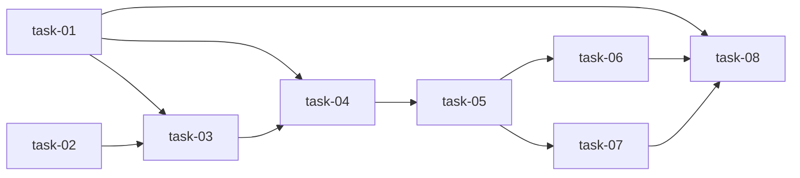

# 实现计划：变更中心工作流引擎

## Wave 分组

### Wave 1：后端状态机基础（并行，无依赖）
- [ ] task-01: Backend状态机核心 — model.py新增StageEnum + TRANSITIONS + can_transition()
- [ ] task-02: DB迁移 — Alembic迁移脚本（stage字段+feedback字段+旧数据映射）

### Wave 2：后端工作流服务（依赖 Wave 1）
- [ ] task-03: Backend工作流服务 — service.py新增transition()/submit_feedback()/check_archive_gate()
- [ ] task-04: Backend API端点 — router.py新增3个路由 + change_writer Agent边界守卫

### Wave 3：前端API层（依赖 Wave 2）
- [ ] task-05: Frontend API层 — changes.ts新增transitionChange/submitFeedback/checkArchiveGate

### Wave 4：前端UI（依赖 Wave 3）
- [ ] task-06: Frontend详情页工作流UI — 阶段流转按钮+反馈表单+归档门禁
- [ ] task-07: Frontend列表页更新 — 新阶段Badge颜色+筛选

### Wave 5：E2E验证（依赖 Wave 1–4）
- [ ] task-08: E2E验证 — 全流程测试

## 任务总表

| 编号 | 任务 | Wave | 优先级 | 估时 | 依赖 | 说明 |
|------|------|------|--------|------|------|------|
| task-01 | Backend状态机核心 | W1 | P0 | 2h | — | model.py: StageEnum(10值) + TRANSITIONS(14条规则) + can_transition() |
| task-02 | DB迁移 | W1 | P0 | 1h | — | Alembic: stage列(default draft) + feedback_category + feedback_text + 旧status→stage映射 |
| task-03 | Backend工作流服务 | W2 | P0 | 3h | task-01,02 | service.py: transition(权限+校验) + submit_feedback(ABCD分类+目标路由) + check_archive_gate(6项检查) |
| task-04 | Backend API端点+Agent守卫 | W2 | P0 | 2h | task-01,02,03 | router.py: 3新端点 + change_writer execute_change守卫(仅ready_for_dev) |
| task-05 | Frontend API层 | W3 | P0 | 1h | task-04 | changes.ts: 3个新API函数 |
| task-06 | Frontend详情页工作流UI | W4 | P0 | 3h | task-05 | 阶段进度条+流转按钮+反馈表单+归档门禁面板 |
| task-07 | Frontend列表页更新 | W4 | P1 | 1h | task-05 | STAGES常量+颜色Badge+阶段筛选下拉 |
| task-08 | E2E验证 | W5 | P0 | 2h | task-01~07 | 全流程: draft→...→archived + 反馈分类 + Agent守卫 |

## 依赖关系图

## 关键路径

task-01 → task-03 → task-04 → task-05 → task-06 → task-08

## 全局验收标准

- [ ] 变更创建后 current_stage 自动为 `draft` 并立即转到 `clarifying`
- [ ] Agent execute_change 在非 `ready_for_dev` 阶段返回 409
- [ ] 业务验收反馈必须包含 A/B/C/D 分类
- [ ] 归档门禁返回每项检查的通过/失败状态
- [ ] 旧数据 status=draft→stage=draft, status=active→stage=clarifying 兼容
- [ ] 所有现有后端测试通过
- [ ] 前端 `next build` 通过
